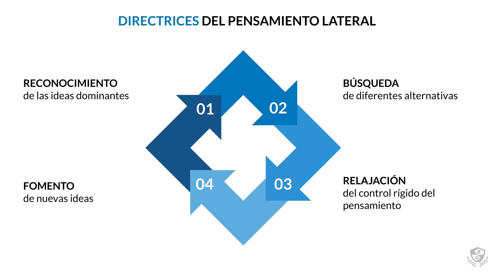
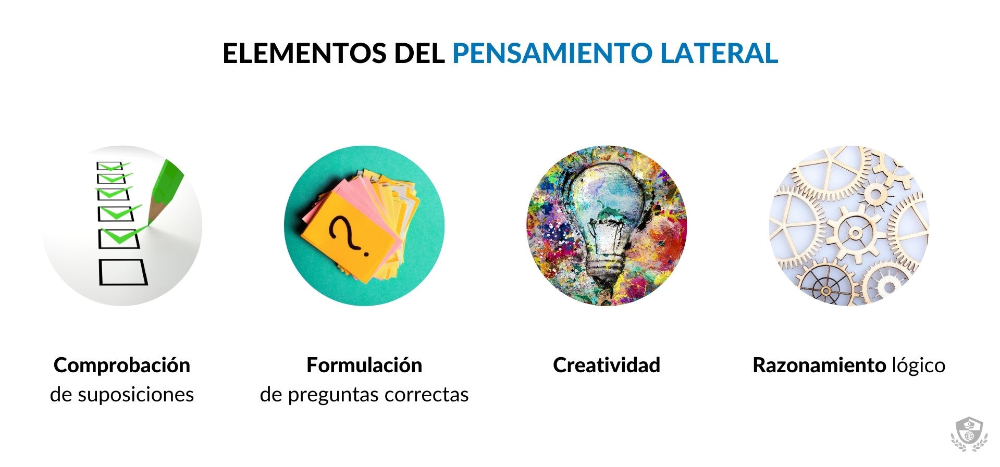
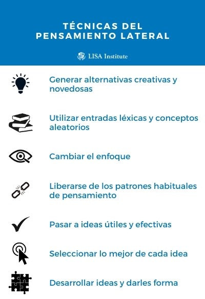
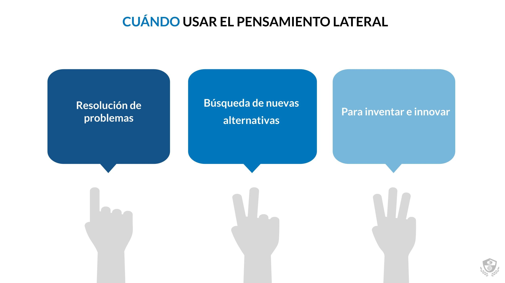

# PENSAMENTO LATERAL

---

**Xeralmente, cando razoamos, tratamos de buscar patróns lóxicos e económicos** (en términos psicolóxicos), analizando premisas e deducindo conclusións “naturais ou habituais” que permitan resolver problemas de forma directa e sinxela. 

---

**Deste xeito, as conclusións e razoamentos non permiten avanzar e atopar novas vías,** solucións ou propostas.

---

**O pensamento lateral aspira a romper estes patróns de pensamento estáticos e a buscar líñas alternativas** de **[pensamento crítico](https://www.lisainstitute.com/blogs/blog/pensamiento-critico-que-es-como-potenciarlo)** e analítico...

---

...que permitan resolver problemas dunha forma máis orixinal e creativa, de modo que se poidan atopar novas respostas aos dilemas da vida cotián.

---

**O pensamento lateral se centra no que podería ser máis que no que é posible e propón 4 directrices:**

---

- **Recoñecer** as ideas dominantes que polarizan a percepción dun problema.

---

- **Buscar** diferentes formas de ver as cousas.

---

- **Relaxar** o ríxido control do pensamento.

---

- **Aproveitar** a oportunidade para fomentar outras ideas.

---

---

---

---

---

ref: https://www.lisainstitute.com/blogs/blog/que-es-el-pensamiento-lateral-y-para-que-sirve