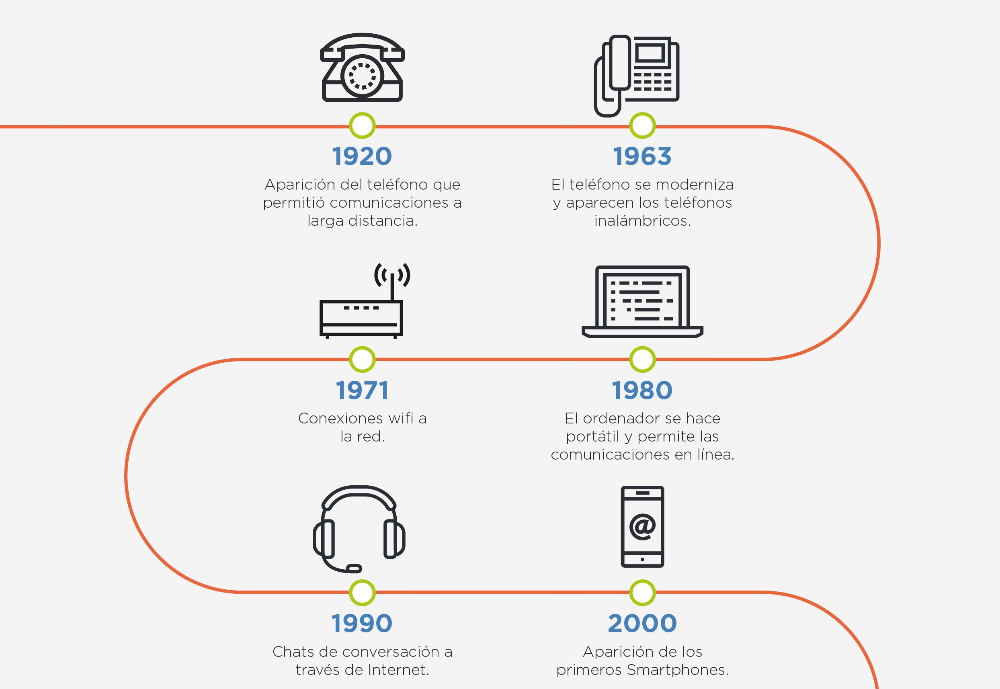
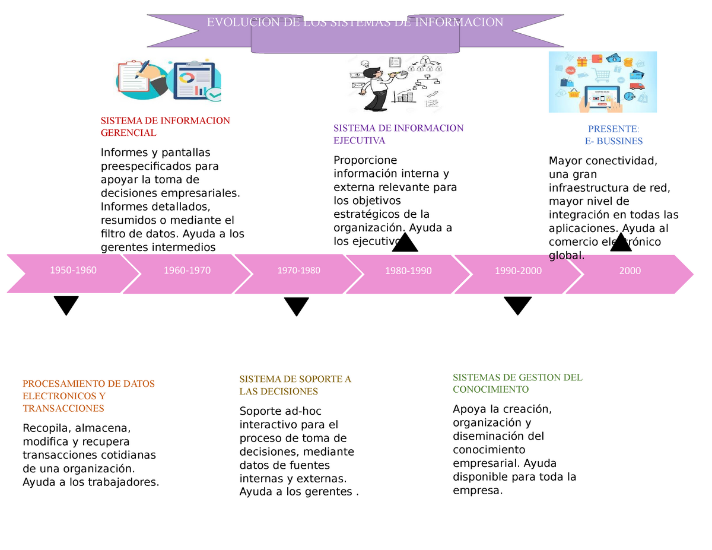
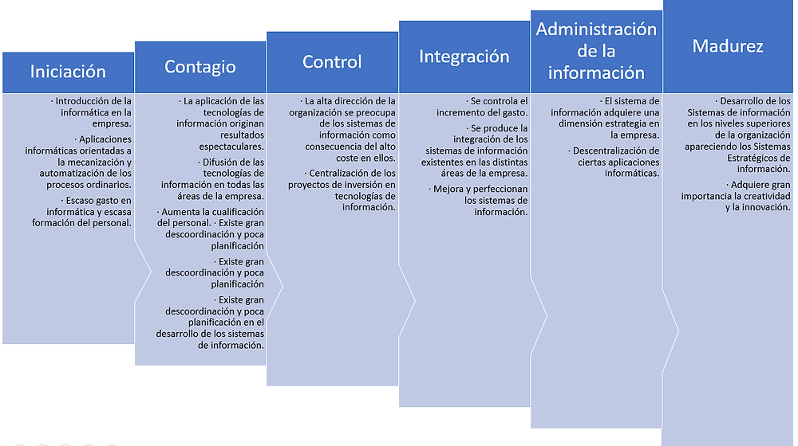
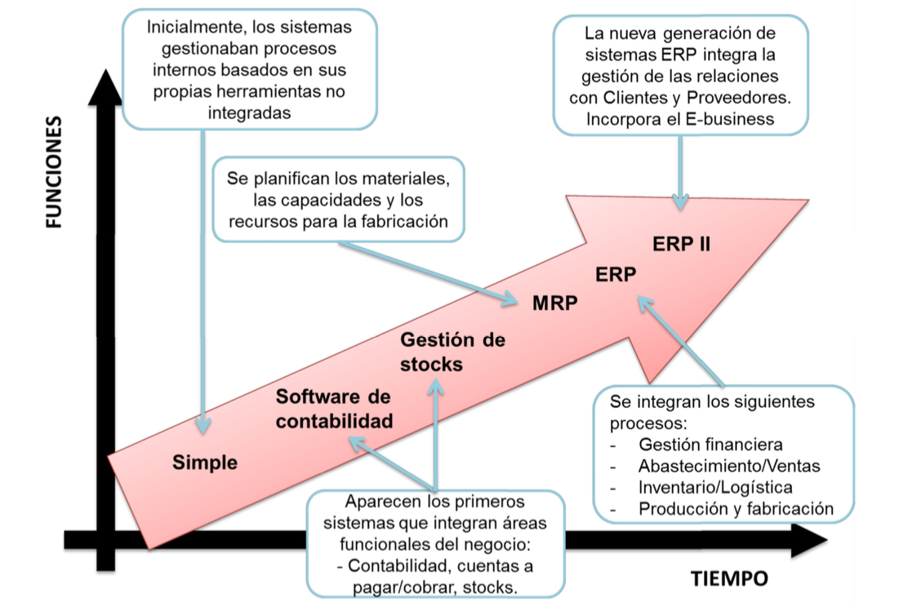
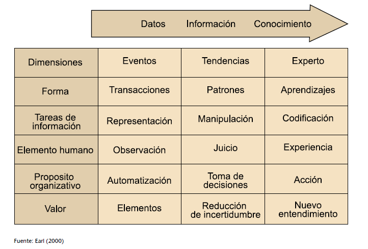
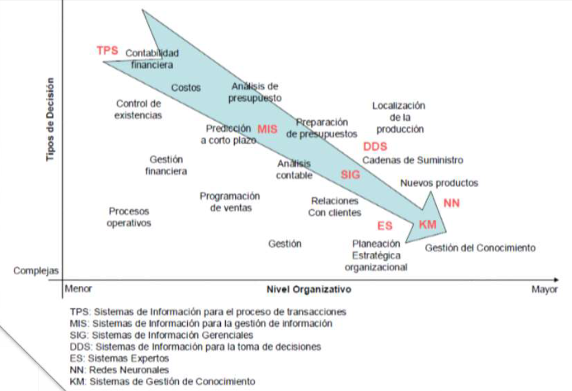
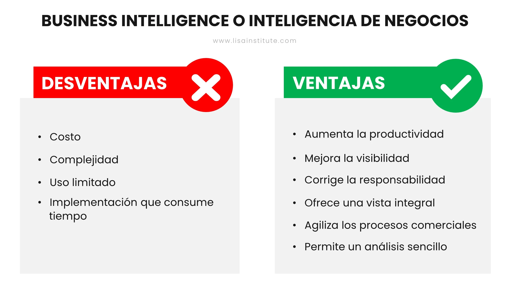
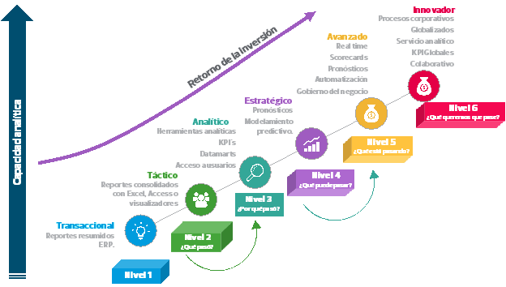
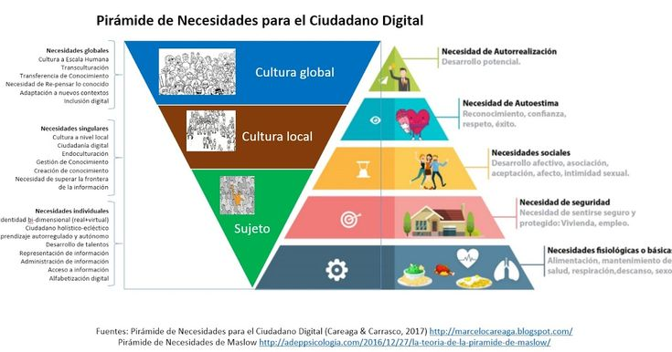
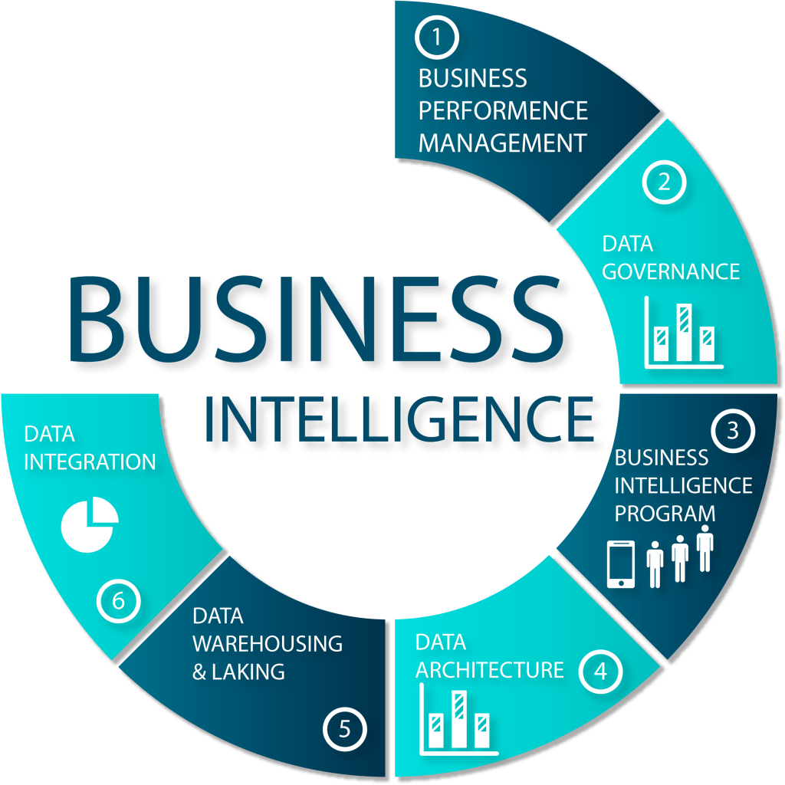

---
marp:true
---
# SISTEMAS DE INFORMACIÓN

> "Son un consultor e investigador que se centra na intersección dos sistemas de información e o comportamento e o cambio nas organizacións. A miña perspectiva xeral é que os sistemas de información carecen de valor a menos que proporcionen mellor información ou mellores formas de facer negocios". 
>
> Thomas Davenport (1999)

---

---

As continuas innovacións nas TIC - Internet, a rede sen arames, os teléfonos móbiles, o nG ou o *cloud computing*- xunto ao aumento dos servizos asociados como o e-commerce,  o m-commerce ou o e-government, a e-medicina, a demais dos blogs, as comunidades virtuais, a autoedición de contidos,... son realidades que están a transformar o mundo. Tamén, ou sobre todo, o mundo do negocio empresarial; con novos modelos, procesos e, porque non, tamén novas necesidades empresariais.

---

Neste ambiente, as empresas reclaman ferramentas para xestionar e optimizar os seus procesos de negocio. 

---

---

Nunha entorna dinámica onde os cambios se suceden de xeito vertixinoso, se necesitan sistemas de información que integren nunha visión global os seus procesos de negocio, ...incluíndo a outras empresas que colaboran e/ou cooperan na cadea de subministro, e aos diferentes actores que participan neste escenario coma os clientes, os socios, os empregados ou os provedores.

---

Implantar un sistema de xestión integral destas características non é sinxelo, implica xeralmente unha inversión económica pero tamén cunha alta probabilidade de ROI inmediato, e a participación dun equipo experto. pero si posible e rendible a curto prazo.

---

---

Os principais beneficios son: o aumento da vantaxe competitiva e o aliñamento da estratexia de negocio coas TIC.

---

---

Nun sentido amplo, un sistema de información é un conxunto de elementos interrelacionados - -  que permiten transformar os datos en información e coñecemento, para poñelo a disposición dos empregados e directivos da organización e que estes poidan utilizalos na toma de decisións, na planificación, na mellora de procesos ou alí onde máis conveña.

---

---

Os sistemas de información de empresa son aplicacións que permiten rexistrar operacións, dar apoio aos procesos de traballo, axudar na toma de decisións e obter vantaxe de eficiencia ou competitividade. 

---

- os programas que soportan os ingresos e reintegros dos caixeiros automáticos, 
- os sistemas de xestión automatizada de pedidos dun restaurante,
- os sistemas que permiten a reposición automática de existencias dun almacén,
- os programas de contabilidade que xestionan nóminas, ingresos, gastos,... 
- o sistema de admisións, altas e localización de pacientes dun hospital, 
- o sistema de información comercial e vendas dunha tenda - en Internet 
- ou o alugamento de bicicletas dunha cidade... 

Todos eles son sistemas de información de empresa.

---

Nos seus inicios, estes sistemas cubrían de forma especializada un área ou grupo de procesos da empresa, como a función comercial, o proceso económico-financeiro, a planificación e xestión da produción... 

---

---

Máis recentemente, sistemas que naceron para apoiar unha función ou departamento da empresa (por exemplo, o departamento económico-financeiro) fóronse combinando e/ou completando con outras funcionalidades para cubrir todas, ou case todas, as áreas da empresa. Falamos logo de **sistemas integrados**.

---

Miles de empresas de todo o mundo e de todos os tamaños adoptaron os sistemas integrados, que prometían, a demais dunha redución de custes de mantemento, a *compartimentación* de datos e procesos entre departamentos, a homoxeneización e optimización dos procesos de traballo dentro da empresa ou entre as súas diferentes filiais, e tamén a reinxeniería.

---

---

A explosión das comunicacións entre empresas e, particularmente, a globalización de Internet, permitiu que os sistemas de empresa den apoio aos procesos internos da empresa e a demais melloren as relacións cos seus clientes, provedores e socios, coma nos sistemas de comercio electrónico ou os sistemas de xestión de produción e pedidos "xusto a tempo" (*just in time*).

---

### ERP - Planificación de recursos empresariais.

---

Un ERP, ou sistema de planificación de recursos empresariais, é un conxunto de aplicacións relacionadas cos procesos de negocio dunha empresa, que permite lograr os obxectivos estratéxicos definidos polos directivos da organización.

---

*"Un sistema ERP é un paquete de software comercial que promete a integración de toda a información que flúe a través da empresa: financeira e contable, recursos humanos, cadea de subministro e cliente"*. Davenport (2000) 

---

*"É un método para unha planificación efectiva e un control de todos os recursos necesarios para producir, enviar e contabilizar os pedidos realizados polos clientes nunha empresa de produción, distribución ou servizos"*. M. A. Rashid (2002)

---

*"Son sistemas de información que integran os procesos clave do negocio de forma que a información flúa libremente entre as diferentes partes da empresa, mellorando a coordinación, a eficacia e o proceso de tomar decisións"*. Laudon e Laudon (2004)

---

*"Un ERP é un sistema de información que permite á organización xestionar os seus recursos de forma eficiente e eficaz. Ofrecendo unha solución total e integrada, que cubre as necesidades de procesamento da información que flúe na organización. Soportando unha visión orientada aos procesos das organizacións"*. Nah (2001)

---

Os sistemas ERP son ferramentas para a transformación dos procesos de negocio, deixando moi atrás aos sistemas de xestión pasiva - follas de calculo, bases de datos documentais,....-.

---

Aspectos máis destacados: 

- Ten unha gran capacidade de adaptación, de modularidade e de integración da información con outro tipo de programas. 
- Están deseñados para cubrir todas as exixencias das áreas funcionais da empresa, creando un fluxo de trabajo (workflow) que permite axilizar os diferentes tipos de traballo.
- Reduce as tarefas repetitivas e facilita a comunicación entre todas as áreas que integran a empresa (incluso os socios da cadea de subministro fora da organización), coa seguridade de dispoñer duns datos correctos.
- Permite personalizar o sistema ERP segundo as necesidades específicas de cada empresa - hasta certos límites.

---

O concepto ERP irá evolucionando ao longo dos próximos anos impulsado polas novas entornas de negocio, as innovacións nas TIC, as necesidades das empresas e a capacidade dos provedores de desenvolvemento de software.

---

---

Os novos modelos de negocio son multiempresa con redes de colaboración, centradas no cliente, o que reflexa un aumento da integración da empresa co exterior.

---

O e-commerce é unha das evolucións máis importantes nos negocios dos últimos cincuenta anos. Internet, intranets e extranets fan posible as múltiples formas de e-commerce (B2B, B2C, C2C...). 

---

A tecnoloxía sen arames e os dispositivos móbiles farán que o m-commerce tome relevancia e posiblemente desprace ao e-commerce.

---

O uso de Internet en calquera momento e en calquera lugar dará paso a novos servizos e a novos modelos de negocio. 

---

As actividades e os procesos do back-office e o front-office que se adaptaron ao e-commerce terán que adaptarse a eses novos modelos. Ou aínda máis: implantalos.

---

As plataformas de arquitectura deberán ter - aínda máis- capacidade para mover gran cantidade de datos en calquera formato, idioma e lugar, en tempo case real.

---

Nesta entorna as empresas incorporan o uso de portais de información, tanto do negocio interno como externo, de xeito cada vez máis habitual. 

---

---

| Sistema | Necesidade de negocio | Ámbitos de aplicación | Tecnoloxía                                                   |
| ------- | --------------------- | --------------------- | ------------------------------------------------------------ |
| **MRP** | Eficiencia | Xestión de inventario Planificación e control da produción | Computadores mainframe Procesamento batch Sistemas de arquivos |
| **MRP-II** | Eficiencia Eficacia e integración co sistema de produción | Extensión a toda a empresa de manufactura | Mainframes Procesamento en tempo real SXBD relacional |
| **ERP** | Eficiencia (principalmente do back-office) Eficacia e integración de tódolos sistemas da organización | Extensión a tódolos sistemas da empresa | Mainframes Microcomputadores en rede cliente/servidor Procesamento distribuído Data warehousing Xestión do coñecemento |
| **ERP-II** | Eficiencia Eficacia e integración dentro de e entre empresas | Extensión ao exterior da empresa Relación co cliente e o provedor | Sistemas cliente/servidor Computación distribuída Tecnoloxía Internet (servizos web, intranets, extranets) |
| **ERP actual** | Eficiencia Eficacia e integración dentro de e entre todos os compoñentes relevantes (consumidores, empresas...) a escala mundial | Toda a organización se estende a outras organizacións (socios, clientes, provedores...) e-commerce | Internet Arquitectura Servizos web Rede sin arames Xestión coñecemento |
| **ERP futuro**  (suite empresarial) | Eficiencia Eficacia e integración dos novos servizos m-commerce | Toda a organización e os seus compoñentes na cadea de valor, así como outras organizacións m-commerce. | Internet Arquitectura máis abertas, Rede sin arames, dispositivos móbiles, intelixencia artificial, *Cloud computing* |

Fonte: *McGaughey & Gunasekaran* (2007) 

---

## Arquitectura do sistema ERP

---

#### Perspectiva funcional
Un sistema ERP é un paquete estandarizado de software deseñado para integrar os procesos dunha empresa. Polo xeral un ERP se compón dunha base de datos centralizada e varios módulos destinados a dar apoio ás áreas principais dunha organización.

---

---

**CRM (*customer relationship management*)**: Xestión de vendas e **clientes**

**SCM (*supply chain management*)**: Relacións cos **provedores**

**PRM (*partnership relationship management*)**: Relacións cos **socios**

**KM, BI, DSS** ... : Relacións cos **empregados** e a dirección

---

##### Xestión de rr.hh. 

Aquí atopamos un conxunto desigual e desintegrado de aplicacións ou solucións parciais:

- **DSS (*decision suport systems*)**: sistemas de axuda á toma de decisións, como p.ex. un sistema que optimice as rutas de transporte;
- **BI (*business intelligence*)**: os BI ou sistemas informacionais, van desde os cadros de mandos de dirección hasta os sistemas de análise de gran volume de datos ou intelixencia de negocio;
- **KM (*knowledge management*)**: os sistemas de xestión do coñecemento permiten trazar "quen sabe que" ou onde se pode atopar unha información dentro da empresa;
- ou as intranets e portais de servizos ao empregado, para pedir unhas vacacións ou apuntarse a un curso.

---

_ref:_

https://www.juanbarrios.com/sistemas-de-informacion-el-business-intelligence/

https://riunet.upv.es/bitstream/handle/10251/16396/sistemas%20integrados%20de%20gesti%EF%BF%BDn%20empresarial_6056.pdf?sequence=1

https://www.lisainstitute.com/blogs/blog/business-intelligence-inteligencia-de-negocios	

---

