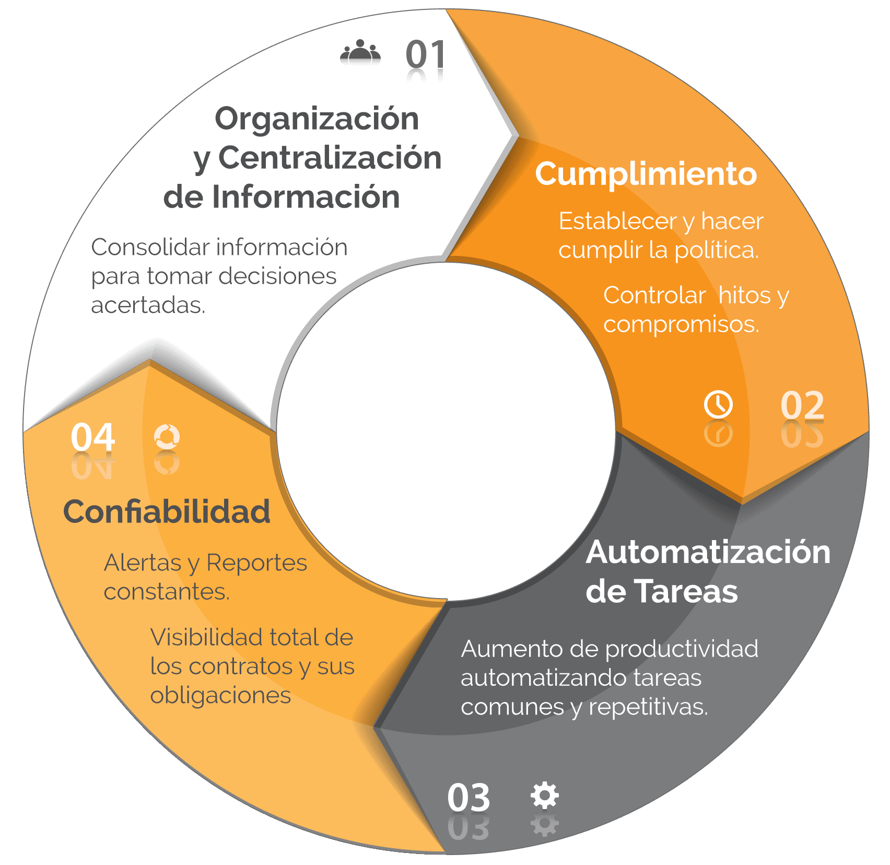
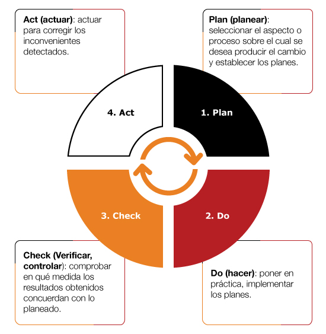

# Sistemas de información

**Os sistemas de información teñen como obxectivo xenérico recompilar datos dixitais, de natureza e fontes diversas, co cometido de tratar e empregar ditos datos de xeito que contribúan á obtención dun obxectivo común aliñado cos obxectivos do proxecto, empresa ou organización.**

Un sistema de información ten como obxectivo principal a xestión e administración dos datos e información que o integran. O importante é poder recuperar eses datos, cun acceso sinxelo e seguro, en calquera momento.

Os compoñentes dun sistema de información permiten unha serie de procesos que, basicamente, consisten en: **obtención e/ou entrada de datos**, **xestión e tratamento**, **almacenamento** e **saída**. Aos que contribúen distintos actores interesados no sistema de información dado.

Os elementos do sistema de información traballan conxuntamente e cos mesmos obxectivos para conseguir o correcto uso e administración de calquera información concreta.

## Como funciona un sistema de información

Por enriba das moitas particularidades dos moitos sistemas dedicados que poden formar parte dun sistema de información, da súa arquitectura e do obxectivo empresarial ao que está orientado, estes pasos resumen a súa metodoloxía habitual:

- **A entrada de información.** Neste paso, a información é obtida de forma automática e/ou introducida de forma manual. A introdución manual a soe protagonizar directamente unha persoa usuaria. A introdución automática xeralmente é xestionada a través diferentes módulos de software especializado que recompilan información das diferentes áreas da empresa, posiblemente cada unha con modelos de datos diferentes - xestión ofimática, IoT, control numérico de procesos, CAD. As formas máis habituais de entrada de rexistros e datos son: os códigos de barras, o teclado de ordenador, as caixas rexistradoras, os sistemas de voz, escáner, e tamén as cámaras de vixilancia, os controis robóticos, os dispositivos TIC conectados,...
- **O tratamento da información rexistrada.** Cada sistema de información dispón dunha serie de operacións e accións configuradas e establecidas en aliñamento cos obxectivos estratéxicos da empresa e/ou organización. Unha vez introducidos os datos, estes se transforman en información grazas a xestión e tratamento dos mesmos - valoración, investigación e análise estatístico, presentación,...- E dita información quedara a disposición da empresa para levar a cabo: un balance ou visión xeral, a toma de decisións, a mellora de procesos, a documentación da actividade,...
- **Almacenamento de información.** Se trata de rexistrar a información no sistema - como arquivos nun ordenador ou coma rexistros nalgún sistema de xestión de base de datos, por exemplo-. Deste xeito, se queres revisala ou acceder a ela cando sexa necesario, sempre estará **almacenada** e **accesible** para as tarefas que se precisen. Os sistemas de almacenamento tamén forman parte do sistema de información, e non é un asusto menor: a súa natureza - discos duros internos ou extraíbles, mainframes, CD, a *nube*,.... e terase que avaliar a fiabilidade e durabilidade, a seguridade no acceso, as copias de seguridade, o seu mantemento,... antes de decidirse polo máis axe
- **A saída da información.** Á información que se inclúe nun sistema de información, facilita que un usuario teña acceso a ela e poida obtelo a través de diferentes dispositivos como: usb, impresoras, sistemas de voz, ordenadores, móbiles,.... A demais os sistemas de información permiten xestionalo acceso á información en base a distintos parámetros preestablecidos - permisos, roles, capacidade de decisión,...

## Algúns sistemas de información comúns en empresas e organizacións

Existen innumerables sistemas de información de distinta natureza e con distinto cometido, pero esta podería ser unha *categorización* utilitaria:

- **Sistemas de información en marketing e comunicación.** O seu obxectivo principal é a venda e promoción de artigos. E tamén a creación de información e datos para que este tipo de artigos se dean a coñecer e atraian o interese público.
- **Os sistemas de información de xestión (MIS).** Son sistemas do máis importante, e baséanse en achegar a información máis destacada e relevante que precisa a empresa para a toma de decisións.
- **Os sistemas de procesamento de transaccións (TPS).** Neste caso, os datos aquí incluídos refírense ás actividades comerciais da empresa - TPV, caixas rexistradoras, sistemas de pago on-line,...-.
- **Os sistemas de apoio ao executivo (EIS).** Especialmente deseñado para proporcionar información e datos relevantes para a toma de decisións estratéxicas específicas.
- **Os sistemas de toma de decisións grupais (GDSS).** Preténdese que a información sexa compartida entre os compoñentes do grupo para que se faciliten as tarefas de traballo e a cooperación.
- **Sistemas de información para expertos (EDSS).** Se trataría de compartir datos de interese entre determinados segmentos e especialistas no tratamento e valoración desa información especializada.

## Elementos dun sistema de información

- **Persoas:**
  - Usuarios internos:
    - Directivos
    - Mandos medios
    - Departamentos
  - Usuarios externos:
    - Clientes
    - Colaboradores
    - Provedores
- **Entorna tecnolóxica**
  - Hardware
  - Software
  - Subsistemas
- **Obxectivos**
  - Estratéxicos
  - Transaccionais

##  Sistemas de información e filosofía de mellora continua

---

 [_ref.:_](https://economipedia.com/definiciones/sistema-de-informacion.html)