# Tutorial UML

A Unified Modeling Language (UML) converteuse rapidamente no estándar de facto para a construción de software orientado a obxectos. Este tutorial ofrece unha visión xeral técnica dos 13 diagramas UML admitidos polo Enterprise Architect. A semántica de UML 2 explícase en detalle no [titorial de UML 2.0](https://sparxsystems-com/resources/tutorials/uml2/index.html) .

# I Parte

## Que é UML?

### A especificación [do Object Management Group (OMG)](https://www.omg.org/about/index.htm) indica:

*"A Linguaxe de Modelado Unificado (UML) é unha linguaxe gráfica para visualizar, especificar, construír e documentar os artefactos dun sistema intensivo en software. O UML ofrece unha forma estándar de escribir os planos dun sistema, incluíndo cousas conceptuais como procesos de negocio e funcións do sistema así como cousas concretas como instrucións da linguaxe de programación, esquemas de bases de datos e compoñentes de software reutilizables".*

O punto importante a destacar aquí é que UML é unha "linguaxe" para especificar e non un método ou procedemento. O UML **úsase para definir un sistema de softwar**e; para **detallar os artefactos do sistema**, para **documentar** e **construír** - é a linguaxe na que está escrito o proxecto. O UML pódese usar de varias maneiras para apoiar unha metodoloxía [de desenvolvemento de software](https://sparxsystems.com/platforms/software_development.html) (como o Proceso Unificado Racional) - pero en si mesmo non especifica esa metodoloxía ou proceso.

UML define a notación e a semántica para os seguintes dominios:

- O Modelo de Interacción do Usuario ou ***Caso de Uso***: describe o límite e a interacción entre o sistema e os usuarios. Corresponde nalgúns aspectos a un modelo de requisitos.
- O modelo de interacción ou comunicación: describe como os obxectos do sistema interactuarán entre si para facer o traballo.
- O modelo de estado ou dinámico: os gráficos de estado describen os estados ou condicións que as clases asuman ao longo do tempo. Os gráficos de actividade describen os fluxos de traballo que implementará o sistema.
- O modelo lóxico ou de clase: describe as clases e obxectos que formarán o sistema.
- O modelo de compoñentes físicos : describe o software (e ás veces os compoñentes de hardware) que compoñen o sistema.
- O modelo de implantación física: describe a arquitectura física e a implantación de compoñentes nesa arquitectura de hardware.

O UML tamén define mecanismos de extensión para estender o UML para satisfacer necesidades especiais (por exemplo , extensións [de modelado de procesos de negocio ).](https://sparxsystems-com/platforms/business_process_modeling.html)

Na II Parte se amplía como usa o UML para definir e construír sistemas reais.

~~Tamén podes consultar [Modelado de procesos de negocio (pdf)](https://sparxsystems-com/downloads/whitepapers/The_Business_Process_Model.pdf), ou outras guías da linguaxe UML .~~

 

## O modelo de caso de uso

Un modelo de caso de uso describe a funcionalidade proposta dun novo sistema. Un caso de uso representa unha unidade discreta de interacción entre un usuario (humano ou máquina) e o sistema. Esta interacción é unha única unidade de traballo significativo, como *Crear conta* ou *Ver detalles da conta*.

Cada caso de uso describe a funcionalidade que se vai construír no sistema proposto, que pode incluír a funcionalidade doutro caso de uso ou estender outro caso de uso co seu propio comportamento.

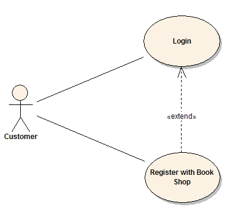

A descrición do caso de uso xeralmente incluirá:

- Comentarios xerais e notas que describen o caso de uso.
- Requisitos: os requisitos funcionais formais dos elementos que un caso de uso debe proporcionar ao usuario final, como ``<capacidade de actualizar a orde>``. Estes corresponden ás especificacións funcionais que se atopan nas metodoloxías estruturadas, e forman un contrato que o Caso de Uso realiza algunha acción ou aporta algún valor ao sistema.
- Restricións: as regras e limitacións formais coas que opera un caso de uso, que definen o que se pode e non se pode facer. Estes inclúen:
  - Condicións previas que xa deben ter ocorrido ou estar en vigor antes de executar o caso de uso; por exemplo, ``<crear orde>`` debe preceder a ``<modificar orde>``
  - Condicións posteriores que deben ser certas unha vez que se complete o caso de uso; por exemplo, ``<a orde é modificada e consistente>``
  - Invariantes que deben ser sempre verdadeiros durante todo o tempo que funciona o Caso de Uso; por exemplo, un pedido sempre debe ter un número de cliente.
- Escenarios: descricións formais e secuenciais dos pasos realizados para levar a cabo o caso de uso ou o fluxo de eventos que ocorren durante unha instancia de caso de uso. Estes poden incluír varios escenarios, para atender circunstancias excepcionais e camiños de procesamento alternativos. Estes adoitan crearse en texto e corresponden a unha representación textual do Diagrama de secuencia.
- Diagramas de escenarios - Diagramas de secuencia para representar o fluxo de traballo; similar a Escenarios pero representado graficamente.
- Atributos adicionais, como fase de implementación, número de versión, clasificación de complexidade, estereotipo e estado.

### Actores

Os casos de uso adoitan estar relacionados con "actores", que son entidades humanas ou de máquina que usan ou interactúan co sistema para realizar un traballo significativo que lles axude a alcanzar un obxectivo. O conxunto de casos de uso aos que un actor ten acceso define o seu papel global no sistema e o alcance da súa acción.

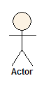

### Inclúe e amplía as relacións entre casos de uso

Un caso de uso pode incluír a funcionalidade doutro como parte do seu procesamento normal. Xeralmente, asúmese que o caso de uso incluído se chama cada vez que se executa a ruta básica. Por exemplo, ao enumerar un conxunto de pedidos de clientes para escoller antes de modificar un pedido seleccionado, o caso de uso ``<list orders>`` incluiríase cada vez que se executa o caso de uso ``<modify order>``.

Un caso de uso pódese incluír noutro ou máis casos de uso, polo que axuda a reducir a duplicación de funcionalidades eliminando o comportamento común nos casos de uso que se reutilizan moitas veces.

Un caso de uso pode estender o comportamento doutro, normalmente cando se dan circunstancias excepcionais. Por exemplo, se un usuario debe obter a aprobación dalgunha autoridade superior antes de modificar un tipo particular de pedido de cliente, entón o caso de uso <obter aprobación> podería estender opcionalmente o caso de uso ``<modify order>`` normal.

## Diagramas de secuencia

Os diagramas de secuencia **proporcionan unha representación gráfica das interaccións dos obxectos ao longo do tempo**. Estes normalmente mostran un usuario ou actor, e os obxectos e compoñentes cos que interactúan na execución dun caso de uso. Un diagrama de secuencia normalmente representa un único "escenario" de caso de uso ou fluxo de eventos.

Os diagramas de secuencia son unha excelente forma de documentar escenarios de uso e tanto de capturar os obxectos necesarios no inicio da análise como de verificar o seu uso máis tarde no deseño. Os diagramas mostran o fluxo de mensaxes dun obxecto a outro e, como tal, corresponden aos métodos e eventos soportados por unha clase/obxecto.

O seguinte exemplo de diagrama de secuencia mostra ao usuario ou actor da esquerda iniciando un fluxo de eventos e mensaxes que se corresponden co escenario de caso de uso. As mensaxes que pasan entre obxectos convértense en operacións de clase no modelo final.

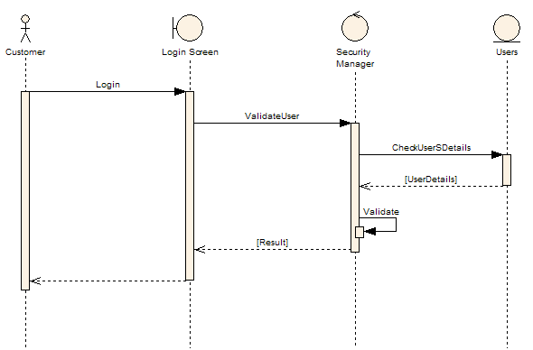

## Diagrama de implementación

Un caso de uso é unha descrición formal da funcionalidade que terá o sistema cando estea construído. Normalmente, un diagrama de implementación está asociado a un caso de uso para documentar que elementos de deseño (por exemplo, compoñentes e clases) implementan a funcionalidade do caso de uso no novo sistema. Isto proporciona un alto nivel de trazabilidade para o deseñador do sistema, o cliente e o equipo que realmente construirá o sistema. A lista de casos de uso aos que un compoñente ou clase está ligado documenta a funcionalidade mínima que debe implementar o compoñente.

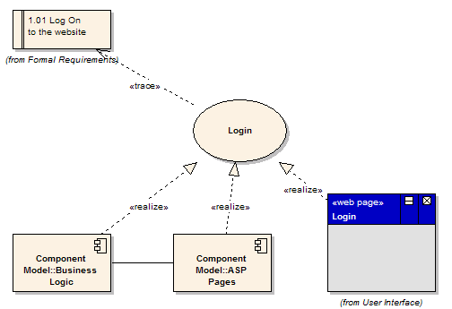

O exemplo anterior mostra que o caso de uso "Iniciar sesión" implementa o requisito formal "1.01 Iniciar sesión no sitio web". Tamén mostra que o compoñente "Lóxica empresarial" e o compoñente "Páxinas ASP" implementan algunha ou toda a funcionalidade de "Iniciar sesión". Outro perfeccionamento é mostrar a pantalla "Iniciar sesión" (unha páxina web) como a implementación do caso de uso "Iniciar sesión". Estes enlaces de implementación ou realización definen a trazabilidade desde os requisitos formais, pasando por casos de uso ata compoñentes e pantallas.

## O modelo dinámico

O modelo dinámico úsase para expresar e modelar o comportamento do sistema ao longo do tempo. Inclúe soporte para diagramas de actividades, diagramas de estado, diagramas de secuencia e extensións, incluíndo [o modelado de procesos de negocio](https://sparxsystems.com/platforms/business_process_modeling.html) .

### Diagramas de secuencia

Os diagramas de secuencia úsanse para mostrar a interacción entre usuarios, pantallas, obxectos e entidades dentro do sistema. Ofrece un mapa secuencial de mensaxes que pasan entre obxectos ao longo do tempo. Con frecuencia, estes diagramas colócanse baixo Casos de uso do modelo para ilustrar o escenario de caso de uso: como interactuará un usuario co sistema e que ocorre internamente para facer o traballo. Moitas veces, os obxectos represéntanse mediante iconas estereotipadas especiais, como no seguinte exemplo. O obxecto etiquetado Pantalla de inicio de sesión móstrase mediante a icona da Interface de usuario. O obxecto etiquetado SecurityManager móstrase mediante a icona do controlador. O Obxecto etiquetado como usuarios móstrase mediante a icona Entidade.

### Diagramas de actividades

Os diagramas de actividades utilízanse para mostrar como se constrúen os diferentes fluxos de traballo no sistema, como comezan e os posibles moitos camiños de decisión que se poden tomar de principio a fin. Tamén poden ilustrar onde se pode producir un procesamento paralelo na execución dalgunhas actividades.

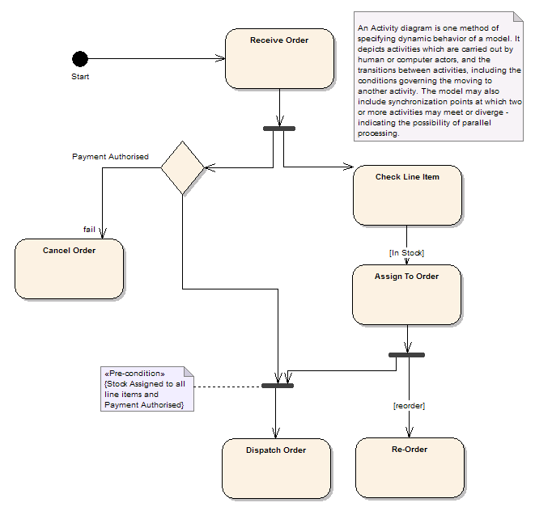

### Gráficas de estado

Os gráficos de estado utilízanse para detallar as transicións ou os cambios de estado polos que pode pasar un obxecto no sistema. Mostran como un obxecto se move dun estado a outro e as regras que rexen ese cambio. Os gráficos de estado normalmente teñen unha condición de inicio e fin.

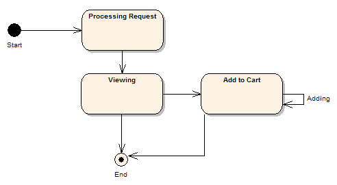

### Modelo de proceso

Un modelo de proceso é unha extensión UML dun diagrama de actividades que se usa para modelar un proceso de negocio; este diagrama mostra o obxectivo que ten o proceso, as entradas, saídas, eventos e información que interveñen no proceso.

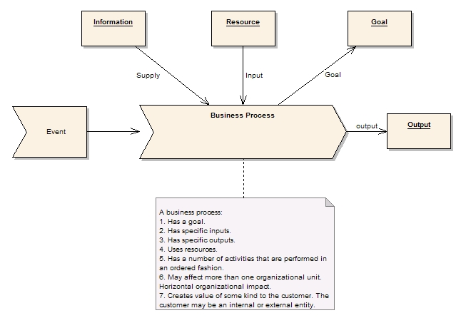

## O modelo lóxico

Un modelo lóxico é unha vista estática dos obxectos e clases que constitúen o espazo de deseño/análise. Normalmente, un Modelo de Dominio é unha visión máis laxa e de alto nivel dos obxectos e entidades de negocio, mentres que o Modelo de Clase é un modelo máis rigoroso e centrado no deseño. Esta discusión refírese principalmente ao modelo de clase

### O modelo de clase

Unha clase é unha construción UML estándar que se usa para detallar o patrón a partir do cal se producirán os obxectos en tempo de execución. Unha clase é unha especificación - un obxecto unha instancia dunha clase. As clases poden ser herdadas doutras clases (é dicir, herdan todo o comportamento e estado dos seus pais e engaden novas funcionalidades propias), teñen outras clases como atributos, delegan responsabilidades noutras clases e implementan interfaces abstractas.

O modelo de clase está no núcleo do desenvolvemento e deseño orientado a obxectos: expresa tanto o estado persistente do sistema como o comportamento do sistema. Unha clase encapsula o estado (atributos) e ofrece servizos para manipular ese estado (comportamento). Un bo deseño orientado a obxectos limita o acceso directo aos atributos de clase e ofrece servizos que manipulan atributos en nome da persoa que chama. Esta ocultación de datos e a exposición dos servizos garante que as actualizacións de datos só se fagan nun só lugar e segundo regras específicas: para sistemas grandes, a carga de mantemento do código que ten acceso directo aos elementos de datos en moitos lugares é extremadamente alta.

A clase está representada como segue:

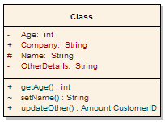

Teña en conta que a clase ten tres áreas distintas:

1. O nome da clase (e estereotipo se se aplica)
2. A área de atributos de clase (é dicir, elementos de datos internos)
3. O comportamento - tanto privado como público

Os atributos e métodos pódense marcar como

- Privado, indicando que non son visibles para os que chaman fóra da clase
- Protexidos, só son visibles para os nenos da clase
- Públicos, son visibles para todos

#### Herdanza

A herdanza de clases móstrase como se indica a continuación: unha clase abstracta neste caso é o pai de dous fillos, cada un dos cales herda as características da clase base e estendeo co seu propio comportamento.

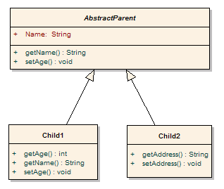

Os modelos de clase pódense recoller en paquetes de comportamento e estado relacionados. O diagrama de abaixo ilustra isto.

## Modelo de compoñentes

O modelo de compoñentes ilustra os compoñentes de software que se utilizarán para construír o sistema. Estes poden ser construídos a partir do modelo de clase e escritos desde cero para o novo sistema, ou poden ser traídos doutros proxectos e provedores de terceiros. Os compoñentes son agregacións de alto nivel de pezas de software máis pequenas e proporcionan un enfoque de bloques de construción de "caixa negra" para a construción de software.

### Notación de compoñentes

Un compoñente pode ser algo así como un control ActiveX, xa sexa un control de interface de usuario ou un servidor de regras de negocio. Os compoñentes son debuxados como mostra o seguinte diagrama:

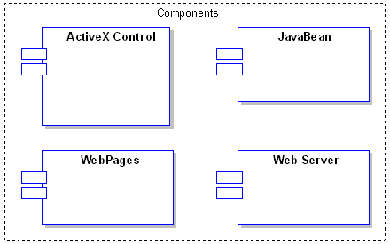

### Diagrama de compoñentes

O diagrama de compoñentes mostra a relación entre os compoñentes do software, as súas dependencias, a comunicación, a localización e outras condicións.

#### Interfaces

Os compoñentes tamén poden expoñer interfaces. Estes son os puntos de entrada visibles ou os servizos que un compoñente está anunciando e poñendo a disposición doutros compoñentes e clases de software. Normalmente un compoñente está formado por moitas clases internas e paquetes de clases. Incluso pode ser ensamblado a partir dunha colección de compoñentes máis pequenos.

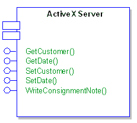

#### Compoñentes e nós

Un diagrama de implantación ilustra a implantación física do sistema nun ambiente de produción (ou de proba). Mostra onde estarán os compoñentes, en que servidores, máquinas ou hardware. Pode ilustrar ligazóns de rede, ancho de banda LAN, etc.

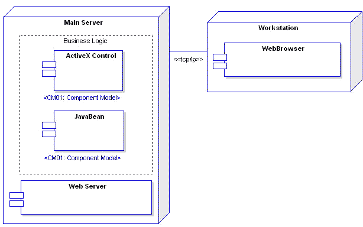

#### Requisitos

Os compoñentes poden ter requisitos adxuntos para indicar as súas obrigas contractuais, é dicir, que servizo prestarán no modelo. Os requisitos axudan a documentar o comportamento funcional dos elementos de software.

#### Restricións

Os compoñentes poden ter restricións asociadas que indican o ambiente no que operan. As condicións previas especifican o que debe ser verdadeiro antes de que un compoñente poida realizar algunha función; as poscondicións indican o que será certo despois de que un compoñente teña feito algún traballo e os invariantes especifican o que debe permanecer certo durante a duración da vida útil dos compoñentes.

#### Escenarios

Os escenarios son descricións textuais/procedurais das accións dun obxecto ao longo do tempo e describen a forma en que funciona un compoñente. Pódense crear varios escenarios para describir o camiño básico (un percorrido perfecto), así como excepcións, erros e outras condicións.

#### Trazabilidade

Pode indicar a trazabilidade mediante ligazóns de realización. Un compoñente pode implementar outro elemento modelo (por exemplo, un caso de uso) ou un compoñente pode ser implementado por outro elemento (por exemplo, un paquete de clases). Ao proporcionar ligazóns de realización a e desde os compoñentes, pode mapear as dependencias entre os elementos do modelo e a trazabilidade desde os requisitos iniciais ata a implementación final.

### Un Exemplo

O seguinte exemplo mostra como se poden ligar compoñentes para proporcionar unha visión conceptual/lóxica da construción dun sistema. Este exemplo refírese ao servidor e aos elementos de seguridade dunha librería en liña. Inclúe elementos como o servidor web, o firewall, as páxinas ASP, etc.

#### Compoñentes do servidor

Este diagrama ilustra a disposición dos principais compoñentes do lado do servidor que requirirán a construción dunha librería en liña. Estes compoñentes son unha mestura de elementos personalizados e comprados que se ensamblarán para proporcionar a funcionalidade necesaria.

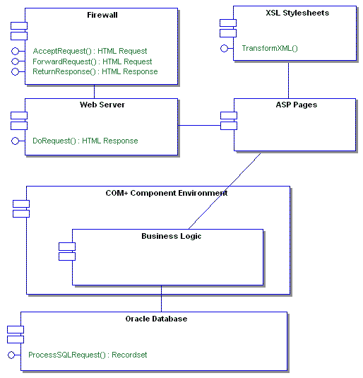

#### Compoñentes de seguridade

O diagrama de compoñentes de seguridade mostra como o software de seguranza, como a autoridade de certificación, o navegador, o servidor web e outros elementos do modelo traballan xuntos para garantir as disposicións de seguridade no sistema proposto.

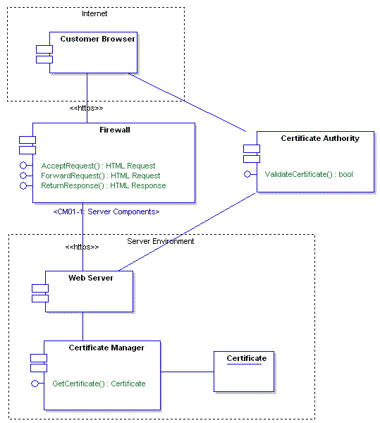

## O Modelo Físico

O modelo físico ou de implantación proporciona un modelo detallado da forma en que os compoñentes se implementarán na infraestrutura do sistema. Detalla as capacidades de rede, as especificacións do servidor, os requisitos de hardware e outra información relacionada coa implantación do sistema proposto.

### Vista de implantación

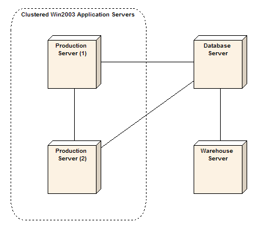

### Modelo físico

O modelo físico mostra onde e como se implantarán os compoñentes do sistema. É un mapa específico da disposición física do sistema. Un diagrama de implantación ilustra a implantación física do sistema nun ambiente de produción (ou de proba). Mostra onde estarán os compoñentes, en que servidores, máquinas ou hardware. Pode ilustrar ligazóns de rede, ancho de banda LAN, etc.

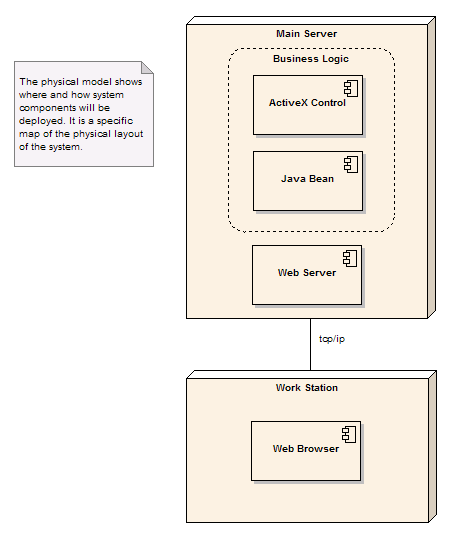

Un nodo úsase para representar calquera servidor, estación de traballo ou outro hardware host usado para implantar compoñentes no ambiente de produción. Tamén pode especificar as ligazóns entre nós e asignarlles estereotipos (como TCP/IP) e requisitos. Os nós tamén poden ter características de rendemento, estándares mínimos de hardware, niveis de sistema operativo, etc. documentados. A seguinte pantalla ilustra as propiedades comúns que pode establecer para un nodo.

# II Parte

Sabemos que o UML é unha linguaxe para especificar os artefactos e as interaccións dun sistema de software. Tamén que se ocupa de 6 dominios principais -desde modelos de casos de uso, pasando por modelos dinámicos e lóxicos ata o modelo de despregamento físico final- e que se incluíron mecanismos de extensión para permitir adicións especializadas á notación do modelo.

**Entón... Como usas o UML?**

O UML úsase normalmente como parte dun proceso de [desenvolvemento de software](https://sparxsystems.com/platforms/software_development.html) , co apoio dunha ferramenta CASE adecuada , para definir os requisitos, as interaccións e os elementos do sistema de software proposto. A natureza exacta do proceso depende da metodoloxía de desenvolvemento utilizada. Un proceso de exemplo pode parecerse ao seguinte:

1. [Utilizarase un modelo de proceso de negocio](https://sparxsystems.com/resources/tutorials/uml/business-process-model.html) capturado para definir as actividades e procesos comerciais de alto nivel que se producen nunha organización e para proporcionar unha base para o modelo de caso de uso. O [Modelo de Procesos de Negocio](https://sparxsystems.com/platforms/business_process_modeling.html) normalmente capturará máis do que implementará un sistema de software (é dicir, inclúe procesos manuais e outros).
2. Asigne un modelo de [caso de uso ao modelo](https://sparxsystems.com/resources/tutorials/uml/use-case-model.html) de [proceso empresarial](https://sparxsystems.com/platforms/business_process_modeling.html) para definir exactamente a funcionalidade que pretende proporcionar desde a perspectiva do usuario empresarial. A medida que se engade cada caso de uso, cree unha ligazón rastrexable desde os procesos de negocio adecuados ata o caso de uso (é dicir, unha conexión de realización). Este mapeo indica claramente que funcionalidades proporcionará o novo sistema para satisfacer os requisitos de negocio descritos no modelo de proceso. Tamén garante que non existan casos de uso sen propósito.
3. Refina os casos de uso: inclúe requisitos, restricións, clasificación de complexidade, notas e escenarios. Esta información describe sen ambigüidades o que fai o Caso de Uso, como se executa e as limitacións na súa execución. Asegúrate de que o caso de uso segue cumprindo os requisitos do proceso empresarial. Incluír a definición de probas do sistema para cada caso de uso para definir os criterios de aceptación para cada caso de uso. Inclúe tamén algúns scripts de proba de aceptación do usuario para definir como probará o usuario esta funcionalidade e cales son os criterios de aceptación.
4. A partir das entradas e saídas do [Modelo de Procesos de Negocio](https://sparxsystems.com/platforms/business_process_modeling.html) e dos detalles dos casos de uso, comeza a construír un modelo de dominio (obxectos de negocio de alto nivel), diagramas de secuencia, diagramas de colaboración e modelos de interface de usuario. Estes describen as "cousas" do novo sistema, a forma en que esas cousas interactúan e a interface que utilizará un usuario para executar casos de uso.
5. A partir do modelo de dominio, o modelo de interface de usuario e os diagramas de escenarios crean o [modelo de clase](https://sparxsystems.com/resources/tutorials/uml/logical-model.html) . Esta é unha especificación precisa dos obxectos do sistema, dos seus datos ou atributos e do seu comportamento ou operacións. Os obxectos de dominio pódense abstraer en xerarquías de clases mediante a herdanza. As mensaxes do diagrama de escenarios adoitan mapearse coas operacións de clase. Se se quere utilizar un marco ou un patrón de deseño existente, pode ser posible importar elementos do modelo existentes para usar no novo sistema. Para cada clase defina probas unitarias e probas de integración para comprobar a fondo i) que a clase funciona como se especifica internamente e que ii) a clase interactúa con outras clases e compoñentes relacionados como se espera.
6. A medida que se desenvolve o modelo de clase, pódese dividir en paquetes e compoñentes discretos. Un compoñente representa un fragmento de software despregable que recolle o comportamento e os datos dunha ou máis clases e expón unha interface estrita a outros consumidores dos seus servizos. Polo tanto, a partir do modelo de clase constrúese un modelo de [compoñentes](https://sparxsystems.com/resources/tutorials/uml/component-model.html) para definir o empaquetado lóxico das clases. Para cada compoñente, defina probas de integración para confirmar que a interface do compoñente cumpre coa especificación dada en relación con outros elementos de software.
7. Simultáneamente co traballo que xa fixeches, deberían ter sido capturados e documentados requisitos adicionais. Por exemplo: requisitos non funcionais, requisitos de rendemento, requisitos de seguridade, responsabilidades, plans de lanzamento, etc. Recolle estes no modelo e mantéñase actualizado a medida que o modelo madure.
8. O [modelo de implantación](https://sparxsystems.com/resources/tutorials/uml/physical-models.html) define a arquitectura física do sistema. Este traballo pódese comezar cedo para capturar as características físicas de implantación: que hardware, sistemas operativos, capacidades de rede, interfaces e software de soporte conformarán o novo sistema, onde se implantará e que parámetros se aplican á recuperación ante desastres, fiabilidade, respaldo, etc. ups e apoio. A medida que se desenvolve o modelo, a arquitectura física irase actualizando para reflectir o sistema real que se propón.
9. Construír o sistema: toma pezas discretas do modelo e asígnalas a un ou máis desenvolvedores. Nunha compilación dirixida a un caso de uso, isto significará asignarlle un caso de uso ao equipo de desenvolvemento, facendo que este constrúa as pantallas, os obxectos de negocio, as táboas de bases de datos e os compoñentes relacionados necesarios para executar ese caso de uso. A medida que se crea cada caso de uso, debe ir acompañado de probas de unidade, integración e sistema completadas. Unha compilación dirixida por compoñentes pode ver compoñentes de software discretos asignados a equipos de desenvolvemento para a construción.
10. Rastrexa os defectos que emerxen nas fases de proba contra os elementos do modelo relacionados, por exemplo. Defectos das probas do sistema contra casos de uso, defectos das probas unitarias contra clases, etc. Fai un seguimento de calquera cambio nos elementos do modelo relacionados para xestionar a "dispersión de alcance".
11. Actualiza e perfecciona o modelo a medida que avanza o traballo, sempre avaliando o impacto dos cambios e melloras do modelo no traballo posterior. Use un enfoque iterativo para traballar o deseño en fragmentos discretos, avaliando sempre a construción actual, os requisitos futuros e calquera descubrimento que saia á luz durante o desenvolvemento.
12. Entregue o software completo e probado nun ambiente de proba e despois de produción. Se se está a realizar unha entrega por fases, esta migración do software construído da proba á produción pode ocorrer varias veces ao longo da vida útil do proxecto.

**Nota:** o proceso anterior é necesariamente breve na descrición e deixa moito sen dicir e aínda que poida que non sexa como traballas ou segues o proceso que adoptaches. Dáse como exemplo de como se pode usar o UML para apoiar un proxecto de desenvolvemento de software.

*Fonte: https://sparxsystems.com/resources/tutorials/uml/part1.html*

​	   	*https://sparxsystems.com/resources/tutorials/uml/part2.html*

​		*https://www.tesisenred.net/bitstream/handle/10803/10633/JMPtesis.pdf*
