### 1. Diagramas de modelización estrutural

Os diagramas de estrutura definen a arquitectura estática dun modelo. Utilízanse para modelar as "cousas" que compoñen un modelo: as clases, os obxectos, as interfaces e os compoñentes físicos. Ademais, utilízanse para modelar as relacións e dependencias entre elementos.

| 1. Diagramas de paquetes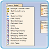 Os diagramas de paquetes utilízanse para dividir o modelo en contedores lóxicos, ou "paquetes", e describir as interaccións entre eles nun alto nivel. | 2. Diagramas de compoñentes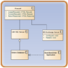 Os diagramas de compoñentes utilízanse para modelar estruturas de nivel superior ou máis complexas, normalmente construídas a partir dunha ou máis clases, e proporcionando unha interface ben definida. |
| ------------------------------------------------------------ | ------------------------------------------------------------ |
| 3. Diagramas de clases ou estruturais 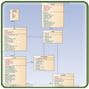 Os diagramas de clases ou estruturais definen os bloques básicos dun modelo: os tipos, clases e materiais xerais utilizados para construír un modelo completo. | 4. Diagramas de implantación 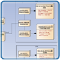 Diagramas de despregamento Os diagramas de despregamento mostran a disposición física de artefactos significativos nun escenario do mundo real. |
| 5. Diagramas de estrutura composta 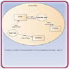 Os diagramas de estrutura composta proporcionan un medio para estratificar a estrutura dun elemento e centrándose nos detalles internos, a construción e as relacións. | 6. Diagramas de obxectos 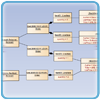 Os diagramas de obxectos mostran como se relacionan e usan as instancias dos elementos estruturais no tempo de execución. |
| 7. Diagramas de perfil 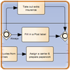 Os diagramas de perfil proporcionan unha forma visual de definir extensións lixeiras para a especificación UML. Os perfís UML úsanse a miúdo para definir un grupo de construcións con propiedades e restricións específicas de dominio ou plataforma, que estenden os elementos UML subxacentes. |                                                              |

### 2. Diagramas de modelización conductual

Os diagramas de comportamento captan as variedades de interacción e estados instantáneos dentro dun modelo a medida que se "executa" ao longo do tempo; rastrexar como actuará o sistema nun ambiente real e observando os efectos dunha operación ou evento, incluídos os seus resultados.

| 8. Diagramas de casos de uso 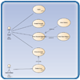 Os diagramas de casos de uso úsanse para modelar as interaccións usuario/sistema. Definen comportamentos, requisitos e restricións en forma de guións ou escenarios. | 9. Diagramas de secuencia  Os diagramas de secuencia están intimamente relacionados cos diagramas de comunicación e mostran a secuencia de mensaxes transmitidas entre obxectos mediante unha liña de tempo vertical. |
| ------------------------------------------------------------ | ------------------------------------------------------------ |
| 10. Diagramas de actividades 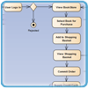 Os diagramas de actividades teñen un amplo número de usos, desde definir o fluxo básico do programa ata capturar os puntos de decisión e accións dentro de calquera proceso xeneralizado. | 11. Diagramas de temporización 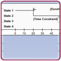 Os diagramas de temporización fusionan diagramas de secuencia e estado para ofrecer unha visión do estado dun obxecto ao longo do tempo e as mensaxes que modifican ese estado. |
| 12. Diagramas de máquinas de estado 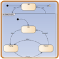 Os diagramas da máquina de estados son esenciais para comprender a condición instantánea ou instantánea, ou "estado de execución" dun modelo cando se executa. | 13. Diagramas xerais da interacción 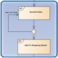 Os diagramas de vista xeral da interacción fusionan os diagramas de actividade e secuencia para permitir que os fragmentos de interacción se combinen facilmente con puntos de decisión e fluxos. |
| 14. Diagramas de comunicación 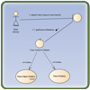 Os diagramas de comunicación mostran a rede e a secuencia de mensaxes ou comunicacións entre obxectos en tempo de execución, durante unha instancia de colaboración. |                                                              |

# UML 2 - Diagrama de paquetes

## Diagramas de paquetes

Os diagramas de paquetes utilízanse para reflectir a organización dos paquetes e os seus elementos. Cando se usan para representar elementos de clase, os diagramas de paquete proporcionan unha visualización dos espazos de nomes. O uso máis común dos diagramas de paquetes é organizar diagramas de casos de uso e diagramas de clases, aínda que o uso de diagramas de paquetes non se limita a estes elementos UML.

O seguinte é un exemplo de diagrama de paquete.

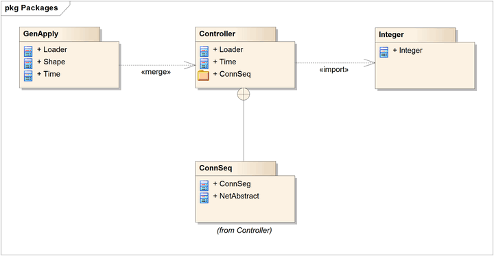

Os elementos contidos nun paquete comparten o mesmo espazo de nomes. Polo tanto, os elementos contidos nun espazo de nomes específico deben ter nomes únicos.

Os paquetes pódense construír para representar relacións físicas ou lóxicas. Cando se elixe incluír clases en paquetes específicos, é útil asignar as clases coa mesma xerarquía de herdanza ao mesmo paquete. Tamén hai un forte argumento para incluír clases que están relacionadas mediante a composición e clases que colaboran con elas no mesmo paquete.

Os paquetes represéntanse en UML 2.1 como cartafoles e conteñen os elementos que comparten un espazo de nomes; todos os elementos dun paquete deben ser identificables, polo que teñen un nome ou tipo únicos. O paquete debe mostrar o nome do paquete e opcionalmente pode mostrar os elementos do paquete en compartimentos adicionais.

### Combinación de paquetes

Un conector «merge» entre dous paquetes define unha xeneralización implícita entre os elementos do paquete fonte e os elementos co mesmo nome no paquete de destino. As definicións de elementos de orixe amplíanse para incluír as definicións de elementos contidas no destino. As definicións dos elementos de destino non se ven afectadas, así como as definicións dos elementos do paquete de orixe que non coinciden cos nomes con ningún elemento do paquete de destino.

### Importación de paquetes

O conector «import» indica que os elementos do paquete de destino, que neste exemplo é unha única clase, usan nomes non cualificados cando se fai referencia desde o paquete orixe. O espazo de nomes do paquete fonte obtén acceso ás clases de destino; o espazo de nomes do destino non se ve afectado.

### Conectores anidados

O conector de anidamento entre o paquete de destino e os paquetes orixe mostra que o paquete de orixe está totalmente contido no paquete de destino.

 

# UML 2 - Diagrama de compoñentes

## Diagramas de compoñentes

Os diagramas de compoñentes ilustran as pezas de software, controladores integrados, etc., que formarán un sistema. Un diagrama de compoñentes ten un maior nivel de abstracción que un diagrama de clases; normalmente un compoñente é implementado por unha ou máis clases (ou obxectos) no tempo de execución. Son bloques de construción polo que un compoñente pode eventualmente abarcar unha gran parte dun sistema.

O diagrama anterior mostra algúns compoñentes e as súas interrelacións. Os conectores de montaxe "enlazan" as interfaces proporcionadas por "Produto" e "Cliente" coas interfaces requiridas especificadas en "Pedido". Unha relación de dependencia asigna os detalles da conta asociada dun cliente á interface requirida; "Pago", indicado por "Pedido".

Os compoñentes son similares na práctica aos diagramas de paquetes, xa que definen límites e úsanse para agrupar elementos en estruturas lóxicas. A diferenza entre os diagramas de paquetes e os diagramas de compoñentes é que os diagramas de compoñentes ofrecen un mecanismo de agrupación máis rico semánticamente. Cos diagramas de compoñentes, todos os elementos do modelo son privados, mentres que os diagramas de paquete só mostran elementos públicos.

### Compoñentes de representación

Os compoñentes represéntanse como un clasificador rectangular coa palabra clave «compoñente»; opcionalmente o compoñente pode mostrarse como un rectángulo cunha icona de compoñente na esquina superior dereita.

### Conector de montaxe

O conector do conxunto une a interface requirida dun compoñente (Compoñente1) coa interface proporcionada doutro compoñente (Compoñente2); isto permite que un compoñente proporcione os servizos que require outro compoñente.

### Compoñentes con portos

O uso de portos con diagramas de compoñentes permite especificar un servizo ou comportamento no seu contorno, así como un servizo ou comportamento que require un compoñente. Os portos poden especificar entradas e saídas xa que poden funcionar de forma bidireccional. O seguinte diagrama detalla un compoñente cun porto para servizos en liña xunto con dúas interfaces proporcionadas para a entrada e o seguimento de pedidos, así como un pago de interface necesario.

 

# UML 2 - Diagrama de clases

## Diagramas de clases

O diagrama de clases mostra os bloques de construción de calquera sistema orientado a obxectos. Os diagramas de clases representan unha vista estática do modelo, ou parte do modelo, describindo que atributos e comportamento ten en lugar de detallar os métodos para realizar operacións. Os diagramas de clases son máis útiles para ilustrar as relacións entre clases e interfaces. As xeneralizacións, agregacións e asociacións son todas valiosas para reflectir a herdanza, a composición ou o uso e as conexións, respectivamente.

O seguinte diagrama ilustra as relacións de agregación entre clases. A agregación máis lixeira indica que a clase "Conta" usa AddressBook, pero non necesariamente contén unha instancia dela. As agregacións fortes e compostas dos outros conectores indican a propiedade ou a contención das clases de orixe polas clases de destino, por exemplo, os valores de Contacto e ContactGroup estarán contidos en AddressBook.

### Clases

Unha clase é un elemento que define os atributos e comportamentos que un obxecto é capaz de xerar. O comportamento descríbese polas posibles mensaxes que a clase é capaz de comprender, xunto coas operacións adecuadas para cada mensaxe. As clases tamén poden ter definicións de restricións, valores etiquetados e estereotipos.

### Notación de clase

As clases represéntanse mediante rectángulos que mostran o nome da clase e, opcionalmente, o nome das operacións e atributos. Os compartimentos úsanse para dividir o nome da clase, os atributos e as operacións.

No diagrama de abaixo a clase contén o nome da clase no compartimento superior, o seguinte compartimento detalla os atributos, co atributo "centro" que mostra os valores iniciais. O compartimento final mostra as operacións setWidth, setLength e setPosition e os seus parámetros. A notación que precede ao atributo, ou nome da operación, indica a visibilidade do elemento: se se usa o símbolo +, o atributo ou operación ten un nivel público de visibilidade; se se usa un símbolo -, o atributo ou operación é privado. Ademais, o símbolo # permite que unha operación, ou atributo, se defina como protexida, mentres que o símbolo ~ indica a visibilidade do paquete.

### Interfaces

Unha interface é unha especificación de comportamento que os implementadores aceptan cumprir; é un contrato. Ao realizar unha interface, as clases están garantidas para soportar un comportamento requirido, o que permite que o sistema trate elementos non relacionados do mesmo xeito, é dicir, a través da interface común.

As interfaces pódense debuxar nun estilo similar ao dunha clase, coas operacións especificadas, como se mostra a continuación. Tamén se poden debuxar como un círculo sen que se detallen operacións explícitas. Cando se debuxa como un círculo, as ligazóns de realización á forma de notación do círculo son debuxadas sen frechas de destino.

### Táboas

Aínda que non forma parte do UML base, unha táboa é un exemplo do que se pode facer cos estereotipos. Está debuxado cunha pequena icona de táboa na esquina superior dereita. Os atributos da táboa son estereotipados como «columna». A maioría das táboas terán unha chave primaria, sendo un ou máis campos que forman unha combinación única que se usa para acceder á táboa, ademais dunha operación de chave primaria que é estereotipada «PK». Algunhas táboas terán unha ou máis chaves estranxeiras, sendo un ou máis campos que, xuntos, se mapean nunha chave primaria nunha táboa relacionada, ademais dunha operación de chave estranxeira que é estereotipada «FK».

### Asociacións

Unha asociación implica que dous elementos do modelo teñen unha relación, normalmente implementado como unha variable de instancia nunha clase. Este conector pode incluír roles nomeados en cada extremo, cardinalidade, dirección e restricións. A asociación é o tipo xeral de relación entre elementos. Para máis de dous elementos, tamén se pode usar un elemento de caixa de ferramentas de representación de diamante. Cando se xera código para diagramas de clases, os extremos de asociación nomeados convértense en variables de instancia na clase de destino. Polo tanto, para o seguinte exemplo, "playsFor" converterase nunha variable de instancia na clase "Xogador".

### Xeneralizacións

Unha xeneralización úsase para indicar a herdanza. Debuxada do clasificador específico a un clasificador xeral, a implicación xeralizada é que a fonte herda as características do destino. O seguinte diagrama mostra unha clase pai xeneralizando unha clase filla. Implícitamente, un obxecto instanciado da clase Circle terá atributos x_position, y_position e radio e un método display(). Teña en conta que a clase "Shape" é abstracta, mostrando o nome en cursiva.

O seguinte diagrama mostra unha vista equivalente da mesma información.

### Agregacións

As agregacións utilízanse para representar elementos que están formados por compoñentes máis pequenos. As relacións de agregación móstranse cunha punta de frecha branca en forma de rombo que apunta cara á clase de destino ou nai.

Unha forma máis forte de agregación -unha agregación composta- móstrase cunha punta de frecha negra en forma de diamante e úsase onde os compoñentes poden incluírse nun máximo dunha composición á vez. Se se elimina o pai dunha agregación composta, normalmente todas as súas partes son eliminadas con ela; non obstante, unha parte pódese eliminar individualmente dunha composición sen ter que eliminar a composición completa. As composicións son relacións transitivas, asimétricas e poden ser recursivas.

O seguinte diagrama ilustra a diferenza entre agregacións débiles e fortes. Unha axenda de enderezos está formada por unha multiplicidade de contactos e grupos de contactos. Un grupo de contactos é unha agrupación virtual de contactos; un contacto pode estar incluído en máis dun grupo de contactos. Se eliminas unha axenda de enderezos, tamén se eliminarán todos os contactos e grupos de contactos; se eliminas un grupo de contactos, non se eliminará ningún contacto.

### Clases de asociación

Unha clase de asociación é unha construción que permite que unha conexión de asociación teña operacións e atributos. O seguinte exemplo mostra que asignar un empregado a un proxecto hai máis que facer un simple vínculo de asociación entre as dúas clases: o papel que ocupa o empregado no proxecto é unha entidade complexa por dereito propio e contén detalles que non pertencen. na clase de empregado ou proxecto. Por exemplo, un empregado pode estar traballando en varios proxectos ao mesmo tempo e ter diferentes postos de traballo e niveis de seguridade en cada un.

### Dependencias

Unha dependencia úsase para modelar unha ampla gama de relacións dependentes entre elementos do modelo. Normalmente utilizaríase no inicio do proceso de deseño cando se sabe que existe algún tipo de vínculo entre dous elementos, pero é demasiado cedo para saber exactamente cal é a relación. Máis adiante no proceso de deseño, as dependencias serán estereotipadas (os estereotipos dispoñibles inclúen «instanciar», «trazar», «importar», e outros) ou substituíranse por un tipo de conector máis específico.

### Rastros

A relación traza é unha especialización dunha dependencia, que enlaza elementos do modelo ou conxuntos de elementos que representan a mesma idea a través dos modelos. As trazas adoitan usarse para seguir os requisitos e os cambios de modelo. Como os cambios poden ocorrer en ambas direccións, a orde desta dependencia adoita ignorarse. As propiedades da relación poden especificar a asignación de trazos, pero o trazo adoita ser bidireccional, informal e raramente computable.

### Realizacións

O obxecto fonte implementa ou realiza o destino. As realizacións utilízanse para expresar a trazabilidade e a integridade do modelo: un proceso ou requisito de negocio realízase mediante un ou máis casos de uso, que á súa vez son realizados por algunhas clases, que á súa vez son realizadas por un compoñente, etc. Requisitos de mapeo, clases , etc. en todo o deseño do seu sistema, a través dos niveis de abstracción do modelado, garante que a imaxe xeral do seu sistema recorde e reflicta todas as pequenas imaxes e detalles que o limitan e o definen. Unha realización móstrase como unha liña discontinua cunha punta de frecha sólida.

### Nidificacións

Un aniñamento é un conector que mostra que o elemento orixe está aniñado dentro do elemento de destino. O seguinte diagrama mostra a definición dunha clase interna, aínda que en EA é máis habitual mostralas pola súa posición na xerarquía da vista do proxecto.

# UML 2 - Diagrama de implantación

## Diagramas de implantación

Un diagrama de despregamento, modela a arquitectura en tempo de execución dun sistema. Mostra a configuración dos elementos de hardware (nodos) e como os elementos de software e os artefactos son mapeados neses nodos.

### Nodo

Un nodo é un elemento de hardware ou software. Móstrase como unha forma de caixa tridimensional, como se mostra a continuación.

### Instancia de nodo

Unha instancia de nodo pódese mostrar nun diagrama. Unha instancia pódese distinguir dun nodo polo feito de que o seu nome está subliñado e ten dous puntos antes do seu tipo de nodo base. Unha instancia pode ter ou non un nome antes dos dous puntos. O seguinte diagrama mostra unha instancia nomeada dun ordenador.

### Estereotipos de nodos

Ofrécense unha serie de estereotipos estándar para os nodos, a saber, «cdrom», «cd-rom», «ordenador», «matriz de discos», «pc», «cliente de ordenador», «servidor de ordenador», «seguro», «servidor». », «almacenamento», «servidor Unix», «PC de usuario». Estes mostrarán unha icona adecuada na esquina superior dereita do símbolo do nodo

### Artefacto

Un artefacto é un produto do proceso de [desenvolvemento de software . ](https://sparxsystems.com/platforms/software_development.html)Isto pode incluír modelos de procesos (por exemplo, modelos de casos de uso, modelos de deseño, etc.), ficheiros fonte, executables, documentos de deseño, informes de probas, prototipos, manuais de usuario, etc.

Un artefacto denotase cun rectángulo que mostra o nome do artefacto, a palabra clave «artefacto» e unha icona de documento, como se mostra a continuación.

### Asociación

No contexto dun diagrama de despregamento, unha asociación representa un camiño de comunicación entre nodos. O seguinte diagrama mostra un diagrama de implantación para unha rede, que representa os protocolos de rede como estereotipos e as multiplicidades nos extremos da asociación.

### Nodo como contedor

Un nodo pode conter outros elementos, como compoñentes ou artefactos. O seguinte diagrama mostra un diagrama de despregamento para parte dun sistema integrado, que representa un artefacto executable como contido no nodo da placa base.

# UML 2 - Diagrama de estrutura composta

## Diagramas de estruturas compostas

Un diagrama de estrutura composta é un diagrama que mostra a estrutura interna dun clasificador, incluíndo os seus puntos de interacción con outras partes do sistema. Mostra a configuración e relación das pezas que, en conxunto, realizan o comportamento do clasificador que contén.

Os elementos de clase foron descritos con moito detalle na sección de diagramas de clases. Esta sección describe como se poden mostrar as clases como elementos compostos que expoñen interfaces e que conteñen portos e partes.

### Parte

Unha parte é un elemento que representa un conxunto dunha ou máis instancias que son propiedade dunha instancia clasificadora que contén. Así, por exemplo, se unha instancia de diagrama posuía un conxunto de elementos gráficos, entón os elementos gráficos poderían representarse como partes; se fose útil facelo, modelar algún tipo de relación entre eles. Teña en conta que unha parte pódese eliminar do seu pai antes de que o pai sexa eliminado, para que a parte non se elimine ao mesmo tempo.

Unha parte móstrase como un rectángulo sen adornos contido no corpo dunha clase ou elemento compoñente.

### Porto

Un porto é un elemento escrito que representa unha parte visible externamente dunha instancia de clasificador que contén. Os portos definen a interacción entre un clasificador e o seu contorno. Un porto pode aparecer no límite dunha parte contida, unha clase ou unha estrutura composta. Un porto pode especificar os servizos que ofrece un clasificador así como os servizos que require do seu contorno.

Un porto móstrase como un rectángulo con nome no bordo do límite do seu clasificador propietario.

### Interfaces

Unha interface é semellante a unha clase pero cunha serie de restricións. Todas as operacións da interface son públicas e abstractas, e non proporcionan ningunha implementación predeterminada. Todos os atributos da interface deben ser constantes. Non obstante, aínda que unha clase só pode herdar dunha única superclase, pode implementar varias interfaces.

Unha interface, cando está soa nun diagrama, móstrase como un rectángulo de elemento de clase coa palabra clave «interface» e co seu nome en cursiva para indicar que é abstracta, ou móstrase como un círculo.

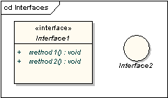

Teña en conta que a notación do círculo non mostra as operacións da interface. Cando as interfaces se mostran como propiedade de clases, denomínanse interfaces expostas. Unha interface exposta pódese definir como proporcionada ou requirida. Unha interface proporcionada é unha afirmación de que o clasificador que o contén proporciona as operacións definidas polo elemento de interface nomeado e defínese debuxando un vínculo de realización entre a clase e a interface. Unha interface requirida é unha declaración de que o clasificador é capaz de comunicarse con algún outro clasificador que proporciona operacións definidas polo elemento de interface nomeado e defínese debuxando unha ligazón de dependencia entre a clase e a interface.

Unha interface proporcionada móstrase como unha "bola nun pau" unida ao bordo dun elemento clasificador. Unha interface requirida móstrase como unha "cunca nun pau" unida ao bordo dun elemento clasificador.

### Delegado

Un conector delegado úsase para definir o funcionamento interno dos portos e interfaces externos dun compoñente. Un conector de delegado móstrase como unha frecha cunha palabra clave «delegado». Conecta un contrato externo dun compoñente como o mostran os seus portos coa realización interna do comportamento da parte do compoñente.

### Colaboración

Unha colaboración define un conxunto de roles cooperativos usados colectivamente para ilustrar unha funcionalidade específica. Unha colaboración só debe mostrar os roles e atributos necesarios para realizar a súa tarefa ou función definida. Illar os roles primarios é un exercicio de simplificación da estrutura e clarificación do comportamento, e tamén prevé a reutilización. Unha colaboración moitas veces implementa un patrón.

Un elemento de colaboración móstrase como unha elipse.

### Vinculación de roles

Un conector de vinculación de funcións extrae dunha colaboración ao clasificador que cumpre a función. Móstrase como unha liña discontinua co nome do rol ao final do clasificador.

### Representa

Pódese extraer un conector representa dunha colaboración a un clasificador para mostrar que se usa unha colaboración no clasificador. Móstrase como unha liña discontinua coa punta de frecha e a palabra clave «representa».

### Aparición

Pódese extraer un conector de ocorrencia dunha colaboración a un clasificador para mostrar que unha colaboración representa (sic) o clasificador. Móstrase como unha liña discontinua coa punta de frecha e a palabra clave «ocorrencia».

 

# UML 2 - Diagrama de obxectos

## Diagramas de obxectos

Un diagrama de obxectos pode considerarse un caso especial dun diagrama de clases. Os diagramas de obxectos usan un subconxunto dos elementos dun diagrama de clases para enfatizar a relación entre instancias de clases nalgún momento no tempo. Son útiles para comprender os diagramas de clases. Non mostran nada arquitectónicamente diferente aos diagramas de clases, pero reflicten multiplicidade e papeis.

### Elementos de clase e obxecto

O seguinte diagrama mostra as diferenzas de aparencia entre un elemento de clase e un elemento de obxecto. Teña en conta que o elemento de clase consta de tres partes, que se dividen en compartimentos de nome, atributo e operación; por defecto, os elementos do obxecto non teñen compartimentos. A visualización dos nomes tamén é diferente: os nomes dos obxectos están subliñados e poden mostrar o nome do clasificador a partir do cal se crea unha instancia do obxecto.

### Estado do tempo de execución

Un elemento clasificador pode ter calquera número de atributos e operacións. Estes non se mostran nunha instancia de obxecto. Non obstante, é posible definir o estado de tempo de execución dun obxecto, mostrando os valores establecidos dos atributos na instancia particular.

### Exemplo de diagramas de clase e obxecto

O seguinte diagrama mostra un diagrama de obxectos co seu diagrama de clases definitorio e ilustra a forma en que se pode usar un diagrama de obxectos para probar a multiplicidade de tarefas nos diagramas de clases. A clase de coche ten unha multiplicidade de 1 a moitos para a clase de rodas, pero se se escolleu unha multiplicidade de 1 a 4, iso non permitiría o coche de tres rodas que se mostra no diagrama de obxectos.

 

# Perfís UML

Os perfís UML proporcionan un mecanismo de extensión xenérico para construír modelos UML en determinados dominios. Están baseados en estereotipos adicionais e valores etiquetados que se aplican a elementos, atributos, métodos, ligazóns, extremos de ligazóns e moito máis. Un perfil é unha colección de tales extensións que, en conxunto, describen algún problema de modelado particular e facilitan construcións de modelado nese dominio. Por exemplo, o Perfil UML para XML, segundo o definido por David Carlson no libro "Modelado de aplicacións XML con UML", páxina 310, describe un conxunto de extensións aos elementos básicos do modelo UML para permitir un modelado preciso dos esquemas XSD.

Enterprise Architect ten un mecanismo xenérico de perfís UML para cargar e traballar con diferentes perfís. Os perfís UML para Enterprise Architect especifícanse en ficheiros XML, cun formato específico; consulte os exemplos a continuación. Estes ficheiros XML pódense importar a EA na páxina de recursos do navegador do proxecto. Unha vez importado, pode arrastrar e soltar elementos do perfil no diagrama actual. EA anexará ao novo elemento o estereotipo, os valores etiquetados e os valores predeterminados, as notas e mesmo o metarchivo, se se especifica. Tamén pode arrastrar e soltar atributos e operacións nas clases existentes e engadirlles inmediatamente co estereotipo, valores, etc. especificados.

Para comezar, a continuación ofrécense algúns perfís para descargar e importar a EA. Co tempo iremos ampliando a gama de Perfís, o contido de cada perfil e o grao de personalización posible en cada perfil. Lembra que sempre podes crear os teus propios perfís para describir escenarios de modelado propios do teu ambiente de desenvolvemento. A continuación tamén se ofrecen máis detalles sobre o traballo con Perfís.

 

## Información xeral sobre perfís UML en EA

|                                               |                                                              |
| --------------------------------------------- | ------------------------------------------------------------ |
|                                               | **Perfil UML para esquemas XSD** (de "Modelado de aplicacións XML con UML" de David Carlson) Este perfil define un conxunto de estereotipos e valores etiquetados para definir esquemas XSD |
|                                               | [Perfil de esquema XSD](https://sparxsystems.com/resources/xml_schema_generation.html) |
|                                               | **Perfil UML para modelado de procesos de negocio** Perfil UML para [modelado empresarial](https://sparxsystems.com/platforms/business_process_modeling.html) derivado do perfil de exemplo na especificación UML 1.4 |
|  | [BPProfile.xml](https://sparxsystems.com/downloads/profiles/BPProfile.xml) |
|                                               | **Eriksson-Penker Extensions for Business Process Modeling** (de "Business Modeling with UML" de Hans-Erik Eriksson e Magnus Penker) Versión revisada proporcionada por [Cephas Consulting](https://enterprisemodelingsolutions.com/) , este perfil utilízase para definir un conxunto de estereotipos para traballar con actividades empresariais, procesos, Obxectos e fluxos de información. |
|  | [EP_Extensions.xml](https://sparxsystems.com/downloads/profiles/EP_Extensions.xml) |
|                                               | **Perfil UML para procesamento distribuído aberto (UML4ODP) Metamodelos** e recursos de perfil de arquitecto empresarial proporcionados por Barry Steer, de [SteerConsulting Services](mailto:bsteer@earthlink.net) . |
|                                               | [Perfil ODP](https://sparxsystems.com/products/3rdparty/odp/index.html) |
|                                               | **Perfil UML para modelado web** (de "Construír aplicacións web con UML" de Jim Conallen) Define un conxunto de estereotipos para traballar con páxinas web, servidores, scripts, ASP, JSP e moito máis. *Teña en conta que Enterprise Architect 7.5 e posteriores inclúen o perfil de modelado web* |
|  | [WebProfile.xml](https://sparxsystems.com/downloads/profiles/WebProfile.xml) |
|                                               | **Perfil UML para SPEM** (de "Software Process Engineering Metamodel Specification" de OMG) Define un conxunto de estereotipos para definir procesos e os seus compoñentes mediante a especificación SPEM. *Teña en conta que Enterprise Architect 7.5 e posteriores inclúen a tecnoloxía SPEM 2.0.* |
|                                               | [Perfil SPEM](https://sparxsystems.com/resources/developers/spem_profile.html) |

## Traballando con perfís UML en Enterprise Architect

| Importar un perfil UMLPara importar un perfil necesitará un ficheiro XML de perfil axeitado (como nos exemplos proporcionados anteriormente). Se o perfil inclúe referencias a algún metaficheiro, deberían estar no mesmo directorio que o perfil XML. Para importar un perfil, siga os pasos seguintes: Fai clic co botón dereito no nodo da árbore de Perfís UML na Vista de recursos e selecciona *Importar perfil* no menú contextual, como na parte dereita.Abrirase o diálogo Importar perfil UML.Localice o ficheiro de perfil XML para importar mediante o botón *Examinar [...]* .Establece as opcións de importación necesarias para todos os estereotipos definidos no perfil. Podes seleccionar importar:Tamaño do elemento si/non: marque isto para importar os atributos do tamaño do elemento.Cor e aparencia si/non: marque isto para importar os atributos de cor (fondo, bordo e fonte) e aparencia (grosor do bordo).Imaxe alternativa si/non: marque isto para importar a imaxe do metarchivo.Modelos de código si/non: marque isto para importar os modelos de código se existen.Sobrescribir modelos existentes si/non: marque isto para sobrescribir os modelos de código existentes definidos no proxecto actual.Preme *Importar* . | 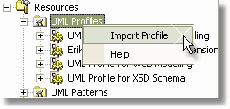 |
| ------------------------------------------------------------ | ---------------------------------------------------------- |
|                                                              |                                                            |
| Importar un perfil UMLUsando elementos do perfilA imaxe que se mostra á dereita detalla a rama de perfís para o Perfil de empresa UML e os elementos UML estereotipados dispoñibles**Usa os elementos do perfil do seguinte xeito:**Elementos como clases e interfaces pódense arrastrar directamente desde a xanela do recurso ata o diagrama actualOs atributos pódense arrastrar sobre un elemento host (por exemplo, Clase) - engadiranse automaticamente á lista de características do elementoAs operacións son como Atributos: arrastre sobre un elemento host para engadir a operaciónEngádense ligazóns como Asociacións, Xeneralización, Dependencia seleccionándoas no navegador, despois fai clic no obxecto de inicio nun diagrama e arrastra ata o obxecto final (do mesmo xeito que engadindo ligazóns normais. A ligazón engadirase co novo estereotipo). e información de valor etiquetada.Pódense engadir extremos de asociación arrastrando o elemento final da ligazón sobre o final dunha asociación no diagrama | 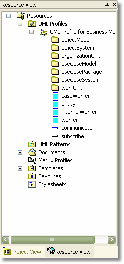 |
|                                                              |                                                            |

### Eliminando un perfil

Para eliminar un perfil, fai clic co botón dereito no perfil para eliminalo e selecciona a opción do menú contextual "Eliminar perfil". Teña en conta que isto non afectará negativamente aos elementos xa definidos mediante este perfil. Se está en uso un estereotipo que se importou mediante o Perfil, non se eliminará do modelo cando elimine o perfil.

### Recargando un perfil

Para volver cargar un perfil, primeiro debes eliminar o perfil como se indica arriba e despois importar de novo. Unha versión futura de EA incluirá a posibilidade de actualizar un perfil.

**Un diagrama de exemplo** construído con elementos de perfil ilustra a visualización de estereotipos e valores etiquetados:

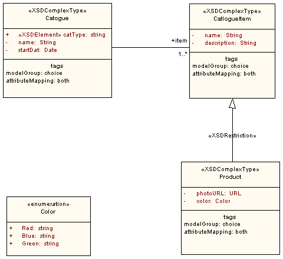

 

# UML 2 - Diagrama de casos de uso

## Diagramas de casos de uso

### Modelo de caso de uso

O modelo de caso de uso recolle os requisitos dun sistema. Os casos de uso son un medio para comunicar cos usuarios e outras partes interesadas o que pretende facer o sistema.

### Actores

Un diagrama de casos de uso mostra a interacción entre o sistema e as entidades externas ao sistema. Estas entidades externas denomínanse actores. Os actores representan roles que poden incluír usuarios humanos, hardware externo ou outros sistemas. Un actor adoita ser debuxado como unha figura de pau nomeada, ou alternativamente como un rectángulo de clase coa palabra clave «actor».

| 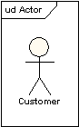 | 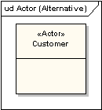 |
| ----------------------------------------------------- | ----------------------------------------------------- |
|                                                       |                                                       |

Os actores poden xeneralizar outros actores como se detalla no seguinte diagrama:

### Casos de uso

Un caso de uso é unha única unidade de traballo significativo. Ofrece unha visión de alto nivel do comportamento observable por alguén ou algo fóra do sistema. A notación para un caso de uso é unha elipse.

A notación para usar un caso de uso é unha liña de conexión cunha punta de frecha opcional que mostra a dirección do control. O seguinte diagrama indica que o actor "Cliente" usa o caso de uso "Retirar".

Opcionalmente, o conector de usos pode ter valores de multiplicidade en cada extremo, como no seguinte diagrama, que mostra que un cliente só pode ter unha sesión de retirada á vez, pero un banco pode ter calquera número de clientes que realizan retiradas ao mesmo tempo.

### Definición de caso de uso

Un caso de uso normalmente inclúe:

- Nome e descrición
- Requisitos
- Restricións
- Escenarios
- Diagramas de escenarios
- Información adicional.

 

### Nome e Descrición

Normalmente, un caso de uso chámase como unha frase verbal e dáse unha breve descrición textual informal.

### Requisitos

Os requisitos definen os requisitos funcionais formais que un caso de uso debe proporcionar ao usuario final. Corresponden ás especificacións funcionais que se atopan nas metodoloxías estruturadas. Un requisito é un contrato ou promesa de que o caso de uso realizará unha acción ou proporcionará algún valor ao sistema.

### Restricións

Unha restrición é unha condición ou restrición na que opera un caso de uso e inclúe condicións previas, posteriores e invariantes. Unha condición previa especifica as condicións que deben cumprirse antes de que o caso de uso poida continuar. Utilízase unha condición posterior para documentar o cambio de condicións que debe ser verdadeira despois da execución do caso de uso. Unha condición invariante especifica as condicións que son verdadeiras durante a execución do caso de uso .

### Escenarios

Un escenario é unha descrición formal do fluxo de eventos que ocorren durante a execución dunha instancia de caso de uso. Define a secuencia específica de eventos entre o sistema e os actores externos. Descríbese normalmente en texto e correspóndese coa representación textual do diagrama de secuencia.

### Incluíndo casos de uso

Os casos de uso poden conter a funcionalidade doutro caso de uso como parte do seu procesamento normal. En xeral, asúmese que calquera caso de uso incluído será chamado cada vez que se execute a ruta básica. Un exemplo disto é que a execución do caso de uso <Identificación da tarxeta> se execute como parte dun caso de uso <Retirada>.

Os casos de uso poden incluírse nun ou máis casos de uso, o que axuda a reducir o nivel de duplicación da funcionalidade eliminando o comportamento común nos casos de uso que se reutilizan moitas veces.

### Ampliación dos casos de uso

Un caso de uso pódese usar para estender o comportamento doutro; úsase normalmente en circunstancias excepcionais. Por exemplo, se antes de modificar un tipo particular de pedido de cliente, un usuario debe obter a aprobación dalgunha autoridade superior, entón o caso de uso <Obter aprobación> pode estender opcionalmente o caso de uso normal de <Modificar orde>.

### Puntos de extensión

O punto no que se engade un caso de uso extensivo pódese definir mediante un punto de extensión.

### Límite do sistema

É habitual mostrar casos de uso como dentro do sistema e actores como fóra do sistema.

 

# UML 2 - Diagrama de secuencia

## Diagramas de secuencia

Un diagrama de secuencia é unha forma de diagrama de interacción que mostra os obxectos como liñas de vida que corren pola páxina, coas súas interaccións ao longo do tempo representadas como mensaxes debuxadas como frechas desde a liña de vida de orixe ata a liña de vida de destino. Os diagramas de secuencia son bos para mostrar que obxectos se comunican con que outros obxectos; e que mensaxes desencadean esas comunicacións. Os diagramas de secuencias non están destinados a mostrar lóxica procesual complexa.

### Liñas de vida

Unha liña de vida representa un participante individual nun diagrama de secuencia. Unha liña de vida normalmente terá un rectángulo que contén o nome do seu obxecto. Se o seu nome é "self", iso indica que a liña de vida representa o clasificador propietario do diagrama de secuencia.

Ás veces, un diagrama de secuencia terá unha liña de vida cun símbolo de elemento actor na súa cabeza. Este será normalmente o caso se o diagrama de secuencia é propiedade dun caso de uso. Os elementos de límite, control e entidade dos diagramas de robustez tamén poden posuír liñas de vida.

### Mensaxes

As mensaxes móstranse como frechas. As mensaxes poden estar completas, perdidas ou atopadas; sincrónico ou asíncrono; chamar ou sinalizar. No seguinte diagrama, a primeira mensaxe é unha mensaxe sincrónica (indicada pola punta de frecha sólida) completa cunha mensaxe de retorno implícita; a segunda mensaxe é asíncrona (indicada coa punta de frecha da liña) e a terceira é a mensaxe de retorno asíncrona (indicada pola liña discontinua).

### Acontecemento de execución

Un rectángulo fino que percorre a liña de vida indica a ocorrencia de execución ou a activación dun foco de control. No diagrama anterior, hai tres ocorrencias de execución. O primeiro é o obxecto fonte que envía dúas mensaxes e recibe dúas respostas; o segundo é o obxecto de destino que recibe unha mensaxe sincrónica e devolve unha resposta; e o terceiro é o obxecto de destino que recibe unha mensaxe asíncrona e devolve unha resposta.

### Mensaxe propia

Unha mensaxe propia pode representar unha chamada recursiva dunha operación, ou un método que chama a outro método pertencente ao mesmo obxecto. Móstrase como a creación dun foco de control anidado na ocorrencia de execución da liña de vida.

### Mensaxes perdidas e atopadas

As mensaxes perdidas son aquelas que se envían pero non chegan ao destinatario previsto ou que van a un destinatario que non se mostra no diagrama actual. As mensaxes atopadas son aquelas que chegan dun remitente descoñecido ou dun remitente que non se mostra no diagrama actual. Indícanse que van ou proceden dun elemento de punto final.

### Lifeline Inicio e fin

Unha liña de vida pódese crear ou destruír durante a escala de tempo representada por un diagrama de secuencia. Neste último caso, a liña de salvamento remata cun símbolo de parada, representado como unha cruz. No primeiro caso, o símbolo na cabeceira da liña de vida móstrase nun nivel inferior na páxina que o símbolo do obxecto que provocou a creación. O seguinte diagrama mostra un obxecto que se está creando e destruíndo.

### Duración e restricións de tempo

Por defecto, unha mensaxe móstrase como unha liña horizontal. Dado que a liña de vida representa o paso do tempo pola pantalla, cando se modela un sistema en tempo real, ou mesmo un proceso empresarial limitado no tempo, pode ser importante ter en conta o tempo que leva realizar accións. Ao establecer unha restrición de duración para unha mensaxe, a mensaxe mostrarase como unha liña inclinada.

### Fragmentos combinados

Afirmouse anteriormente que os diagramas de secuencia non están destinados a mostrar unha lóxica procesual complexa. Aínda que este é o caso, hai unha serie de mecanismos que permiten engadir un certo grao de lóxica procesual aos diagramas e que están baixo o título de fragmentos combinados. Un fragmento combinado é unha ou máis secuencias de procesamento encerradas nun cadro e executadas baixo determinadas circunstancias. Os fragmentos dispoñibles son:

- Fragmento alternativo (denominado "alt") modelos if...then...else construcións.
- O fragmento de opción (denominado "opt") modifica as construcións de modelos.
- O fragmento de ruptura modela unha secuencia alternativa de eventos que se procesa en lugar do resto do diagrama.
- O fragmento paralelo (denominado "par") modela o procesamento simultáneo.
- O fragmento de secuenciación débil (denominado "seq") inclúe unha serie de secuencias para as que todas as mensaxes deben ser procesadas nun segmento anterior antes de que poida comezar o seguinte, pero que non impón ningunha secuenciación dentro dun segmento ás mensaxes que non comparten un salvavidas.
- O fragmento de secuenciación estrita (denominado "estricto") inclúe unha serie de mensaxes que deben procesarse na orde indicada.
- O fragmento negativo (denominado "neg") inclúe unha serie de mensaxes non válidas.
- O fragmento crítico encerra unha sección crítica.
- Ignorar fragmento declara que unha mensaxe ou mensaxe non ten interese se aparece no contexto actual.
- O fragmento de consideración é en efecto o contrario do fragmento de ignorar: debe ignorarse calquera mensaxe non incluída no fragmento de consideración.
- O fragmento de aserción (denominado "afirmación") indica que calquera secuencia que non se mostre como operando da afirmación non é válida.
- O fragmento de bucle encerra unha serie de mensaxes que se repiten.

O seguinte diagrama mostra un fragmento de bucle.

 

Tamén hai unha ocorrencia de interacción, que é semellante a un fragmento combinado. Unha ocorrencia de interacción é unha referencia a outro diagrama que ten a palabra "ref" na esquina superior esquerda do cadro e ten o nome do diagrama de referencia que se mostra no medio do cadro.

### Porta

Unha porta é un punto de conexión para conectar unha mensaxe dentro dun fragmento cunha mensaxe fóra dun fragmento. EA mostra unha porta como un pequeno cadrado nun marco de fragmentos. As portas de diagrama actúan como conectores fóra da páxina para diagramas de secuencia, que representan a fonte das mensaxes entrantes ou o destino das mensaxes saíntes. Os dous diagramas seguintes mostran como se poden usar na práctica. Teña en conta que a porta do diagrama de nivel superior é o punto no que a punta da frecha da mensaxe toca o fragmento de referencia; non é necesario representalo como unha forma de caixa.

### Descomposición de partes

Un obxecto pode ter máis dunha liña de vida que saia del. Isto permite que as mensaxes entre e intraobxectos se mostren no mesmo diagrama.

### Estado Invariante / Continuacións

Un invariante de estado é unha restrición colocada nunha liña de vida que debe ser verdadeira no tempo de execución. Móstrase como un rectángulo con extremos semicirculares.

Unha continuación ten a mesma notación que un invariante de estado, pero úsase en fragmentos combinados e pode estenderse por máis dunha liña de vida.

 

# UML 2 - Diagrama de actividades

## Diagramas de actividades

En UML, utilízase un diagrama de actividades para mostrar a secuencia de actividades. Os diagramas de actividade mostran o fluxo de traballo desde un punto de inicio ata o punto de chegada detallando os moitos camiños de decisión que existen na progresión dos eventos contidos na actividade. Poden utilizarse para detallar situacións nas que se pode producir un procesamento paralelo na execución dalgunhas actividades. Os diagramas de actividade son útiles para a modelización de empresas onde se usan para detallar os procesos implicados nas actividades empresariais.

A continuación móstrase un exemplo dun diagrama de actividades.

Nas seguintes seccións descríbense os elementos que constitúen un diagrama de actividade.

### Actividades

Unha actividade é a especificación dunha secuencia parametrizada de comportamento. Unha actividade móstrase como un rectángulo de cantos redondeados que encerra todas as accións, fluxos de control e demais elementos que compoñen a actividade.

### Accións

Unha acción representa un único paso dentro dunha actividade. As accións dedícanse mediante rectángulos de cantos redondeados.

### Restricións de acción

Pódense engadir restricións a unha acción. O seguinte diagrama mostra unha acción con condicións previas e posteriores locais.

### Control de fluxo

Un fluxo de control mostra o fluxo de control dunha acción a outra. A súa notación é unha liña cunha punta de frecha.

### Nodo inicial

Un nodo inicial ou inicial represéntase cunha gran mancha negra, como se mostra a continuación.

### Nodo final

Hai dous tipos de nodos finais: nodos finais de actividade e de fluxo. O nodo final da actividade represéntase como un círculo cun punto dentro.

O nó final do fluxo represéntase como un círculo cunha cruz no interior.

A diferenza entre os dous tipos de nodos é que o nodo final do fluxo denota o final dun único fluxo de control; o nodo final da actividade indica o final de todos os fluxos de control dentro da actividade.

### Obxectos e fluxos de obxectos

Un fluxo de obxectos é un camiño polo que poden pasar obxectos ou datos. Un obxecto móstrase como un rectángulo.

Un fluxo de obxectos móstrase como un conector cunha punta de frecha que indica a dirección no que se pasa o obxecto.

Un fluxo de obxectos debe ter un obxecto en polo menos un dos seus extremos. Unha notación abreviada para o diagrama anterior sería usar pinos de entrada e saída.

Un almacén de datos móstrase como un obxecto coa palabra clave «almacén de datos».

### Nodos de decisión e fusión

Os nós de decisión e os nós de fusión teñen a mesma notación: unha forma de diamante. Ambos poden ser nomeados. Os fluxos de control que saen dun nodo de decisión terán condicións de garda que permitirán que o control fluya se se cumpre a condición de garda. O seguinte diagrama mostra o uso dun nodo de decisión e un nodo de combinación.

### Bifurcación e unión de nós

As bifurcacións e as unións teñen a mesma notación: unha barra horizontal ou vertical (a orientación depende de se o fluxo de control se executa de esquerda a dereita ou de arriba abaixo). Indican o inicio e o final dos fíos de control concorrentes. O seguinte diagrama mostra un exemplo do seu uso.

Unha unión é diferente dunha combinación en que a unión sincroniza dúas entradas e produce unha única saída. A saída dunha unión non se pode executar ata que se reciban todas as entradas. Unha combinación pasa por calquera control que atravesa directamente. Se un símbolo de combinación recibe dúas ou máis entradas, a acción sinalada polo seu fluxo de saída execútase dúas ou máis veces.

### Rexión de expansión

Unha rexión de expansión é unha rexión de actividade estruturada que se executa varias veces. Os nós de expansión de entrada e saída debuxáronse como un grupo de tres caixas que representan unha selección múltiple de elementos. A palabra clave "iterativo", "paralelo" ou "fluxo" móstrase na esquina superior esquerda da rexión.

### Manexadores de excepcións

Os controladores de excepcións pódense modelar en diagramas de actividade como no exemplo seguinte.

### Rexión de actividade interrompible

Unha rexión de actividade interrompible rodea un grupo de accións que se poden interromper. No exemplo moi sinxelo que aparece a continuación, a acción "Procesar orde" executarase ata a súa finalización, cando pasará o control á acción "Pechar orde", a non ser que se reciba unha interrupción "Cancelar solicitude", que pasará o control á acción "Cancelar orde". "acción.

### Partición

Unha partición de actividade móstrase como un carril de natación horizontal ou vertical. No seguinte diagrama, as particións utilízanse para separar as accións dentro dunha actividade entre as realizadas polo departamento de contabilidade e as realizadas polo cliente.

 

# UML 2 - Diagrama de temporización

## Diagramas de temporización

Os diagramas de tempo UML úsanse para mostrar o cambio de estado ou valor dun ou máis elementos ao longo do tempo. Tamén pode mostrar a interacción entre eventos cronometrados e as restricións de tempo e duración que os rexen.

### Estatal Lifeline

Unha liña de vida de estado mostra o cambio de estado dun elemento ao longo do tempo. O eixe X mostra o tempo transcorrido nas unidades escollidas, mentres que o eixe Y está etiquetado cunha lista de estados determinada. A continuación móstrase unha liña de vida estatal.

### Valor Lifeline

Unha liña de vida de valor mostra o cambio de valor dun elemento ao longo do tempo. O eixe X mostra o tempo transcorrido nas unidades escollidas, o mesmo que para a liña de vida do estado. O valor móstrase entre o par de liñas horizontais que se cruzan en cada cambio de valor. A continuación móstrase unha liña de vida de valor.

### Xuntando todo

As liñas de vida de estado e valor pódense apilar unhas sobre outras en calquera combinación. Deben ter o mesmo eixe X. As mensaxes pódense pasar dunha liña de vida a outra. Cada transición de estado ou valor pode ter un evento definido, unha restrición de tempo que indica cando debe ocorrer un evento e unha restrición de duración que indica durante canto tempo debe estar vixente un estado ou valor. Unha vez que todos estes foron aplicados, un diagrama de tempo pode parecer o seguinte.

 

# UML 2 - Diagrama da máquina de estados

## Diagramas de máquinas de estado

Un diagrama de máquina de estado modela o comportamento dun só obxecto, especificando a secuencia de eventos polos que pasa un obxecto durante a súa vida útil en resposta a eventos.

Como exemplo, o seguinte diagrama de máquina de estado mostra os estados polos que pasa unha porta durante a súa vida útil.

A porta pode estar nun dos tres estados: "Aberto", "Pechado" ou "Pechado". Pode responder aos eventos Abrir, Pechar, Bloquear e Desbloquear. Teña en conta que non todos os eventos son válidos en todos os estados; por exemplo, se se abre unha porta, non pode pechala ata pechala. Observe tamén que unha transición de estado pode ter unha condición de garda anexada: se a porta está aberta, só pode responder ao evento Pechar se se cumpre a condición doorWay->isEmpty. A sintaxe e as convencións utilizadas nos diagramas de máquinas de estados serán discutidas por completo nas seguintes seccións.

### Estados

Un estado dedícase mediante un rectángulo de cantos redondeados co nome do estado escrito no seu interior.

### Estados iniciais e finais

O estado inicial denotase cun círculo negro cheo e pódese etiquetar cun nome. O estado final denotase cun círculo cun punto dentro e tamén se pode etiquetar cun nome.

### Transicións

As transicións dun estado ao seguinte dedícanse mediante liñas con puntas de frecha. Unha transición pode ter un gatillo, unha garda e un efecto, como se indica a continuación.

"Trigger" é a causa da transición, que pode ser un sinal, un evento, un cambio nalgunha condición ou o paso do tempo. "Guard" é unha condición que debe ser verdadeira para que o disparador cause a transición. "Efecto" é unha acción que se invocará directamente no obxecto que posúe a máquina de estados como resultado da transición.

### Accións estatais

No exemplo de transición anterior, asociouse un efecto coa transición. Se o estado de destino tivese moitas transicións que chegasen a el, e cada transición tivese o mesmo efecto asociado con ela, sería mellor asociar o efecto co estado de destino en lugar das transicións. Isto pódese facer definindo unha acción de entrada para o estado. O seguinte diagrama mostra un estado cunha acción de entrada e unha acción de saída.

Tamén é posible definir accións que ocorren sobre eventos, ou accións que ocorren sempre. É posible definir calquera número de accións de cada tipo.

### Autotransicións

Un estado pode ter unha transición que volve a si mesma, como no seguinte diagrama. Isto é máis útil cando se asocia un efecto coa transición.

### Estados compostos

Un diagrama de máquina de estado pode incluír diagramas de sub-máquina, como no exemplo seguinte.

A forma alternativa de mostrar a mesma información é a seguinte.

A notación da versión anterior indica que os detalles da submáquina Comprobar PIN móstranse nun diagrama separado.

### Punto de entrada

Ás veces non quererá entrar nunha submáquina no estado inicial normal. Por exemplo, na seguinte submáquina sería normal comezar no estado "Inicializando", pero se por algún motivo non fose necesario realizar a inicialización, sería posible comezar no estado "Listo" transición ao punto de entrada nomeado.

O seguinte diagrama mostra a máquina de estados un nivel máis arriba.

### Punto de saída

De xeito similar aos puntos de entrada, é posible ter nomeados puntos de saída alternativos. O seguinte diagrama dá un exemplo onde o estado executado despois do estado de procesamento principal depende da ruta que se use para saír do estado.

### Selección Pseudo-Estado

Un pseudoestado escollido móstrase como un diamante con unha transición que chega e dúas ou máis transicións saíndo. O seguinte diagrama mostra que calquera estado ao que se chegue, despois do seu pseudoestado escollido, depende do formato de mensaxe seleccionado durante a execución do estado anterior.

### Pseudo-Estado de unión

Os pseudoestados de unión úsanse para encadear varias transicións. Unha única unión pode ter unha ou máis transicións de entrada e unha ou máis de saída; pódese aplicar unha garda a cada transición. As unións están libres de semántica. Unha unión que divide unha transición de entrada en múltiples transicións de saída realiza unha rama condicional estática, en oposición a un pseudoestado de elección que realiza unha rama condicional dinámica.

### Terminar o seudoestado

Introducir un pseudoestado de terminación indica que a liña de vida da máquina de estados rematou. Un pseudoestado terminado nótase como unha cruz.

### Estados da historia

Un estado histórico úsase para lembrar o estado anterior dunha máquina de estados cando foi interrompida. O seguinte diagrama ilustra o uso dos estados históricos. O exemplo é unha máquina de estado pertencente a unha lavadora.

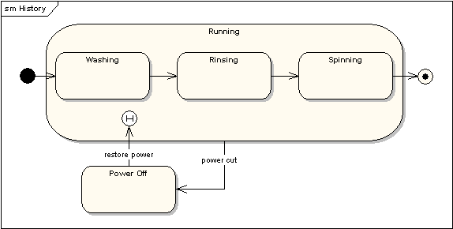

Nesta máquina de estado, cando unha lavadora está en funcionamento, pasará de "Lavado" a "Aclarado" a "Centro". Se hai un corte de enerxía, a lavadora deixará de funcionar e pasará ao estado "Apagado". Despois, cando se restableza a alimentación, introdúcese no estado de execución no símbolo "Estado histórico", o que significa que debería retomarse onde o quedou por última vez.

### Rexións concorrentes

Un estado pódese dividir en rexións que conteñan subestados que existen e se executan simultaneamente. O seguinte exemplo mostra que dentro do estado "Aplicando freos", os freos dianteiro e traseiro funcionarán de forma simultánea e independente. Observe o uso de pseudoestados de bifurcación e unión, en lugar de escolleir e fusionar pseudoestados. Estes símbolos úsanse para sincronizar os fíos simultáneos.

 

# UML 2 - Diagrama xeral da interacción

## Diagramas de interacción xeral

Un diagrama de visión xeral de interacción é unha forma de diagrama de actividade no que os nodos representan diagramas de interacción. Os diagramas de interacción poden incluír diagramas de secuencia, comunicación, visión xeral da interacción e cronometraxe. A maior parte da notación dos diagramas xerais de interacción é a mesma para os diagramas de actividades. Por exemplo, os nodos inicial, final, decisión, fusión, bifurcación e unión son todos iguais. Non obstante, os diagramas xerais de interacción introducen dous elementos novos: ocorrencias de interacción e elementos de interacción.

### Ocorrencia de interacción

As ocorrencias de interacción son referencias a diagramas de interacción existentes. Unha ocorrencia de interacción móstrase como marco de referencia; é dicir, un cadro con "ref" na esquina superior esquerda. O nome do diagrama ao que se fai referencia móstrase no centro do cadro.

### Elemento de interacción

Os elementos de interacción son similares ás ocorrencias de interacción, xa que amosan unha representación de diagramas de interacción existentes dentro dun marco rectangular. Diferéncianse en que mostran en liña o contido do diagrama de referencias.

### Xuntando todo

Todos os mesmos controis dos diagramas de actividade (bifurcación, unión, combinación, etc.) pódense usar nos diagramas de interacción xeral para poñer a lóxica de control en torno aos diagramas de nivel inferior. O seguinte exemplo representa un proceso de venda de mostra, con subprocesos abstraídos dentro de ocorrencias de interacción.

# UML 2 - Diagrama de comunicación

## Diagramas de comunicación

Un diagrama de comunicación, anteriormente chamado diagrama de colaboración, é un diagrama de interacción que mostra información similar aos diagramas de secuencia pero o seu foco principal está nas relacións de obxectos.

Nos diagramas de comunicación, os obxectos móstranse con conectores de asociación entre eles. As mensaxes engádense ás asociacións e móstranse como frechas curtas que apuntan na dirección do fluxo de mensaxes. A secuencia de mensaxes móstrase mediante un esquema de numeración.

Os dous diagramas seguintes mostran un diagrama de comunicación e o diagrama de secuencia que mostra a mesma información. Aínda que é posible derivar a secuencia de mensaxes no diagrama de comunicación a partir do esquema de numeración, non é inmediatamente visible. O que o diagrama de comunicación mostra con bastante claridade é o conxunto completo de mensaxes que se pasan entre obxectos adxacentes.

---

Fonte: https://sparxsystems.com/resources/tutorials/uml2/index.html 
