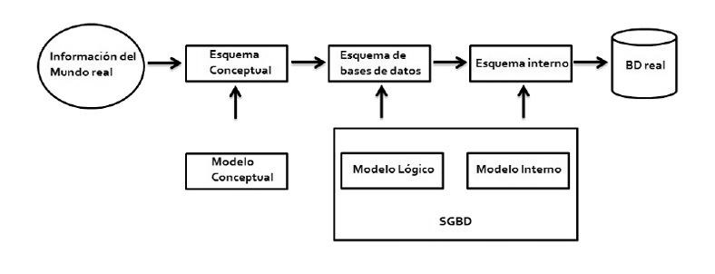
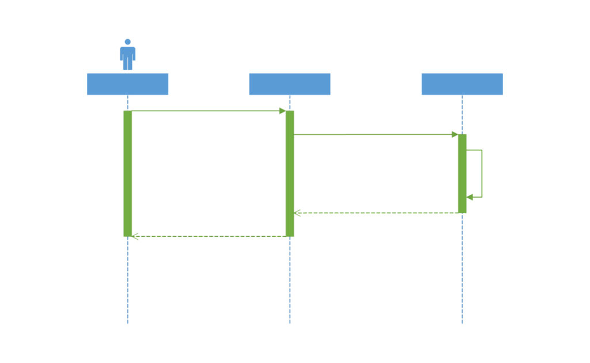
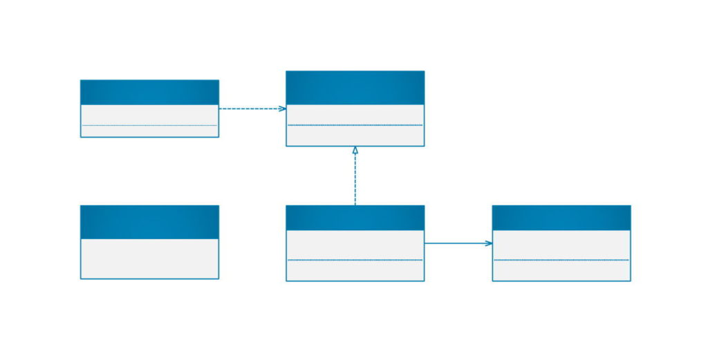
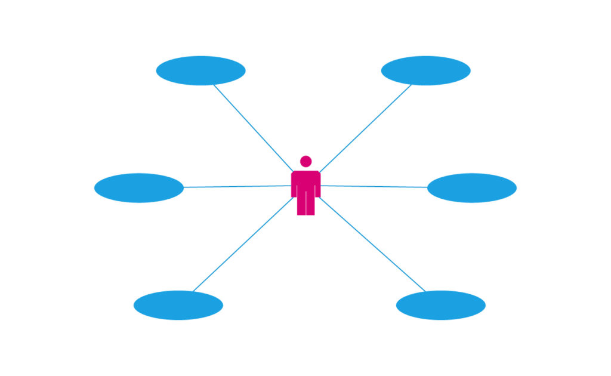

# Modelo de datos conceptual

---

Una base de datos podemos de definila como unha colección de datos relacionados entre si.

---

Os datos son unha 'representación de feitos, conceptos ou instruccións'.

Realizada de maneira estruturada esta representación permite a comunicación, interpretación, manipulación e uso - tanto por parte de distintos usuarios como por parte doutro software específico- de ditos datos; que poden, a demais, ser presentados de diferentes formas en cada caso.

---

*Estrutura dos modelos de datos.*

Para pasar dun simple esquema a unha base de datos real debemos seguir algúns pasos:

---

Estes pasos son os chamados **modelos de datos**. Para chegar aos modelos de datos e poder ir dun esquema é implantación nunha base de datos utilizamos un modelo conceptual e un modelo lóxico.

–O modelo conceptual: consiste en organizar un esquema teórico dos datos, que nos permita pasar das formas do real á súa formulación correcta cara un sistema informático. Está información será almacenada e xestionada por un
SXBD. Neste modelo atopamos distintos modos de uso, como o modelo
entidad-relación (E/R), o modelo RM/ T e o modelo semántico.

–O modelo lóxico: consiste na representación dos datos dirixida a un SXBD. Neste modelo atopamos distintos modos de uso como o modelo xerárquico, o modelo en rede, o modelo relacional, o modelo relacional extendido e o modelo orientado a obxectos.

---
|  |  |
| :--- | :--- |
| **Mundo real**  |  Nel está toda a información que podemos intentar empregar como persoas. O primeiro concepto que se toma como punto de inicio é algún asunto desa realidade.  |
| **Esquema conceptual**  |  Simboliza o modelo de datos, independentemente do SXBD que se vaia a empregar.  |
| **Esquema de bd** |  Consiste na representación dos datos, dunha forma máis cercana ao sistema informático. Tamén é coñecido como esquema canónico.  |
| **Esquema interno** | Consiste na representación dos datos nun modelo concreto, segundo o SXBD empregado. |
| **Base de datos real** | Consiste na representación e almacenamento dos datos, nun dispositivo de almacenamento físico. |

---
### 1.3

O modelo de entidad-relación (E/R,  *entity-relationship*), creado por Peter Chen nos anos 1976-77, é un modelo que sirve para crear esquemas conceptuais de bases de datos, e se pode considerar prácticamente un estándar. Tamén é coñecido como modelo EI (Entidade/Interrelación).

Inicialmente só se incluían os conceptos de entidade, relación e atributos. Despois se engadiron outras propostas (superclase, subclase, especialización, generalización, herencia, categoría e agregación) que forman o modelo entidad relación extendido, coñecido polas siglas ERE.

---

### ERE

---

## UML
#### Creación de modelos de base de datos

A Linguaxe de Modelado Unificado (UML) xoga un papel importante no desenvolvemento de software, pero tamén noutros sistemas de moitos sectores da industria, xa que é un medio para mostrar visualmente o comportamento e a estrutura dun sistema ou dun proceso. UML axuda a identificar posibles erros nas estruturas de aplicacións, o comportamento do sistema ou outros procesos comerciais.  

---

#### Por que usar UML? 

UML apareceu por primeira vez en escena na década de 1990 da man de tres enxeñeiros de software: Grady Booch, Ivar Jacobson e James Rumbaugh. Estes enxeñeiros querían desenvolver unha forma menos caótica de representar un desenvolvemento de software cada vez máis complexo, separando a metodoloxía do proceso. Hoxe, o UML segue sendo a notación estándar utilizada polos desenvolvedores, así como por xestores de proxectos, empresas tecnolóxicas e profesionais de todas as industrias. 

---

#### Cales son os beneficios de UML? 

- Simplificar a complexidade 
- Mantén abertas as liñas de comunicación 
- Automatizar a produción e os procesos de software 
- Axuda a resolver problemas persistentes de deseño 
- Aumenta a calidade do traballo 
- Reducir custos e tempo de comercialización   

---

#### Tipos de diagramas UML 

Hai dous tipos principais de diagramas UML: diagramas de estrutura e diagramas de comportamento (e moitos outros derivan destes grupos). Estas variacións existen para representar os distintos tipos de escenarios e diagramas que usan diferentes tipos de persoas. 

Desde clientes ata xestores de proxectos, autores técnicos, deseñadores, analistas, programadores e xestores de control de calidade, cada rol utilizará un diagrama particular adaptado ás súas necesidades. O obxectivo do UML é expresar os diagramas visualmente dun xeito que todos poidan entender facilmente.   

---

*Exemplo de diagrama de secuencia UML básico.*

---

Vexamos estes diagramas con máis detalle: 

##### diagramas estruturais 

Representan a estrutura estática dun programa ou sistema de software, e tamén mostran os diferentes niveis de abstracción e implementación. Utilízanse para visualizar as diferentes estruturas que compoñen un sistema, como unha base de datos ou unha aplicación. Mostran a xerarquía de compoñentes ou módulos e como se conectan ou interactúan entre si. Estas ferramentas proporcionan directrices e garanten que todas as partes dun sistema funcionen segundo o previsto en relación entre si. 

##### diagramas de comportamento 

O foco aquí está nos aspectos dinámicos do sistema ou proceso de software. Estes diagramas mostran a funcionalidade dun sistema e destacan o que debe ocorrer no sistema que se está a modelar. 

---

#### Diferentes tipos de diagramas UML incluídos en cada categoría: 

##### 1. Diagramas estruturais UML 

- **Diagrama de clases** . Este diagrama, o máis común no desenvolvemento de software, utilízase para representar o deseño físico e lóxico dun sistema e mostrar as súas clases. É semellante a un diagrama de fluxo en que as clases están representadas por caixas. Este diagrama ofrece unha representación visual das distintas clases e como están interrelacionadas. Cada clase ten tres compartimentos: 
- Parte superior: nome da clase 
- Sección media: atributos de clase 
- Sección inferior: métodos ou operacións da clase 

---

*Exemplo de diagrama de interface de clase UML.*

---

- **Diagrama de obxectos** . Este diagrama utilízase a miúdo como unha forma de comprobar a corrección dun diagrama de clases, é dicir, para determinar se funcionará na práctica. Mostra os obxectos dun sistema e as súas relacións, e ofrece unha mellor perspectiva dos posibles erros de deseño que hai que corrixir. 

---

- **Diagrama de compoñentes** . Tamén chamado "diagrama de fluxo de compoñentes", mostra os grupos lóxicos de elementos e as súas relacións. É dicir, ofrece unha visión máis simplificada dun sistema complexo dividíndoo en compoñentes máis pequenos. Cada unha das partes está representada por unha caixa rectangular, co seu nome escrito no seu interior. Os conectores definen a relación ou dependencias entre os distintos compoñentes. 

---

- **Diagrama de estruturas compostas** . Este diagrama raramente se usa fóra do campo do desenvolvemento de software. A razón disto é que, aínda que é semellante a un diagrama de clases, describe con maior detalle a estrutura interna de varias clases e mostra as interaccións entre elas. A non ser que sexas un programador, normalmente abondará cunha vista máis xeral. 

---

- **Diagrama de implementación** . Este diagrama mostra os compoñentes de hardware (nodos) e software (artefactos) e as súas relacións. Ofrece unha representación visual de onde se implanta exactamente cada compoñente de software. 

---

- **Diagrama do paquete** . Utilízase para ilustrar as dependencias entre os paquetes que compoñen un modelo. O obxectivo principal é mostrar a relación entre os distintos grandes compoñentes que conforman un sistema complexo. 

---

- **Diagrama de perfil** . Este diagrama é máis unha linguaxe que un diagrama. Un diagrama de perfil axuda a crear novas propiedades e semánticas para os diagramas UML definindo estereotipos, valores etiquetados e restricións. Estes perfís permítenche personalizar un metamodelo UML para diferentes plataformas (por exemplo, Java Platform, Enterprise Edition (Java EE) ou Microsoft .NET Framework) e dominios (por exemplo, modelado de procesos de negocio, arquitectura orientada a servizos, aplicacións médicas). , etc.). 

---

##### 2. Diagramas de comportamento UML: 

- **Diagrama de actividades** . Representa un proceso paso a paso cun comezo e un final claros. É un conxunto de actividades que deben producirse para acadar un obxectivo. Mostra como cada actividade leva á seguinte e como están conectadas. Fóra do desenvolvemento de software, estes diagramas pódense usar en practicamente calquera ambiente empresarial. Tamén se denominan "mapeamento ou modelado de procesos". 

---

Exemplo de diagrama de caso de uso básico de UML. 

---

- **Diagrama de casos de uso** . Describe o que fai un sistema, pero non como o fai. Un caso de uso é un conxunto de eventos que ocorren cando un axente usa un sistema para completar un proceso. Un axente é calquera persoa ou cousa que interactúa co sistema (persoa, organización ou aplicación) desde fóra do sistema. Polo tanto, un diagrama de casos de uso describe visualmente ese conxunto de secuencias e representa os requisitos funcionais do sistema. 

---

- **Diagrama de resumo** **de interacción** . Este diagrama a miúdo complexo é semellante ao diagrama de actividades, xa que ambos mostran unha secuencia de actividades paso a paso. Non obstante, un diagrama de resumo de interacción é un diagrama de actividades formado por diferentes diagramas de interacción. Usa as mesmas anotacións que un diagrama de actividade (nodos de inicio, fin, decisión, unión, bifurcación e unión), ademais de elementos como a interacción, o uso da interacción, a restrición de tempo e a restrición de duración. 

---

- **Diagrama temporal** . Este diagrama UML úsase cando o tempo é esencial. Tamén chamado "diagrama de eventos ou secuencias", non mostra como interactúan ou cambian os obxectos entre si. Mostra funcionalmente como actúan os obxectos e axentes nunha liña de tempo. O importante aquí é o tempo que tardan os eventos e os cambios que se producen en función das restricións de duración. As partes principais dun diagrama temporal son as seguintes: 
  - Lifeline: participante individual 
  - Escala de tempo do estado: diferentes estados polos que atravesa unha liña de vida dentro dunha canalización 
  - Restricción de duración: tempo necesario para que se cumpra unha restrición 
  - Restricción horaria: tempo que ten o participante para facer algo 
  - Momento de destrución: onde remata a liña de vida dun obxecto. Despois do momento da destrución, non haberá outro momento de destrución nun salvavidas. 

---

- **Diagrama da máquina de estado** . Tamén chamado diagrama de estados, este diagrama úsase cando o comportamento do obxecto é complexo e o detalle é esencial. Axuda a describir o comportamento dun obxecto (ou ás veces dun operador) e como cambia en función de eventos internos e externos. 

---

- **Diagrama de secuencia** . Amplamente utilizado dentro e fóra da comunidade de deseño, este diagrama visualmente atractivo é ideal para mostrar calquera tipo de proceso empresarial. Mostra a estrutura dun sistema e, en particular, a secuencia de mensaxes e interaccións entre axentes e obxectos cronoloxicamente. Os diagramas de secuencia mostran iteracións e ramas sinxelas, e son axeitados para realizar varias tarefas. 

---

- **Diagrama de comunicación** . Un diagrama de comunicación ou colaboración é semellante a un diagrama de secuencia, pero enfatiza a comunicación entre obxectos. Mostra a organización dos obxectos que participan nunha interacción e inclúe iteracións e ramas máis complexas. 

---

### Modelos de bases de datos 

---

O UML tamén gañou popularidade como notación para crear modelos de bases de datos. Estes modelos son unha excelente ferramenta visual para a reflexión, os diagramas de forma libre e o traballo colaborativo. 

Aínda que o UML non ten especificacións para o modelado de datos, pode ser unha ferramenta útil para a elaboración de diagramas, especialmente porque os datos das bases de datos poden usarse na programación orientada a obxectos. 

---

#### Diferentes tipos de modelos de datos que se poden crear: 

- **Modelo xerárquico de base** de datos . Antigo pero non menos útil, este modelo organiza os datos nunha estrutura en forma de árbore. A árbore está formada por varios grupos chamados "segmentos" e usa unha relación un-a-moitos. Ademais, o acceso aos datos é previsible. 

- **Modelo de rede** . Este modelo toma a forma dun gráfico, onde os tipos de relación son arcos e os tipos de obxecto son nós. A diferenza doutros modelos de bases de datos, o esquema dos modelos de rede non se limita a unha rede ou xerarquía. 

---

- **Modelo de base de datos orientada a obxectos** . Este modelo utiliza unha colección de obxectos ou elementos de software reutilizables, con funcións e métodos asociados. Por exemplo, unha base de datos multimedia pode ter imaxes que non se poden almacenar nunha base de datos relacional. Ou unha base de datos de hipertexto permite incluír ligazóns a outros obxectos. 

- **Modelo relacional** . Aquí, os datos estrutúranse mediante relacións ou estruturas matemáticas en forma de cuadrícula con columnas e filas. É basicamente unha táboa. 

- **Modelo relacional de obxectos** . Como o seu nome indica, este modelo é unha combinación dos dous modelos mencionados anteriormente. Admite obxectos, clases, herdanza e outros elementos orientados a obxectos, pero tamén admite tipos de datos, estruturas tabulares e outros elementos dun modelo de datos relacional. 

---

- **Modelo de relación de entidades** . Consta de tipos de entidades (persoas, lugares ou cousas). Mostra as relacións que poden existir entre eles. Un diagrama de relacións de entidades ilustra a estrutura lóxica das bases de datos definindo entidades e os seus atributos e mostrando as relacións entre elas. 

- **Modelo de documento** . Deseñado para almacenar e xestionar documentos ou datos semiestruturados, en lugar de datos atómicos. Ten unha estrutura en árbore na que cada nodo é un obxecto que representa unha parte do documento. 

---

- **Atributo da entidade e modelo de valor** . Nos modelos EAV ou de esquema aberto, os datos rexístranse en tres columnas: 
	1. A entidade (o que se vai describir) 
	2. O atributo ou parámetro (por exemplo, o nome, a descrición ou o tipo de datos) 
	3. O valor do atributo. 

- **Contorno de estrela** . É a versión simplificada dun modelo de dimensións, na que os datos se organizan en dimensións ou feitos. Utilízase en intelixencia empresarial e almacenamento de datos xa que é axeitado para consultar conxuntos de datos grandes. 

---

### Máis fácil con sotfware específico

Se estás creando modelos de bases de datos ou diagramas UML, o uso dunha ferramenta de software simplifica e mellora o proceso. Asegúrate de escoller un que che permita: 

- Crear diagramas profesionais con modelos predefinidos e miles de formas nun ecosistema de contidos que cumpre cos estándares do sector como UML 2.5, pero tamén BPMN 2.5 e IEEE. 
- Da vida aos teus gráficos con superposicións de datos, cores e gráficos para facelos máis fáciles de entender, incluída a visualización de datos de Excel nun só paso. 
- Colabora con outros usuarios mediante a co-autoría, comentarios e anotacións. 
- Comunica unha única versión da verdade e accede a diagramas desde case calquera lugar cun navegador ou aplicacións do dispositivo. 

No desenvolvemento de software e outros sistemas en moitos sectores da industria, o uso de diagramas UML visuais pode desempeñar un papel esencial na creación de estruturas e procesos de comportamento correctos. Obtén máis información sobre a creación de diagramas UML de con esta [guía paso a paso.](https://support.office.com/en-us/article/uml-diagrams-in-visio-ca4e3ae9-d413-4c94-8a7a-38dac30cbed6) 

---

#### Modelar unha base de datos con UML 

Ferramentas de deseño de diagramas de bases de datos:

###### ON-LINE
- [dbdiagram.io](https://dbdiagram.io) (dev)
- [diagrams.net](https://app.diagrams.net) (anteriormente draw.io) (GUI)
- [lucidchart.com](https://www.lucidchart.com/pages/) (GUI)
- [quickDBD](https://www.quickdatabasediagrams.com) (dev)
- [ERDplus.com](https://erdplus.com) (menos complexo)
- [Visual Paradigm Online](https://online.visual-paradigm.com/es/diagrams/solutions/free-uml-tool/)

###### ESCRITORIO
- [umodel](https://www.altova.com/umodel/download)
- [Jetbrain](https://www.jetbrains.com/help/phpstorm/creating-diagrams.html)

---

Ferramentas de modelado:

- Diagramas de relacións de entidades (ERD)

- Esquemas Relacionais (Diagramas Relacionais)

- Esquemas de estrelas (modelos dimensionales)

Máis funcións

- Converter automaticamente diagramas ER en esquemas relacionais

- Exportar SQL

- Exportar diagramas como PNG/SVG