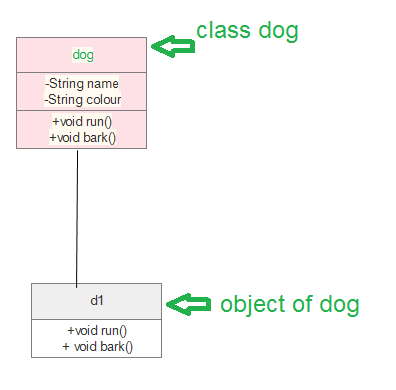
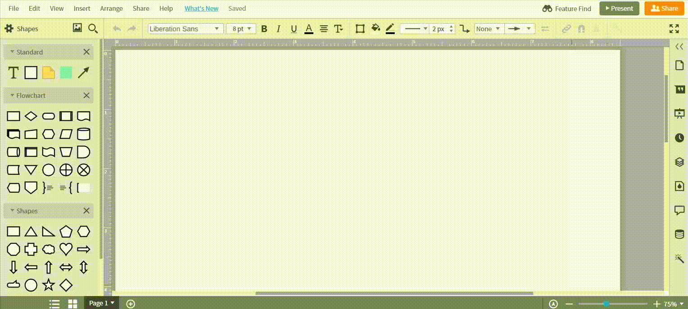
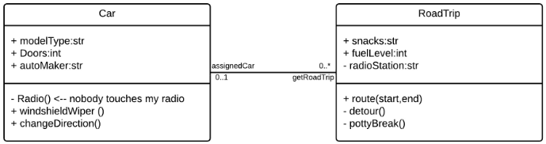
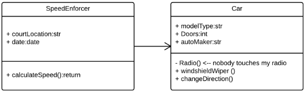
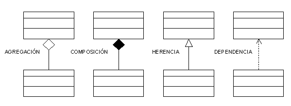

# UML  

---

# UML 

É a linguaxe de modelado de propósito xeral que se usa para visualizar un sistema. É unha linguaxe gráfica estándar para a industria do software coa que especificar, visualizar, construír e documentar os artefactos dos sistemas de software, así como para o modelado de negocios.

---

## Beneficios de UML: 

- Simplifica o deseño de software complexo, tamén pode implementar POO coma un concepto moi utilizado.
- Reduce miles de palabras de explicación nuns poucos diagramas gráficos que poden reducir o consumo de tempo para comprender.
- Fai que a comunicación sexa máis clara e real.
- Axuda a adquirir todo o sistema nunha vista.
- Faise moi doado para o programador de software implementar a demanda real unha vez que teña unha imaxe clara do problema.

---

Con UML se pode diagramar calquera cousa (ou case!), idea de negocio ou procedemento. Os diagramas UML divídense, de xeito xeral, en dous tipos: Diagramas estruturais e Diagramas de comportamento: 

---

- ### Diagramas estruturais UML 
    - Diagrama de clases
    - Diagrama do paquete
    - Diagrama de obxectos
    - Diagrama de compoñentes
    - Diagrama de estrutura composta
    - Diagrama de implantación

---

- ### Diagramas de comportamento UML 
    - Diagrama de actividades
    - Diagrama de secuencia
    - Diagrama de casos de uso
    - Diagrama de estados
    - Diagrama de comunicación
    - Diagrama xeral da interacción
    - Diagrama de tempo

---

## Diagramas de clases

---

Os diagramas de clases son especialmente útiles para presentar os principais bloques de construción dun sistema ou método orientado a obxectos.

O diagrama de clases pódese usar para mostrar as entidades ou clases, as relacións entre elas,... 

Dado que as clases son o bloque de construción dunha aplicación que se basea en POO, o diagrama de clases ten unha estrutura adecuada para representar as clases, a herdanza, as relacións e todo o que teñen os POO no seu contexto.

---

**Os diagramas de clases:**

- Describen os tipos de obxectos e a relación estática entre eles.
- Pode representar axeitadamente varios aspectos do concepto de POO.
- Permite anticipar o deseño e análise das aplicacións anticipando problemas o que permite ser máis rápidos e eficientes.

---

##### :key: Crear un diagrama UML nunha GUI
Asuntos a ter en conta ao debuxar un diagrama de clases:

- Cada clase está representada por un rectángulo que ten unha subdivisión de tres compartimentos *__nome__*, *__atributos__* e *__operación__*.
- Hai tres tipos de modificadores que se usan para decidir a visibilidade de atributos e operacións. 
**\+** úsase para visibilidade pública (para todos)
**\#** úsase para visibilidade protexida (para autorizados e derivados)
 **\-**  úsase para visibilidade privada (só para min)

---

**Avaliar visibilidade**

Público (+)
Privado (-)
Protexido (#)
Paquete (~)
Derivado (/)

---

Os diagramas de clases non só se usan para ter unha vista estática do sistema, senón que tamén se usan para construír o código executable para a enxeñaría directa e inversa de calquera sistema.

Cun diagrama de clases se amosa claramente o mapeo con linguaxes orientadas a obxectos como Java, C++, etc. Na práctica, un diagrama de clases úsase xeralmente para propósitos de construción:

- Descrición da vista estática do sistema.
- Vistas da relación entre os elementos do sistema.
- Descrición das funcionalidades do sistema.
- Modelado de aplicacións de software utilizando linguaxes orientadas a obxectos.

---

---

### Crear un diagrama de clases (Lucidchart)

*Lucidchart dispón dunha biblioteca de figuras que pode axudarche a crear prácticamente calquer diagrama de clases.*

- #### Engadir ou importar formas
    Cada diagrama de clases debe incluír as formas UML de clase. En Lucidchart, para engadir a biblioteca de formas UML á barra de ferramentas:
        - Fai clic en "Formas" no lado esquerdo do editor e escolle "UML". 

---

---

## Elementos básicos dun diagrama de clases

O diagrama de clases estándar está composto por tres seccións:

- **Sección superior:** contén o nome da clase. Esta sección sempre é necesaria, tanto se estás falando do clasificador coma dun obxecto.
- **Sección media:** Contén os atributos da clase. Usa esta sección para describir as calidades da clase. Isto só é necesario cando se describe unha instancia específica dunha clase.
- **Sección inferior:** Inclúe operacións de clase (métodos). Amosada en formato de lista, cada operación ocupa a súa propia liña. As operacións describen como interactúa unha clase cos datos.

---

### Modificadores de acceso aos membros

Todas as clases teñen diferentes niveis de acceso dependendo do modificador de acceso (visibilidade). Aquí están os niveis de acceso cos seus símbolos correspondentes:

- Público (+)
- Privado (-)
- Protexido (#)
- Paquete (~)
- Derivado (/)
- Estático (subliñado)

---

### Ámbitos dos membros

Hai dous ámbitos para os membros: **clasificadores** e **instancias**.

Os clasificadores son membros estáticos mentres que as instancias son as instancias específicas da clase. Se estás familiarizado coa teoría básica de OO, isto non é nada innovador.

### Compoñentes adicionais do diagrama de clases

Segundo o contexto,**as clases nun diagrama de clases poden representar os obxectos principais, as interaccións na aplicación ou as clases a programar**. 

---

#### Composición básica:

- **Clases:** un modelo para crear obxectos e implementar comportamentos nun sistema. En UML, unha clase **representa un obxecto** ou un conxunto de obxectos que comparten unha estrutura e un comportamento comúns. Están representados por un rectángulo que inclúe filas do nome da clase, os seus atributos e as súas operacións. Cando debuxas unha clase nun diagrama de clases, só tes que cubrir a fila superior; as outras son opcionais se queres proporcionar máis detalles.
  - **Nome:** a primeira fila nunha forma de clase.
  - **Atributos:** a segunda fila nunha forma de clase. Cada atributo da clase móstrase nunha liña separada.
  - **Métodos:** A terceira fila en forma de clase. Tamén coñecidos como operacións, os métodos móstranse en formato de lista con cada operación na súa propia liña.

---

- **Sinais** : Símbolos que representan comunicacións unidireccionais e asíncronas entre obxectos activos.
- **Tipos de datos:** clasificadores que definen valores de datos. Os tipos de datos poden modelar tanto os tipos primitivos como as enumeracións.
- **Paquetes:** formas deseñadas para organizar clasificadores relacionados nun diagrama. Simbolízanse cunha gran forma de rectángulo con pestanas.
- **Interfaces:** unha colección de sinaturas de operacións e/ou definicións de atributos que definen un conxunto cohesionado de comportamentos. As interfaces son similares ás clases, agás que unha clase pode ter unha instancia do seu tipo, e unha interface debe ter polo menos unha clase para implementala.

---

- **Enumeracións:** representacións de tipos de datos definidos polo usuario. Unha enumeración inclúe grupos de identificadores que representan os valores da enumeración.
- **Obxectos:** instancias dunha clase ou clases. Pódense engadir obxectos a un diagrama de clases para representar instancias concretas ou prototípicas.
- **Artefactos:** elementos do modelo que representan as entidades concretas dun sistema de software, como documentos, bases de datos, ficheiros executables, compoñentes de software, etc.

---

### Interaccións

O termo "interaccións" refírese ás diversas relacións e ligazóns que poden existir nos diagramas de clase e de obxectos. Algunhas das interaccións máis comúns inclúen:

- **Herdanza:** o proceso de que un fillo ou subclase adquira a funcionalidade dun pai ou superclase, tamén coñecido como xeneralización. Simbolízase cunha liña recta conectada cunha punta de frecha pechada que apunta cara á superclase.

---

*No exemplo, o obxecto "Car" herdará tódolos atributos (speed, numbers of passengers, fuel) e métodos (go(), stop(), changeDirection()) da clase pai ("Vehicle"); engadidos aos atributos específicos (model type, number of doors, auto maker) e metodos da súa propia clase (Radio(), windshieldWiper(), ac/heat()). A herdanza móstrase mediante unha liña continua cunha frecha pechada e oca no extremo que sinala ao donante - clase pai -.*

---

- **Asociación bidireccional:** a relación predeterminada entre dúas clases. Ambas clases son conscientes unha da outra e da súa relación coa outra. Esta asociación está representada por unha liña recta entre dúas clases.

---

*No exemplo, a clase "Car" e a clase "RoadTrip" están interrelacionadas. Nun extremo da liña, "Car" adquire a asociación de "assignedCar" co valor de multiplicidade de 0..1, polo que cando existe a instancia de "RoadTrip", pode ter unha instancia de "Car" asociada a ela ou ningún. Neste caso, é necesaria unha clase "Caravan" separada cun valor de multiplicidade de 0.. para demostrar que un "RoadTrip" pode ter varias instancias de "Car" asociadas. Dado que unha instancia de car podería ter varias asociacións "getRoadTrip", é dicir, un coche podería realizar varias viaxes por estrada, o valor de multiplicidade establécese en 0..*

---

- **Asociación unidireccional:** unha relación un pouco menos común entre dúas clases. Unha clase é consciente da outra e interactúa con ela. A asociación unidireccional está modelada cunha liña de conexión recta que apunta unha punta de frecha aberta dende a clase coñecedora ata a clase coñecida.

---

## :eye:
*..., na túa viaxe pola ruta 66, podes atoparte cun limite de velocidade onde unha cámara rexistra a túa actividade de condución; pero non o saberás ata que recibas unha notificación por correo. E non está debuxado na imaxe, pero neste caso, o valor da multiplicidade sería 0.. dependendo de cantas veces pases pola cámara de velocidade.*

---

## Exemplos de diagramas de clases

Crear un diagrama de clases para trazar fluxos de procesos é sinxelo. Revisa algún dos exemplos mentres creas os teus propios diagramas de clases.

---

### Diagrama de clases para un sistema de xestión hoteleira

Un diagrama de clases pode mostrar as relacións entre cada obxecto nun sistema de xestión de hoteis, incluíndo a información dos hóspedes, as responsabilidades do persoal e a ocupación da habitación. O seguinte exemplo ofrece unha visión xeral útil do sistema de xestión do hotel.

---

[*Usar modelo*](https://www.lucidchart.com/documents/editNewOrRegister/d3ab2c31-8f2f-4ada-8f23-fb1654c0f0c9)

---

### Diagrama de clases para un sistema ATM

Os caixeiros automáticos son enganosamente sinxelos: aínda que os clientes só precisan premer algúns botóns para recibir diñeiro en efectivo, hai moitas capas de seguridade polas que un caixeiro automático seguro e eficaz debe pasar para evitar fraudes e proporcionar valor aos clientes bancarios. As distintas partes humanas e inanimadas dun sistema ATM están ilustradas por este diagrama de fácil lectura: cada clase ten o seu título e os atributos están listados a continuación.
*([fonte Lucidchart](https://www.lucidchart.com/))*

---

*[Usar modelo](https://www.lucidchart.com/documents/editNewOrRegister/f3617503-abc4-4fa3-9b16-7dccea412d79)*

---
## Como facer un diagram

- #### Engadir textos e conceptos a diagrama de clase

Para engadir texto en cada fila da forma da clase, só tes que facer clic e escribir.
- A primeira fila debe incluír só o nome da clase
- A segunda presenta os atributos da clase.
- A última sección enumera os posibles métodos ou operacións que a clase pode levar a cabo. 

*O texto das dúas seccións inferiores adoita estar aliñado á esquerda e escríbese con primeiras letras minúsculas.*

---

Continúa engadindo formas de clase ata que a túa aplicación estática estea completamente representada.

Indica o **alcance (_scope_)** subliñando certos membros (atributos ou métodos nunha clase). Os membros poden clasificarse como **instancias** ou **clasificadores**. Os clasificadores adoitan recoñecerse como estáticos, o que significa que os valores dos atributos seguen sendo os mesmos en todas as instancias e a invocación de métodos non afecta o estado da instancia. En comparación, as instancias conteñen métodos que poden cambiar o estado da instancia e os valores dos atributos que poden variar entre as instancias. Para indicar un **clasificador**, só tes que subliñar o seu nome; deixa o texto para indicar unha instancia.

---

Demostra **visibilidade (_visibility_)** colocando o símbolo correcto dentro da forma da clase e antes do atributo ou método particular. Isto tamén se chama **avaliar a visibilidade**. Consulta esta lista para atopar o símbolo asociado a cada nivel de acceso:

- **Público (+)**
- **Privado (-)**
- **Protexido (#)**
- **Paquete (~)**
- **Derivado (/)**

---

Para **amosar as interaccións** nos diagramas de clase e de obxectos, ou os vínculos que existen entre os obxectos podes indicar as relacións entre eles debuxando unha liña e despois empregando a notación segundo sexa necesario.

---

#### Formatar diagramas de clases
Dálle formato aos diagramas de clases *Temas* da barra lateral dereita,  seleccionar un formato de estilo predefinido (ou emprega os teus propios gráficos e recursos).

---

---
> ###### FONTES:
> - [Diagrama de clases uml](https://www.lucidchart.com/pages/es/tutorial-de-diagrama-de-clases-uml)
> - [Diagramas de clases uml](https://www.geeksforgeeks.org/unified-modeling-language-uml-class-diagrams/?ref=lbp)

---

FORMAWEB IV 
2021-2022

i.berndz &copy;2022

