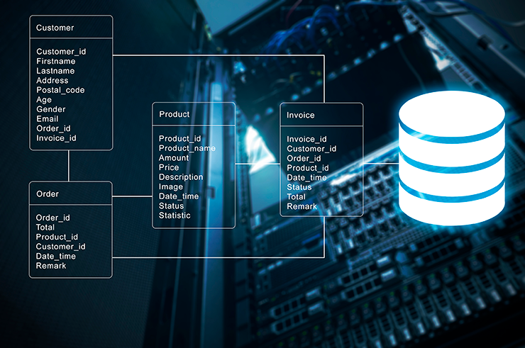
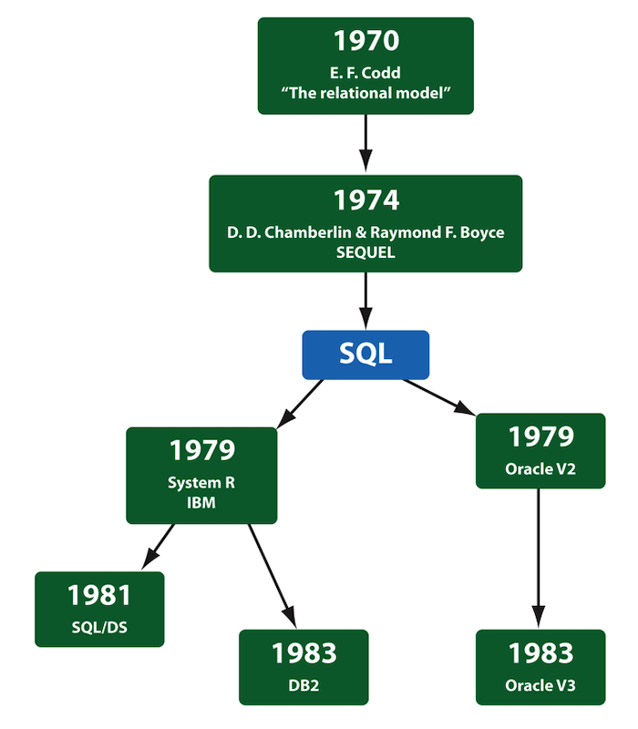
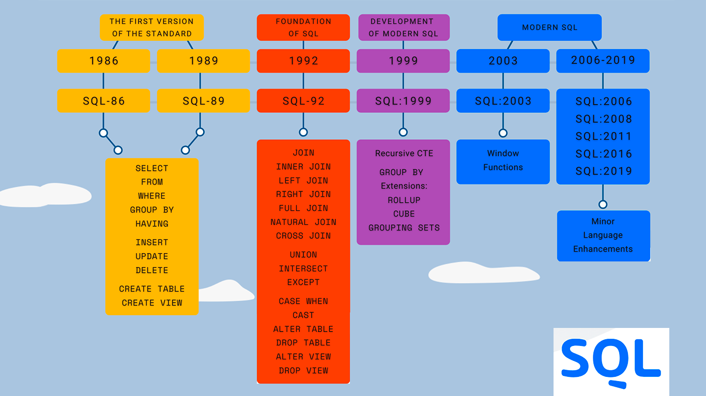

# 1. Que é SQL?

---

## SQL
son as iniciais de
Structured Query Language
(*Linguaxe estruturada de consulta*)

---
<!-- _backgroundColor: #f32a;  -->
<!-- _color: #bbb; -->

## SQL
foi inicialmente
[desenvolta](https://learnsql.com/blog/history-of-sql/) por IBM
durante os anos 1970s

---

---

## SQL
é a **linguaxe estándar** para comunicarse con sistemas de xestión de bases de datos relacionais como Oracle, MS Access, MS SQL Server, MySQL, DB2, Sybase, etc…

---

# 2. Proposito da SQL

---

## SQL
se emprega para **crear** novas bases de datos  ``CREATE``

---

## SQL
se emprega para **crear** novas táboas nas bases de datos  ``CREATE``

---

## SQL
se emprega para **insertar** rexistros nas bases de datos  ``INSERT``

---

## SQL
se emprega para **modificar** rexistros nas bases de datos  ``UPDATE``

---

## SQL
se emprega para **eliminar** rexistros nas bases de datos  ``DELETE``

---

## SQL
se emprega para **recuperar** datos dunha base de datos

---

## SQL
se emprega para **executar consultas** nunha base de datos

---

## SQL
pode **establecer permisos** en táboas, procedementos e vistas

---

## SQL
se emprega para **crear** procedementos almacenados nas bases de datos

---

## SQL
se emprega para **crear** vistas nas bases de datos

---

# 3. Quen ten que saber SQL?

---

## i. Desenvolvedores de Bases de datos - *Database Developers*

• Deseñar e desenvolver estruturas de taboas de bases de datos, formularios, informes e consultas, etc.

---

## ii. Administradores de BDs (DBA)

• Manter as bases de datos actualizadas e xestionar o acceso a bases de datos
• Redacción de informes, documentación e manuais de funcionamento

---

## iii. *Testers* de bases de datos

• Verificar a integridade dos datos
• Verificar as manipulacións de datos (engadir, actualizar e eliminar)
• Verificar as comparacións de datos

---

# 4. Subconxuntos de SQL

---

Os comandos de SQL - *SQL Commands*- pódense clasificar en grupos segundo a súa natureza:

> ## i) Linguaxe de definición de datos Data Definition Language  DDL
> ## ii) Linguaxe de manipulación de datos Data Manipulation Language  DML
> ## iii) Linguaxe de control de datos Data Control Language  DCL

---

# 5. DDL - Data Definition Language

---

Comandos e operacións en DDL - Data Definition Language

---

i. `CREATE`: para crear bases de datos e obxectos de base de datos

---

ii. `ALTER`: para modifcar obxectos de base de datos existentes

---

iii. `DROP`: para limpar bases de datos e obxectos de base de datos

---

iv. `TRUNCATE`: para remove todolos rexistros dunha táboa

---

v. `RENAME`: para renomear obxectos de base de datos

---

# 6. DML - Data Manipulation Language

---

Commandos e operacións en DML - Data Manipulation Language

---

i. `SELECT`: para seleccionar datos especificos da base de datos

---

ii. `INSERT`: para insertar novos rexistros nunha táboa

---

iii. `UPDATE`: para modificar rexistros existentes

---

iv. `DELETE`: para eliminar rexistros existentes dunha táboa

---

# 7. DCL - Data Control Language

---

Commandos e operacións en  DCL - Data Control Language

--

i. `GRANT`: para prover acceso as persoas aos obxectos da base de datos

---

ii. `REVOKE`: para quitar dereitos de acceso do usuario aos obxectos da base de datos

---

iii. `DENY`: para denegar permisos aos usuarios

---
