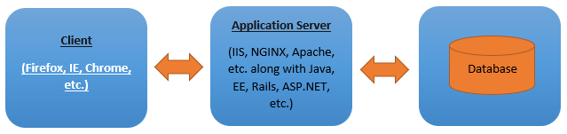

#### PROGRAMA DE EMPREGO

# FORMAWEB IV

|                       |                                                              |
| --------------------- | ------------------------------------------------------------ |
| **CURSO:**            | PROGRAMA DE EMPREGO FORMAWEB IV                           |
| **MÓDULO**            | MF0966_3. Consulta e manipulación de información contida en xestores de datos |
| **UNIDADE FORMATIVA** | UF2215: Ferramentas dos SXBD. Pasarelas e medios de conexión.             |
| **NºEXP:**            | 36/00004/2021                                                |

[TOC]

# Definición de arquitectura de 3 niveles dun DBMS

Un DBMS é unha ferramenta moi importante para organizar de forma eficiente os datos na base de datos pois é a que proporciona un acceso simplificado aos datos. O DBMS reduce a redundancia e axuda á coherencia dos datos. O deseño dun DBMS baséase na súa arquitectura que se denomina basicamente como arquitectura cliente/servidor, está definición aplícase ao(s) vínculo(s) dun enorme número de PCs, servidores de bases de datos, servidores web e algúns módulos máis conectados con redes.

A arquitectura DBMS pódese considerar segundo o tipo como dun único nivel ou de varios niveis. Na arquitectura cliente/servidor a arquitectura de base de datos ten dous tipos:

- arquitectura de 2 niveis, e
- arquitectura de 3 niveis. 

Na arquitectura DBMS de 3 niveis, se inclúe unha capa adicional relativa ao cliente e ao servidor onde o cliente pode non conectarse directamente co servidor.

### Arquitectura de 3 niveles de DBMS

A estratexia DBMS depende da súa arquitectura cliente/servidor para conectar moitas cantidades de PCs, servidores de bases de datos, servidores web e tamén outros compoñentes dispoñibles nas redes. Aquí, a arquitectura cliente/servidor inclúe varios ordenadores cunha estación de traballo que están asociados a través da rede. A arquitectura do DBMS está determinada pola forma en que os usuarios están relacionados coa base de datos para recibir a súa solicitude realizada.

Esta arquitectura de deseño axuda no esquema, desenvolvemento, implantación e mantemento da ferramenta DBMS onde permite clasificar o software de base de datos en distintos módulos que poden ser mellorados, reformados, substituídos ou alterados de forma autónoma. Este proceso axuda a comprender os compoñentes dunha base de datos.

Xa que unha base de datos mantén información importante e tamén admite datos de acceso rápido e estable; a elección da arquitectura DBMS axeitada beneficiará a xestión de datos.

Normalmente pódese considerar que o DBMS é dos seguintes tipos:

**1. Arquitectura de 1 nivel:** neste tipo de arquitectura, a base de datos ponse directamente a disposición do usuario onde se pode implementar e os cambios que se fagan aquí reflectiranse directamente na propia base de datos. Non ofrece ningunha ferramenta conveniente para os operadores finais.

Esta arquitectura de 1 nivel aplícase para a creación da aplicación nativa, onde os escritores de programas poden enlazar directamente coas bases de datos para unha resposta rápida.

**2. Arquitectura de 2 niveis:** neste tipo de arquitectura pódese dicir similar á primeira arquitectura como o tipo normal de cliente-servidor onde as aplicacións do lado do cliente poden conectarse á base de datos directamente do lado do servidor. As API como JDBC e ODBC aplícanse a este tipo de arquitectura de dous niveis. Aquí, os programas de aplicación e as interfaces de usuario execútanse no lado do cliente.

Aquí, o lado do servidor está destinado a ofrecer funcionalidades como a xestión de transaccións e o procesamento de consultas. Para comunicarse co DBMS, a aplicación do cliente debe establecer unha conexión co lado do servidor.

**3. Arquitectura de 3 niveis:** Xeralmente, hai outra capa presente entre o servidor e o cliente na arquitectura de 3 niveis de DBMS onde se facilita unha conexión directa co servidor. A aplicación no extremo do usuario funciona xunto cun servidor de aplicacións que se conecta adicionalmente co sistema de base de datos.

O usuario final non ten ningunha preocupación pola prevalencia da base de datos máis aló do servidor de aplicacións, onde nin sequera a base de datos ten ningunha pista sobre o usuario final fóra da aplicación. Este tipo de arquitectura de 3 niveis aplícase a un gran número de aplicacións web.

**Algúns detalles máis sobre a arquitectura de 3 niveis nun DBMS:**

Sábese que a arquitectura de 3 niveis de DBMS é o deseño cliente-servidor máis frecuente en DBMS onde a mellora e mantemento da lóxica, procedementos funcionais, interface de usuario e almacenamento de datos realízase de forma autónoma como módulos distintos. Esta arquitectura de 3 niveis inclúe un servidor de base de datos, unha capa de aplicación e unha capa de presentación que se separan en función da complexidade dos usuarios e de como se implementen os datos dispoñibles na base de datos.

Podemos dicir que a arquitectura DBMS de 3 niveis é unha extensión da arquitectura cliente-servidor de 2 niveis que consta das seguintes capas:

**Capa de presentación:** esta tamén se chama capa de nivel de usuario debido á función dos usuarios finais nesta capa arquitectónica do DBMS onde non teñen coñecemento sobre ningunha prevalencia da base de datos fóra desta capa. A aplicación pode ofrecer varias vistas do DBMS nesta capa. Aquí, todas as vistas son producidas por aplicacións que existen no nivel de aplicación. A arquitectura DBMS de varios niveis é moi modificable xa que todos os seus módulos son independentes e quizais tamén se modifiquen de forma similar. Por exemplo, tableta, PC, móbil, etc.

**Capa de aplicación:** esta é unha capa de nivel medio onde reside o servidor de aplicacións xunto cos programas que acceden á base de datos. Esta capa de aplicación no nivel ofrece unha vista abstracta da base de datos para un usuario para que os usuarios ao final non sexan conscientes da presenza da base de datos lonxe da aplicación. Por outro lado, o nivel de base de datos non ten idea doutro operador de usuario fóra do nivel de capa de aplicación. Polo tanto, a capa de aplicación ensambla no medio e actúa como mediador entre a base de datos e o usuario final.

Esta capa tamén se denomina capa de lóxica empresarial que procesa a lóxica funcional, as regras e as restricións antes dos datos transitorios para o operador ou ata o DBMS.

**Servidor de base de datos:** esta é a capa de nivel de datos onde se atopa a base de datos xunto cos seus idiomas de manexo de consultas. Aquí, podemos ter ademais as relacións que definen os datos e as súas restricións asociadas neste nivel de nivel.

A continuación móstrase un diagrama que ilustra a arquitectura de 3 niveis en DBMS:

*Fig. Arquitectura de 3 niveis de DBMS*

O obxectivo de deseñar unha arquitectura de 3 niveis é o seguinte:

- Para a independencia dos datos do programa
- Funcións de soporte do DBMS
- Axuda a múltiples vistas dos datos
- Por non conectar a base de datos física e as aplicacións de usuario.

Un dos maiores exemplos de arquitectura de 3 niveis en DBMS inclúe calquera sitio web enorme en Internet.

### Conclusión

A arquitectura DBMS de 3 niveis implícase cando hai grandes casos de aplicacións web. Como esta arquitectura comprende unha capa extra entre o servidor e o cliente, polo tanto, o operador final non ten coñecemento sobre a presenza da base de datos fóra do servidor de aplicacións. A aplicación do cliente coopera con este servidor de aplicacións que se interconecta adicionalmente co sistema de base de datos.

---

MRZ 2022

FORMAWEB IV