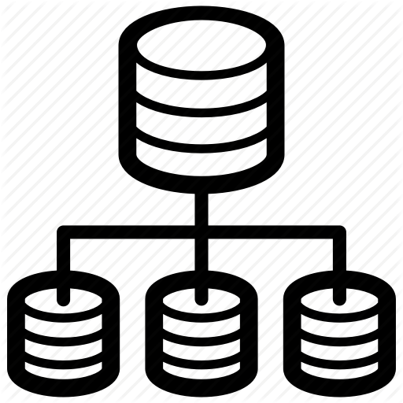
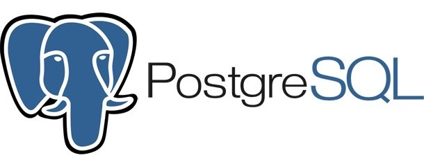
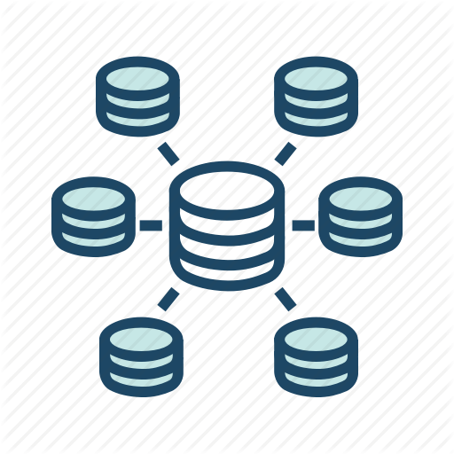
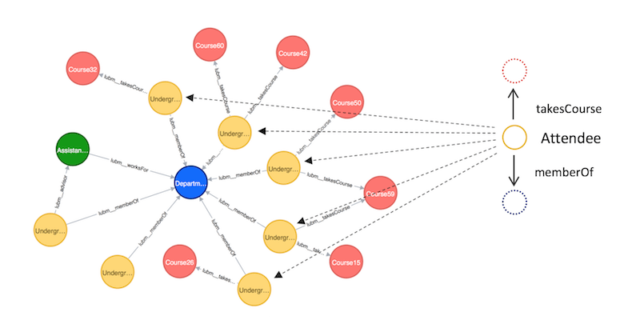
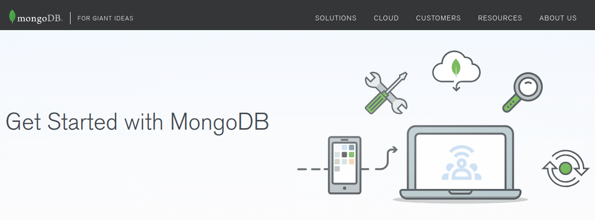
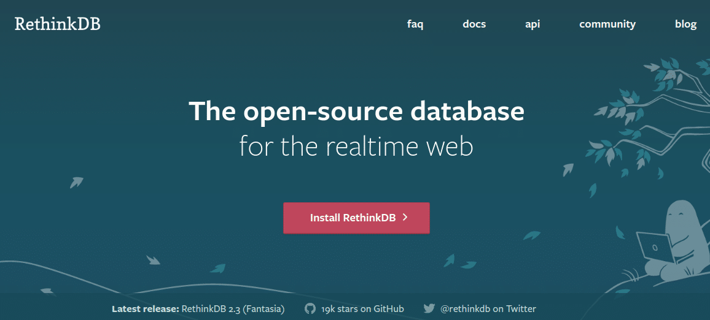
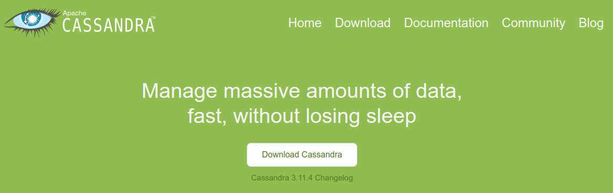
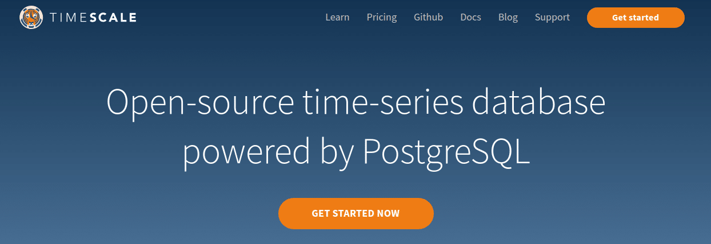
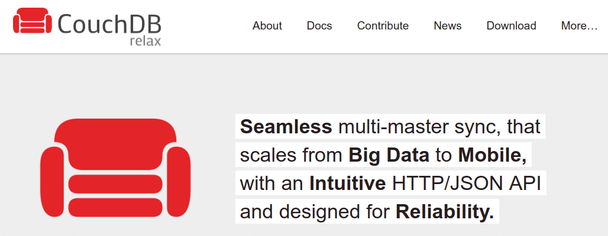

#### PROGRAMA DE EMPREGO

# FORMAWEB IV

|                       |                                                              |
| --------------------- | ------------------------------------------------------------ |
| **CURSO:**            | PROGRAMA DE EMPREGO FORMAWEB IV                           |
| **MÓDULO**            | MF0966_3. Consulta e manipulación de información contida en xestores de datos |
| **UNIDADE FORMATIVA** | UF2215: Ferramentas dos SXBD. Pasarelas e medios de conexión.             |
| **NºEXP:**            | 36/00004/2021                                                |

[TOC]

# Sistemas xestores de bases de datos

**Unha definición:**

**Sistema Xestor de Base de Datos:** Conxunto coordinado de programas, procedementos, linguaxes, etc., que suministra, tanto aos usuarios non informáticos, como aos analistas programadores, ou ao administrador, os medios necesarios para describir e manipular os datos contidos na base de datos, mantendo a súa integridade, confidencialidade e seguridade. 

- Os SXBD (sistemas xestores de bases de datos ou DBMS - *database managenet system*-) ofrecen un conxunto de programas que permiten acceder e xestionar bases de datos, a súa estrutura e contidos.

- Os SXBD permiten aos usuarios a creación e o mantemento de bases de datos, facilitando a definición, construcción e manipulación da información contenida nelas.
  - Definir a base de datos consistirá en especificar os tipos de datos, as estruturas e as restricóns que os datos han cumprir á hora de almacenarse na base de datos. 
  - A construcción da base de datos será o proceso de almacenamento de datos concretos nalgún medio ou soporte de almacenamento que esté supervisado polo SXBD. 
  - A manipulación da base de datos incluirá a posibilidade de realizar consultas para recuperar información específica, a actualización dos datos e a xeración de informes a partir do seu contido. 

## Avantaxas dun SXBD

- Proporcionan ao usuario unha visión abstracta dos datos, ocultando parte da complexidade relacionada con cómo se almacenan e manteñen os datos.
- Ofrecen independencia física, é dicir, a visión que o usuario ten da información, e a manipulación dos datos almacenados é independente de cómo estéan almacenados físicamente.
- Disminuen a redundancia e a inconsistencia de datos.
- Aseguran a integridade dos datos.
- Facilitan o acceso aos datos, aportando rapidez e evitando a pérdida dos mesmos.
- Aumentan a seguridade e a privacidade dos datos.
- Melloran a eficiencia.
- Permiten compartir datos e accesos concurrentes.
- Facilitan o intercambio de datos entre distintos sistemas.
- Incorporan mecanismos de copias de seguridade e recuperación para restablecer a información en caso de fallos no sistema.

O SSBD interacciona con outros elementos software existentes no sistema, concretamente co sistema operativo (SO). Os datos almacenados de forma estruturada na base de datos poden ser utilizados indistintamente por outras aplicacións, pero será o SXBD quen ofrecerá unha serie de facilidades a ditas aplicacións para o acceso e a manipulación da información, baseandose nas funcións e métodos propios do sistema operativo (SO).

## Funcións dun SXBD

Un SXBD desesenvolve tres funcións fundamentais:

- descripción, manipulación e utilización dos datos. 

### 1. Función de descripción ou definición:

Permite ao deseñador da base de datos crear as estruturas apropiadas para integrar axeitadamente os datos. Esta función é a que permite definir as tres estruturas da base de datos: Estrutura interna, Estrutura conceptual e Estrutura externa. 

Esta función se realiza mediante o **linguaxe de descripción de datos o DDL**. Mediante esa linguaxe: se definen as estruturas de datos, se definen as relacións entre os datos e se definen as regras (restricións) que han de cumprir os datos.
Se especificarán as características dos datos a cada un dos tres niveles:

 - A nivel interno (estrutura interna), se indicará o espazo de disco reservado para base de datos, a lonxitude dos campos, o seu modo de representación (linguaxe para definición da estrutura externa).
 - A nivel conceptual (estrutura conceptual), se proporcionan ferramentas para definición das entidades e a súa identificación, atributos das mesmas, interrelacións entre elas, restricións de integridade, etc.; é dicir, o esquema da base de datos (linguaxe para definición da estrutura lóxica global).
 - A nivel externo (estrutura externa), se deben definir as vistas dos distintos usuarios a través da linguaxe para definición de estruturas externas. A demais, o SXBD se ocupará da transformación das estruturas externas orientadas aos usuarios ás estruturas conceptuais, e da relación desta e a estrutura física.

### 2. Función de manipulación:

Permite aos usuarios da base de datos buscar, engadir, suprimir ou modificar os datos da mesma, sempre dacordo coas especificacións e as normas de seguridade dictadas polo administrador. Se levará a cabo por medio dunha **linguaxe de manipulación de datos (DML)** que facilita os instrumentos necesarios para a realización destas tarefas.

Tamén se encarga de definir a vista externa de todos os usuarios da base de datos, ou vistas parciais que cada usuario ten dos datos definidos coa linguaxe de descrición de datos DDL.

Por manipulación de datos entendese:

- A recuperación de información almacenada na base de datos, ou o que se coñece como *consultas*.
- A inserción de información nova na base de datos.
- O borrado de información da base de datos.
- A modificación de información almacenada na base de datos.

### 3. Función de control: 
Permite ao administrador da base de datos establecer mecanismos de protección das diferentes visións dos datos asociadas a cada usuario, proporcionando elementos de creación e modificación a ditos usuarios. Adicionalmente, incorpora sistemas para a creación de copias de seguridade, carga de farquivos, auditoría, protección de ataques, configuración do sistema, etc. A linguaxe que implementa esta función é a **linguaxe de control de datos o DCL.**

 

### E con qué linguaxe poderemos desenvolver todas estas funcións sobre unha base de datos?

A Linguaxe Estructurada de Consultas (SQL: Structured Query Language) e unha linguaxe que proporciona sentencias para realizar operacións de DDL, DML e DCL. A demais, os SXBD soén proporcionar outras ferramentas que complementan a estas linguaxes como xeradores de formularios, informes, interfaces gráficas, xeradores de aplicacións, etc.

> *SQL foi publicado en 1986 polo ANSI (American National Standard Institute) e foi evolucionando ao longo do tempo ata converterse nunha dos estandares máis recoñecidos.*

## Compoñentes dun SXBD
Un SXBD é un paquete de software complexo orientado a proporcionar servizos relacionados co almacenamento e a explotación dos datos de forma eficiente. Para o que conta cunha serie de compoñentes:

1. **Linguaxes da base de datos**. Calquera SXBD ofrece a posibilidade de utilizar linguaxes e interfaces axeitadas os diferentes tipos de usuarios. A través das linguaxes se poden especificar os datos que compoñen a BD, a súa estrutura, relacións, regras de integridade, control de acceso, características físicas e vistas externas dos usuarios.

   > *As linguaxes do SXBD son: Linguaxe de Definición de Datos (**DDL**), Linguaxe de Manipulación de Datos (**DML**) e Linguaxe de Control de Datos (**DCL**).*

2. **O dicionario de datos**. Descripción dos datos almacenados. Información útil para os programadores de aplicacións. É o lugar onde se deposita a información sobre a totalidade dos datos que forman a base de datos. Contén as características lóxicas das estruturas que almacenan os datos, o seu nome, descrición, contido e organización. Nunha base de datos relacional, o diccionario de datos aportará información sobre:
   
      - Estructura lóxica e física da BD.
      - Definición de taboas, vistas, índices, disparadores, procedementos, funcións, etc.
      - Cantidade de espazo asignado e utilizado polos elementos da BD.
      - Descripción das restricións de integridade.
      - Información sobre os permisos asociados a cada perfil de usuario.
      - Auditoría de acceso aos datos, utilización, etc.

3. **O xestor de la base de datos**. É a parte de software encargada de garantir o correto, seguro, íntegro e eficiente acceso ao almacenamento dos datos. Esta compoñente é a que se encarga de proporcionar unha interface entre os datos almacenados e os programas de aplicación que os manexan. É un intermediario entre o usuario e os datos. É o encargado de garantir a privacidade, seguridade e integridade dos datos, controlando os accesos concurrentes e interactuando co sistema operativo.

4. **Usuarios da base de datos.** Nos SXBD existen diferentes perfiles de usuario, cada un deles cunha serie de permisos sobre os obxectos da BD. Xeralmente serán:
   
    - O administrador da base de datos o Database Administrator (DBA), que será a persoa ou grupo  encargados da función de administración da base de datos. Ten o control centralizado da base de datos e é o responsable do seu bo funcionamento. É o encargado de autorizar o acceso á base de datos, de coordinar e vixiar a súa utilización e de adquirir os recursos software e hardware que sexan necesarios.
    - Os usuarios da base de datos, que serán diferentes usuarios con diferentes necesidades sobre os datos, así como diferentes privilegios e niveles de acceso. Algúns que podemos contar:
            - Deseñadores.
                - Operadores e persoal de mantemento.
                - Analistas e programadores de aplicacións.
                - Usuarios finais: ocasionais, simples, avanzados e autónomos.

5. **Ferramentas da base de datos.** Son un conxunto de aplicacións que permiten aos administradores a xestión da base de datos, dos usuarios e permisos, xeradores de formularios, informes, interfaces gráficas, xeradores de aplicacións, etc. ‐
              
## Arquitectura.
Un SXBD conta cunha arquitectura a través da que se lle simplifica aos diferentes usuarios da base de datos a súa labor. O obxectivo fundamental é separar os programas de aplicación da base de datos física.

Atopar un estándar para esta arquitectura non é fácil.

Os tres estándares de máis relevancia son: ANSI/SPARC/X3, CODASYL ou ODMG (éste sólo para as bases de datos orientadas a obxectos). Tanto ANSI (EEUU), como ISO (resto do mundo), son os referentes en canto a estandarización de bases de datos, conformando un único modelo de bases de datos.

A arquitectura proposta proporcionará tres niveles de abstracción: nivel interno ou físico, nivel lóxico ou conceptual e nivel externo ou de visión do usuario.

- Nivel interno ou físico: Neste nivel se describe a estrutura física da base de datos a través dun esquema interno encargado de detallar o sistema de almacenamento da base de datos e os seus métodos de acceso. É o nivel máis preto ao almacenamento físico. A través do esquema físico se indican, entre outros, os arquivos que conteñen a información, a súa organización, os métodos de acceso aos rexistros, os tipos de rexistros, a lonxitude, os campos que os compoñen, as unidades de almacenamento, etc.
- Nivel lóxico ou conceptual: Neste nivel se describe a estructura completa da base de datos a través dun esquema que detalla as entidades, atributos, relacións, operacións dos usuarios e restriccións. Os detalles relacionados coas estruturas de almacenamento se ocultan, permitindo realizar unha abstracción ao máis alto nivel.
- Nivel externo ou de visión do usuario: Neste nivel se describen as diferentes vistas que os usuarios percibirán da base de datos. Cada tipo de usuario ou grupo deles verá só a parte da base de datos que lle interesa, ocultando o resto.
  Para unha base de datos, só existirá un único esquema interno, un único esquema conceptual e poderían existir varios esquemas externos definidos para un ou varios usuarios.

Gracias a esta arquitectura se consigue a independencia de datos a dous niveis:

- Independencia lógica: Podemos modificar o esquema conceptual sen alterar os esquemas externos nin os programas de aplicación.
- Independencia física: Podemos modificar o esquema interno sen necesidade de modificar o esquema conceptual ou o externo. É dicir, pódese cambiar o sistema de almacenamento, reorganizar os arquivos, engadir novos, etc., sen que isto afecte ao resto de esquemas.

## Tipos de SXBD

Poderíase facer a seguinte clasificación, atendiendo a diferentes criterios:
a. O primeiro criterio que se soe empregar é **segundo o modelo lóxico** no que se basean. O modelo lóxico que máis se emprega é, por agora, o relacional. Os modelos en rede e xerárquico quedaron obsoletos. Outro dos modelos de máis uso é o modelo orientado a obxectos. Así quedarían:

- Modelo Xerárquico.
- Modelo de Rede.
- Modelo Relacional.
- Modelo orientado a Obxectos.
- Modelo orientado a documentos
  

b. O segundo criterio de clasificación atende ao **número de usuarios** aos que da servizo o sistema:

- Monousuario: só atenden a un usuario á vez, e o seu principal uso é nos ordenadores personais.
- Multiusuario: entre los que se encuentran la mayor parte de los SGBD, atienden a varios usuarios al mismo tiempo.

c. O terceiro criterio responde ao **número de sitios nos que está distribuida** a base de datos:
- Centralizados: os datos se almacenan nun só computador. Os SXBD centralizados poden atender a varios usuarios, pero o SXBD e a base de datos en sí residen por completo nunha soa máquina.
- Distribuidos (Homoxéneos, Heteroxéneos): a base de datos real e o propio software do SGBD poden estar distribuidos en varios sitios conectados por unha rede. Os sistemas homoxéneos utilizan o mesmo SXBD en múltiples sitios. Unha tendencia recente consiste en crear software para ter acceso a varias bases de datos autónomas preexistentes almacenadas en sistemas distribuidos heteroxéneos. Isto da lugar aos SXBD federados ou sistemas multibase de datos nos que os SGBD participantes teñen certo grado de autonomía local.

d. O cuarto criterio toma como referencia o custe. En xeral trátase de tecnoloxías de alto custe, incluidos os sitemas monousuario.

e. O quinto, e último, criterio de clasificación sería o propósito:

- Propósito Xeral: poden ser utilizados para o tratamento de calquera tipo de base de datos e aplicación.

- Propósito Específico: Cando o rendimento é fundamental, se pode deseñar e construir un software de propósito especial ou aplicación específica. Este sistema non sirve para outras aplicacións.

  > *Moitos sistemas de reservas de líñas aéreas son de propósito especial e pertenecen á categoría de sistemas de procesamiento de transaccións en líña, que deben atender un grande número de transaccións concorrentes sen excesivos retrasos.*

Existen multitude de SXDB no mercado. A elección dun SXBD é unha decisión moi importante á hora de desenvolver os teus proxectos. As veces, o sistema máis avanzado segundo os entendidos, pode non selo para o tipo de proxecto que esteas desesenvolvendo. Tes que ter en conta factores coma o volumen de carga que deberá soportar a base de datos, qué sistema operativo utilizaras como soporte, cál é o noso orzamento, os prazos de entrega, etc.

| SISTEMA                  | Descripción                                                  | URL                                                          |
| ------------------------ | ------------------------------------------------------------ | ------------------------------------------------------------ |
| **ORACLE**               | Reconocido como un dos mellores. Multiplataforma, confiable e seguro. Arquitectura Cliente/Servidor. Baseado no modelo de datos relacional. De gran potencia, aínda que cun prezo elevado, iso fai que se empregue especialmente no seo de grandes empresas. Ten unha versión gratuita Oracle Database Express Edition (XE). | https://www.oracle.com/database/technologies/appdev/xe.html  |
| **MYSQL**                | Sistema moi extendido que se ofrece baixo dous tipos de licenza, comercial ou libre. As empresas que desexen incorporalo en productos propios, deben comprar unha licenza específica. Es relacional, multifio, multiusuario e multiplataforma. A súa velocidade faino axeitado para as consultas de bases de datos e plataformas web. | http://www.mysql.com/                                        |
| **Db2**                  | Multiplataforma, o motor de base de datos relacional integra XML de maneira nativa, o que IBM denomina pureXML, que permite almacenar documentos completos para realizar operacións e buscas de maneira xerárquica dentro deste, e integralo con buscas relacionais. | https://www.ibm.com/cloud/blog/announcements/ibm-db2-developer-community-edition?mhsrc=ibmsearch_a&mhq=db2 |
| **INFORMIX**             | Outra opción de IBM para o mundo empresarial. Sinxelo e fiable. SXBD relacional baseado en SQL. Multiplataforma. Consume menos recursos que Oracle, con utilidades moi avanzadas respecto á conectividade e funcións relacionadas coas tecnoloxías de Internet/Intranet, XML, etc. | http://www.ibm.com/es-es/products/informix                   |
| **Microsoft SQL SERVER** | SXBD producido por Microsoft. Segue o modelo relacional, Só funciona baio Microsoft Windows, utiliza arquitectura Cliente/Servidor. Constitue a alternativa a outros potentes SGBD coma Oracle, PostgreSQL ou MySQL. | https://www.microsoft.com/es-es/sql-server/sql-server-downloads |
| **SYBASE**               | Un DBMS con bastantes anos no mercado, ten 3 versiones para ajustarse a las necesidades reales de cada empresa. Es un sistema relacional, altamente escalable, de alto rendimiento, con soporte a grandes volúmenes de datos, transacciones y usuarios, y de bajo costo. | https://www.sap.com/spain/index.html                         |

Outros SGBD comerciais importantes son: DBASE, ACCESS, INTERBASE ou FOXPRO.

#### Open Source

A alternativa aos SXBD comerciais son os SXBD de código aberto - Open Source-. Son sistemas distribuidos e desesenvoltos libremente para un mundo dominado, durante tanto tempo, por bases de datos como Oracle e SQL Server, agora parece haber solucións infinitas. Parte do motivo é a innovación impulsada por código aberto: desenvolvedores realmente talentosos que queren crear algo no que poidan deleitarse.

A outra parte é o auxe dos novos modelos de negocio, nos que as empresas manteñen unha versión comunitaria do seu produto para gañar compromiso e tracción ao tempo que ofrecen unha oferta comercial complementaria.

*Máis bases de datos das que se poden manter. Demasiadas opcións, demasiada documentación para revisar, e unha vida tan curta ;).*

**[MySQL](https://dev.mysql.com)**, posiblemente é a solución de base de datos de código aberto máis popular e extendida que existe.

É o que todos aprendemos primeiro, é compatible con case todos os CMS ou frameworks existentes e é moi, moi bo para a maioría dos casos de uso. 

Os seguintes: nalgúns casos, poden ser alternativa a MySQL, noutros, son unha solución completamente diferente para unha necesidade completamente diferente. 

Outro asunto a ter en conta sempre que selecciones un SXBD é a compatibilidade. Se tes un proxecto que, por calquera motivo, só admite un motor de base de datos en particular, esa é a túa opción.

## PostgreSQL

Se habitúas a empregar PHP (WordPress, Magento, Drupal, etc.), pode que [PostgreSQL](https://www.postgresql.org/) te soe algo afastado. Non obstante, este software de base de datos relacional existe desde 1997 e é a mellor opción en comunidades como Ruby, Python, Go, etc.

Moitos desenvolvedores destacan a PostgreSQL polas funcións que ofrece ou pola estabilidade.

Hai moitos [clientes SQL](https://geekflare-com/es/multi-platform-sql-client) dispoñibles para conectarse ás bases de datos PostgreSQL para a súa administración e desenvolvemento.

**Características únicas**

PostgreSQL ten varias características interesantes en comparación con outras bases de datos relacionais (específicamente, MySQL), como:

- Tipos de datos integrados para matriz (MySQL opta no seu lugar polas cadeas de datos separados por comas), rango, UUID, xeolocalización (especialmente interesante para aplicacións baseadas na localización), etc.
- Compatibilidade nativa para almacenamento de documentos (estilo JSON), XML e almacenamento de valores clave (Hstore)
- Replicación síncrona e asíncrona
- Scriptable en PL, Perl, Python e moito máis
- Busca de texto completo

**Cando usar PostgreSQL**

PostgreSQL é sempre unha opción inmellorable de base de datos relacional. 

PostgreSQL tamén ten unha clara vantaxe se vas botar man de instalacións parciais de NoSQL para un modelo de datos híbrido; dado que o almacenamento de documentos e valores clave é compatible de forma nativa.

**Cando non usar PostgreSQL**

PostgreSQL non ten sentido cando o modelo de datos non é relacional e/ou cando os requisitos arquitectónicos son moi específicos. Por exemplo, vexamos Google Analytics, onde se crean constantemente novos informes a partir de datos existentes. Estes sistemas están pesados para a lectura e sofren cando se lles impón un esquema estrito. Por suposto, PostgreSQL ten un motor de almacenamento de documentos, pero as cousas comezan a desmoronarse cando se trata de grandes conxuntos de datos.

## MariaDB

[MariaDB](https://mariadb.org/) foi creada como substituto de MySQL pola mesma persoa que desenvolveu MySQL.

Despois de que Oracle se fixera cargo de MySQL en 2010 (mediante a adquisición de Sun Microsystems, que, por certo, foi tamén o xeito no que Oracle chegou a controlar Java), o creador de MySQL iniciou un novo proxecto de código aberto chamado MariaDB.

Por que importan todos estes detalles aburridos? Débese a que MariaDB construíuse a partir da mesma base de código que MySQL (no mundo de código aberto, isto coñécese como "bifurcar" un proxecto existente). Como resultado, MariaDB preséntase como un substituto "drop-in" de MySQL.

Isto quere dicir que, se estás a usar MySQL e queres migrar a MariaDB, o proceso é moi sinxelo.

Desafortunadamente, esa migración é unha rúa de sentido único. Non é posible volver de MariaDB a MySQL, e se tentas usar a forza, quedarás sen a túa base de datos.

**Características únicas**

Aínda que MariaDB é esencialmente un clon de MySQL, as diferenzas entre ambos aumentaron co tempo. Adoptar MariaDB debe ser unha decisión ben pensada. Aínda que haxa moitas cousas que o fan interesante:

- Gratuíto e aberto.
- Varias opcións de motor de almacenamento para necesidades especializadas: por exemplo, o motor Spider para transaccións distribuídas; ColumnStore para almacenamento distribuído en paralelo e almacenamento masivo de datos;...
- Melloras de velocidade, grazas ao seu motor de almacenamento Aria para consultas complexas.
- Columnas dinámicas para diferentes filas dunha táboa.
- Mellores capacidades de replicación (por exemplo, replicación dende varias fontes)
- Varias funcións JSON
- Columnas virtuais

. . . e máis. Pode ser esgotador estar ao día de todas as funcións de MariaDB. 

**Cando usar MariaDB**

Se queres un verdadeiro substituto de MySQL, e non pensas volver atrás, deberías usar MariaDB xa que queren manterse no fío da innovación.

**Cando non usar MariaDB**

A compatibilidade con MySQL é a única preocupación aquí. Dito isto, cada vez é menos un problema xa que proxectos como WordPress, Joomla, Magento, etc. comezaron a admitir tamén MariaDB. Iso si: non usar MariaDB para enganar un CMS que non o admite, xa que moitos trucos específicos de bases de datos farán saltar facilmente o sistema.

> [Guía de instalación de MariaDB](https://geekflare.com/es/mariadb-installation-guide/) .

## CockroachDB

O equipo detrás de CockroachDB parece estar formado por masoquistas. Cun nome de produto coma ese, seguramente queren poñer todas as probabilidades en contra e aínda así gañar.

A idea detrás da "cascuda" é que é un insecto construído para sobrevivir. ;)

O equipo detrás de CockroachDB (formado por antigos enxeñeiros de Google) estaba frustrado coas limitacións das solucións SQL tradicionais. Que historicamente as solucións SQL estiveran aloxadas nunha única máquina (os datos non ocupaban tanto) non xogaba ao seu favor cando se trata de manexar datos a grande escala. Durante moito tempo, non houbo forma de crear un clúster de bases de datos executando SQL, polo que MongoDB chamou tanto a atención.

Mesmo cando xurdiron a replicación e a agrupación en MySQL, PostgreSQL e MariaDB, non resultou sinxelo incorporalos cambios. CoachroachDB quere cambiar esta inconsistencia de cara a expansión do sistema. CoachroachDB incorpora fragmentación sen esforzo, agrupación e alta dispoñibilidade ao mundo de SQL.

**Cando usar CockroachDB**

É o soño dun arquitecto de sistemas feito realidade. Configuración rápida de clúster, envío de consultas,...

**Cando non usar CockroachDB**

*Mellor o demo que coñeces que o que vas coñecer.* Se o teu RDBMS existente funciona ben para ti e podes manexar os problemas de escala que provoca, quédate con el. 

## ClickHouse

[ClickHouse](https://clickhouse.tech/) é un sistema de base de datos OLAP rápido e de código aberto .

Utiliza cada hardware ao máximo para resolver cada consulta máis rápido. O rendemento máximo para procesar unha consulta adoita ser superior a dous terabytes por segundo. Para evitar unha maior latencia, as lecturas equilibran automaticamente as réplicas. 

Admite a replicación asíncrona multi-master e pode implementala en diferentes centros de datos. Dado que os nodos permanecen iguais, pode evitar incluso puntos únicos de falla. O tempo de inactividade dun só nodo ou de todo o centro de datos nunca afectará á dispoñibilidade do sistema para a escritura e a lectura.

Sinxelo de usar. Axiliza o procesamento de datos, pon todos os teus datos nun só sistema de forma organizada e está dispoñible ao instante para informar. Ademais, o dialecto SQL axuda a expresar o resultado sen usar ningunha API non estándar. 

Podese configurar como un sistema distribuído que se asenta en nós separados sen un único punto de fallo. As súas funcións de seguridade son fortes, incluíndo mecanismos de seguridade de nivel empresarial e de seguridade en caso de erro humano.

Axeitado para análises web e de aplicacións, telecomunicacións, redes publicitarias, xogos en liña, IoT, intelixencia empresarial, finanzas, comercio electrónico, vixilancia e moito máis. 

Intégrase con Hadoop, Postgres e MySQL.

Se non estás preparado para instalar e configurar un servidor, podes probar [Kamatera](https://es.kamatera.com/express/compute/) ofrecido por ClickHouse cun só clic.

## Neo4j

Un dos desenvolvementos máis importantes da última década son os datos conectados. O mundo que nos rodea non está dividido en táboas, filas e caixas; é unha lea xigante con todo conectado a case todo o demais.

As redes sociais son un bo exemplo, e construír un modelo de datos similar usando SQL ou incluso bases de datos baseadas en documentos é un pesadelo.

Isto é porque a estrutura de datos ideal para estas solucións é o gráfico, que é unha besta completamente diferente. E para iso, necesitas unha base de datos de gráficos como [neo4j](https://neo4j.com/) .

O exemplo anterior está tomado directamente do sitio web de Neo4j e mostra como os estudantes universitarios están conectados cos seus departamentos e cursos. Este modelo de datos é simplemente imposible con SQL, xa que será difícil evitar bucles infinitos e desbordamentos de búfer.

**Características únicas**

As bases de datos de gráficos son únicas por dereito propio e Neo4j é practicamente a única opción para traballar con gráficos. Como resultado, calquera característica que teña é única. 

- Soporte para aplicacións transaccionais e análise de gráficos.
- Habilidades de transformación de datos para asimilar datos tabulares a gran escala en gráficos.
- Linguaxe de consulta especializada (Cypher) para consultar a base de datos de gráficos
- Funcións de visualización e descubrimento

É un punto discutible para discutir cando usar Neo4j e cando non. Se precisas relacións baseadas en gráficos entre os teus datos, necesitas Neo4j. 

## MongoDB

[MongoDB](https://www.mongodb.com/) foi a primeira base de datos non relacional que provocou grandes cambios na industria tecnolóxica e segue a chamar a atención.

A diferenza das bases de datos relacionais, MongoDB é unha "base de datos de documentos", que almacena datos en anacos, con datos relacionados agrupados no mesmo anaco. Isto enténdese mellor imaxinando unha agregación de estruturas JSON como esta:

Aquí, a diferenza dunha estrutura baseada en táboas, os datos de contacto e os niveis de acceso do usuario residen no mesmo obxecto. Ao recuperar o obxecto de usuario, os datos asociados obtéñense automaticamente e non hai concepto de unión. [Aquí podes atopar](https://geekflare.com/es/getting-started-mongodb/) unha introdución máis detallada a MongoDB.

**Características únicas**

MongoDB ten algunhas características serias (case quero escribir "kick-ass" para transmitir o impacto, pero quizais non sería apropiado nun sitio web público) características que fixeron que varios arquitectos experimentados abandonasen o terreo relacional para sempre:

- Un esquema flexible para casos de uso especializados/imprevisibles.
- [Fragmento](https://geekflare.com/es/mongodb-sharding-best-practices/) e agrupación ridículamente sinxelos . Só tes que configurar a configuración dun clúster e esquecelo.
- Engadir ou eliminar un nodo dun clúster é moi sinxelo.
- Bloqueos transaccionais distribuídos. Esta característica faltaba nas versións anteriores, pero finalmente foi introducida.
- Está optimizado para escrituras moi rápidas, o que o fai moi adecuado para datos analíticos como sistema de almacenamento en caché.

Se soo como un portavoz de MongoDB, pido desculpas, pero é difícil exagerar os beneficios de MongoDB. Por suposto, o modelado de datos NoSQL é estraño ao principio, e algúns nunca o entenden, pero para moitos arquitectos, case sempre gaña a un esquema baseado en táboas.

**Cando usar MongoDB**

MongoDB é unha gran ponte cruzada desde o mundo estruturado e estrito de SQL ata o mundo amorfo e case confuso de NoSQL. Destaca na creación de prototipos xa que simplemente non hai ningún esquema do que preocuparse e cando *realmente* precisa escalar. Si, pode usar un servizo na nube SQL para desfacerse dos problemas de escalado da base de datos, pero é caro.

Finalmente, hai casos de uso nos que as solucións baseadas en SQL simplemente non funcionan. Por exemplo, se está a construír un produto como [Canva](https://www.canva.com/) , onde o usuario pode crear deseños arbitrariamente complexos e poder editalos máis tarde, boa sorte cunha base de datos relacional!

**Cando non usar MongoDB**

A completa falta de esquema que ofrece MongoDB pode funcionar como un pozo de alquitrán para aqueles que non saben o que están a facer. Discrepancia de datos, datos mortos, campos baleiros que non deberían estar baleiros: todo isto e moito máis é posible. MongoDB é esencialmente un almacén de datos "tonto" e, se decide facelo, o código da súa aplicación debe asumir unha gran responsabilidade para manter a integridade dos datos.

## RethinkDB

Como di o seu nome, [RethinkDB](https://www.rethinkdb.com/) *"repensa"* a idea e as capacidades dunha base de datos cando se trata de aplicacións en tempo real.

Cando se actualiza unha base de datos, a aplicación non ten forma de sabelo. O enfoque aceptado é que a aplicación active unha notificación en canto hai unha actualización, que se envía ao front-end a través dunha ponte complexa (PHP -> Redis -> Node -> Socket.io é un exemplo).

Pero que pasa se as actualizacións se puidesen enviar directamente desde a base de datos á interface?

Si, esa é a promesa de RethinkDB. Polo tanto, se estás a construír unha verdadeira aplicación en tempo real (xogo, mercado, análise, etc.), paga a pena botar unha ollada a Rethink DB.

## Redis

Cando se trata de bases de datos, é case demasiado fácil pasar por alto a existencia de [Redis](https://redis.io/) . Isto débese a que Redis é unha base de datos en memoria e úsase principalmente para soportar funcións como a caché.

É moi fácil de aprender a empregala - un traballo de dez minutos (¡literalmente!)-, e é unha simple tenda de valores clave que almacena cadeas cun tempo de caducidade (que se pode configurar en infinito, por suposto). O que Redis perde en funcións, compensao en usabilidade e rendemento. Dado que vive enteiramente na memoria RAM, as lecturas e as escrituras son incriblemente rápidas (uns centos de miles de operacións por segundo son algo común para ela).

Redis tamén ten un sofisticado [sistema pub-sub](https://redis.io/topics/pubsub) , o que fai que esta "base de datos" sexa dúas veces máis atractiva.

Noutras palabras, se tes un proxecto que podería beneficiarse da caché ou ter algúns compoñentes distribuídos, Redis é a primeira opción.

## SQLite

O *pequeno* [SQLite](https://www.sqlite.org) é moito coma para ignoralo.

SQLite é unha biblioteca C lixeira que proporciona un motor de almacenamento de bases de datos relacionais. Todo nesta base de datos vive nun único arquivo (cunha extensión .sqlite) que podes colocar en calquera lugar do teu sistema de arquivos. E iso é todo o que necesitas para usalo! Si, non hai ningún software de "servidor" que instalar e ningún servizo ao que conectarse.

**Funcións útiles**

Aínda que SQLite é unha alternativa lixeira a unha base de datos como MySQL, ten un gran potencial. Algunhas das súas características son:

- Soporte total para transaccións, con COMMIT, ROLLBACK e BEGIN.
- Soporte para 32.000 columnas por táboa
- Compatibilidade con JSON
- Soporte JOIN de 64 vías
- Subconsultas, busca de texto completo, etc.
- Tamaño máximo da base de datos de 140 terabytes.
- Tamaño máximo de fila de 1 gigabyte.
- 35 % máis rápido que as E/S de ficheiros

**Cando usar SQLite**

SQLite é unha base de datos moi especializada que se centra nun enfoque sen sentido e sen sentido. Se a túa aplicación é relativamente sinxela e non queres a molestia dunha base de datos completa, SQLite é un candidato serio. Ten un sentido especial para CMS de tamaño pequeno e mediano e aplicacións de demostración.

**Cando non usar SQLite**

Aínda que é impresionante, SQLite non cobre todas as funcións do SQL estándar nin do teu motor de base de datos favorito. Faltan os clústeres, os procedementos almacenados e as extensións de script. Ademais, non hai ningún cliente para conectarse, consultar e explorar a base de datos. Finalmente, a medida que aumenta o tamaño da aplicación, o rendemento se degrada.

## Cassandra

Mentres moitos proclaman que o fin de Java está preto, de cando en vez, a comunidade lanza unha bomba e silencia aos críticos. [Cassandra](https://cassandra.apache.org/) é un deses exemplos.

Cassandra pertence á coñecida como familia de bases de datos "Columnarizadas". A abstracción de almacenamento en Cassandra é unha columna en lugar dunha fila. A idea aquí é almacenar todos os datos nunha columna fisicamente xuntos no disco, minimizando o tempo de busca.

**Características únicas**

Cassandra foi deseñada pensando nun caso de uso específico: tratar con cargas de dixitación pesadas e tolerancia cero para o tempo de inactividade. Estes convértense nos teus puntos de venda únicos.

- Rendemento de escritura extremadamente rápido. Cassandra é posiblemente a base de datos máis rápida que existe cando se trata de manexar cargas de escritura pesadas.
- Escalabilidade lineal. É dicir, podes seguir engadindo tantos nodos a un clúster como queiras, e haberá un aumento cero na complexidade ou fraxilidade do clúster.
- Tolerancia de partición incomparable. É dicir, aínda que varios nodos dun clúster Cassandra caigan, a base de datos está deseñada para seguir funcionando sen perda de integridade.
- escritura estática

**Cando usar Cassandra**

O rexistro e as análises son dous dos mellores casos de uso de Cassandra. Pero iso non é todo: o punto doce é cando cómpre manexar datos de gran tamaño (Apple ten unha implementación de Cassandra que xestiona máis de 400 petabytes de datos mentres que Netflix xestiona 1 billón de solicitudes ao día) con literalmente cero tempo de inactividade. A alta dispoñibilidade é unha das características de Cassandra.

**Cando non usar Cassandra**

O esquema de almacenamento da columna de Cassandra tamén ten os seus inconvenientes. O modelo de datos é bastante plano, e se necesitas agregacións, Cassandra queda curta. Ademais, acada unha alta dispoñibilidade sacrificando a coherencia (lembremos o teorema CAP para sistemas distribuídos), o que o fai menos axeitado para sistemas nos que se precisa unha alta precisión de lectura.

## Timescale

Os novos desenvolvementos demandan novos tipos de bases de datos, e a Internet das Cousas (IoT) é un destes fenómenos. Unha das mellores bases de datos de código aberto para iso é [Timeline](https://www.timescale.com/) .

A escala temporal é un tipo do que se denomina base de datos "serie temporal". É diferente dunha base de datos tradicional en que é o principal foco de preocupación e a análise e visualización de conxuntos de datos masivos é unha prioridade. As bases de datos de series temporais raramente ven un cambio nos datos existentes; un exemplo son as lecturas de temperatura enviadas por un sensor nun invernadoiro: os novos datos seguen acumulándose cada segundo, o que é de interese para a análise e a elaboración de informes.

Entón, por que non usar unha base de datos tradicional cun campo de marca de tempo? Ben, hai dúas razóns principais para iso:

- As bases de datos de propósito xeral non están optimizadas para traballar con datos baseados no tempo. Para a mesma cantidade de datos, unha base de datos de propósito xeral será moito máis lenta.
- A base de datos debe xestionar cantidades masivas de datos a medida que chegan novos datos, e eliminar datos ou cambiar o esquema máis tarde non é unha opción.

**Características únicas**

Timescale DB ten algunhas características interesantes que o diferencian doutras bases de datos da mesma categoría:

- Está construído sobre PostgreSQL, posiblemente a mellor base de datos relacional de código aberto que existe. Se o teu proxecto xa está a executar PostgreSQL, Timecale deslizarase directamente.
- A consulta realízase utilizando a sintaxe SQL familiar, reducindo a curva de aprendizaxe.
- Velocidades de escritura ridículamente rápidas: millóns de insercións por segundo non son descoñecidas.
- Miles de millóns de filas ou petabytes de datos: non é gran cousa para Timescale.
- Auténtica flexibilidade co esquema: escolle entre relacional ou sen esquema segundo as túas necesidades.

Non ten moito sentido falar de cando usar ou non a base de datos Timescale. Se o teu dominio é IoT ou se buscas funcións de base de datos similares, Timecale paga a pena botarlle unha ollada.

## CouchDB

[CouchDB](https://couchdb.apache.org/) é unha pequena solución de base de datos que se atopa tranquila nun recuncho e ten un pequeno pero dedicado seguidores. Foi creado para xestionar os problemas dunha perda de rede e unha eventual resolución de datos, que resulta ser un problema tan complicado que os desenvolvedores cambiarían de traballo en lugar de tratar con el.

Basicamente, podes pensar nun clúster CouchDB como unha colección distribuída de nodos grandes e pequenos, algúns dos cales se espera que estean fóra de liña. Tan pronto como un nodo se conecta, envía os datos de volta ao clúster, que se dixerirá lentamente e con coidado, e finalmente queda dispoñible para todo o clúster.

**Características únicas**

CouchDB é unha especie única cando se trata de bases de datos.

- Capacidades de sincronización de datos primeiro sen conexión
- Versións especializadas para navegadores web e móbiles (PouchDB, CouchDB Lite, etc.)
- Fiabilidade probada en batalla e resistente a choques
- Agrupación sinxela con almacenamento de datos redundante

**Cando usar CouchDB**

CouchDB foi creado para tolerar fóra de liña e segue sendo incomparable neste sentido. Un caso de uso típico son as aplicacións móbiles nas que unha parte dos seus datos reside nunha instancia de CouchDB no teléfono do usuario (porque alí é onde se xerou). O interesante é que non pode confiar en que o dispositivo do usuario estea conectado todo o tempo, o que significa que a base de datos debe ser oportunista e estar lista para resolver as actualizacións en conflito máis tarde. Isto conséguese mediante o impresionante [Protocolo de replicación do sofá](https://docs.couchdb.org/en/stable/replication/protocol.html) .

**Cando non usar CouchDB**

Intentar usar CouchDB fóra do seu caso de uso previsto provocará un desastre. Usa moito máis almacenamento que calquera outra cousa, simplemente porque necesita manter copias redundantes de datos e resultados de resolución de conflitos. Como resultado, as velocidades de escritura tamén son terriblemente lentas. Finalmente, CouchDB non é adecuado como motor de esquema de propósito xeral, xa que non funciona ben cos cambios de esquema.

Pódese dicir e moito dos SXBD, máis se atendemos ao evanxelismo e/ou marketing promocional propio de cada unha das marcas ou  iniciativas. Ver, comparar e **probar** antes de seleccionar un en concreto e bo código!

---

Máis info:

[SXBD](https://es.wikipedia.org/wiki/Sistema_de_gestión_de_bases_de_datos) 

---

MRZ 2022

FORMAWEB IV

