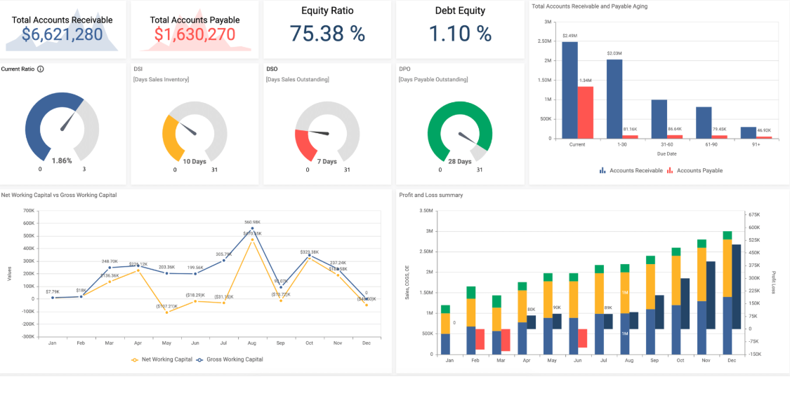
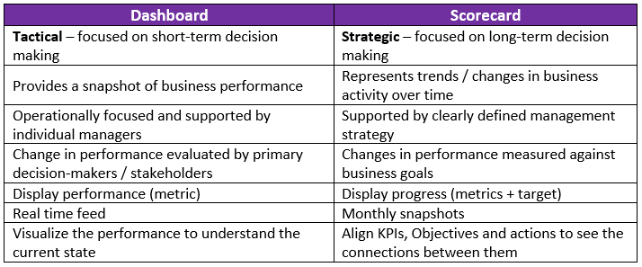

#### PROGRAMA DE EMPREGO

# FORMAWEB IV

|                       |                                                              |
| --------------------- | ------------------------------------------------------------ |
| **CURSO:**            | PROGRAMA DE EMPREGO FORMAWEB IV                           |
| **MÓDULO**            | MF0966_3. Consulta e manipulación de información contida en xestores de datos |
| **UNIDADE FORMATIVA** | UF2215: Implementación e uso dunha base de datos             |
| **NºEXP:**            | 36/00004/2021                                                |

[TOC]

# Diferenza entre un panel de control (dashboard) e os taboleiros de obxectivos (scorecard)

En moitos sistemas, suites ou aplicacións de control atopamos taboleiros que amosan diferentes grupos de datos e/ou informes. 

*A primeira vista pódese ter a impresión de que "panel de control" e "cadro de mando" son intercambiables, pero hai algunhas distincións importantes*:

|                                                         | **Dashboard**                                                | **Scorecard**                                                |
| ------------------------------------------------------- | ------------------------------------------------------------ | ------------------------------------------------------------ |
| **Úsase para…**                                         | medición/seguimento do rendemento                            | xestión do rendemento                                        |
| **Como ferramenta de medición é...**                    | métrico                                                      | KPI (Métrica + Obxectivo): obtén máis información sobre [a diferenza entre métrica e KPI](https://bscdesigner.com/quantification-measure-metric-kpi.htm) |
| **A medida está ligada aos obxectivos empresariais..**. | non está vinculado                                           | ligado (aliñado)                                             |
| **Mide…**                                               | rendemento                                                   | progreso (o valor actual fronte ao valor obxectivo)          |
| **Está actualizado…**                                   | en tempo real                                                | periodicamente (mensual)                                     |
| **Céntrase en…**                                        | obxectivos operativos (a curto prazo).                       | obxectivos estratéxicos (a longo prazo) (máis sobre a diferenza entre [obxectivos estratéxicos e operativos](https://bscdesigner.com/strategic-vs-operational-goals.htm) ) |
| **A súa finalidade é…**                                 | dar unha idea de alto nivel do que está a suceder na empresa | planificar e executar unha estratexia, identificar por que está a suceder algo e que se pode facer ao respecto |
| **A súa axuda…**                                        | visualizar a actuación para comprender o estado actual       | aliñar obxectivos, KPI e accións para ver a conexión entre eles |
| **Se fora un coche sería...**                           | cadro de mandos do automóbil (mostra como funciona o teu coche) | GPS (mostra cando e como chegará)                            |
|                                                         | son ferramentas tácticas (rendemento, eficiencia,...)        | son ferramentas estratéxicas (posicionamento, vendas,...)    |

Nun *scorecard*  se avalían os obxectivos comerciais globais e se analizan os KPIs. O *dashboard* está máis orientado a un nivel operativo polo que o seu obxectivo é identificar as métricas relevantes e amosar o seguimento dos seus valores. Se ocorre algo no panel de control, un executivo debe analizar a conexión de causa e efecto entre varias partes do sistema empresarial para descubrir o que hai que facer para solucionar o problema.

Os seus procesos de uso tamén son diferentes:

| Dashboard                                                    | Scorecard                                                    |
| ------------------------------------------------------------ | ------------------------------------------------------------ |
| 1. O sistema empresarial xera eventos. O rendemento do proceso calcúlase e preséntase en forma de medidas. | 1. O empregado responsable segue os obxectivos empresariais do mapa estratéxico. |
| 2. O panel operativo visualiza as medidas en forma de gráfico, diagrama ou calibre. | 2. O empregado executa o plan de acción que está aliñado co obxectivo de negocio específico e mídese con KPI seleccionados. |
| 3. Se o desempeño do proceso non é normal, un cadro de mando xera unha notificación ao responsable. | 3. O KPI, o seu valor compárase cos valores obxectivo e limiares (luz de stop): A actualización móstrase para o KPI específico. Visualización dos cambios no mapa estratéxico e nos gráficos de KPI. |
| 4. A persoa xestor responsable investiga e segue enlaces de causa e efecto para identificar e solucionar o problema de forma oportuna. | 4. O xestor responsable fai un seguimento do progreso segundo un plan desenvolvido e suxire actualizacións cando sexa necesario. |

É difícil distinguir quen usa o panel de control e quen usa cadro de mando. Algunhas empresas reservan o *scorecard* para directivos, outras prefiren compartilo con todos os seus empregados.

Suponse que un panel de control só está dispoñible para os roles de supervisor, pero algunhas empresas pensan que esta valiosa información tamén pode axudar aos empregados de nivel de liña no seu traballo diario.

### Panel de control: explorar a causa e o efecto

Cando un supervisor recibe un sinal de aviso xerado por un panel de control, despois de botar unha primeira ollada ao que está a suceder, o supervisor debe entender a relación de causa e efecto entre os obxectivos empresariais, as accións e as medidas.

Isto podería parecer moi parecido ao que un cadro de mando suxire facer cos obxectivos comerciais do mapa estratéxico da empresa.

### Cadro de mando: Medida e KPI

Aínda que moitas fontes tenden a diferenciar as medidas (sen obxectivo) e os KPI (con obxectivo), na práctica a maioría das empresas seguen a idea do KPI tamén nos paneis de control asignando algún punto de referencia sintético que serva de referencia ás melloras e actualizacións do sistema .

**Diferenza entre o panel de control e o cadro de mando**

Unha diferenza importante entre os paneis de control e os cadros de mando é que un cadro de mando céntrase nunha métrica determinada e compáraa cunha previsión ou obxectivo, mentres que un panel de control presentará varios números de diferentes xeitos. Os paneis de control indican aos sistemas de saúde como o están facendo en xeral; Os paneis indican aos sistemas o que está a suceder agora mediante métricas interactivas con capacidades de exploración. En resumo, un panel é un **sistema de seguimento do rendemento** , mentres que un cadro de mando é un **sistema de xestión do rendemento** .

As tarxetas de puntuación son ideais cando buscas unha visión concisa dunha área específica. Se precisa determinar o ben que se están a cumprir os KPIs de mercadotecnia ou como un equipo específico está a xestionar as súas tarefas, un cadro de puntuación pode iluminar o que están preto ou lonxe dos seus obxectivos. Isto pode ser útil cando intentas identificar áreas para mellorar ou formas de facer tarefas específicas máis eficientes.

Os paneis de control son vantaxosos cando necesitas unha vista panorámica das operacións da túa organización. Dado que poden albergar varios informes e conxuntos de datos nun único centro, os paneis son moi útiles cando se revisa o seu éxito diariamente. Non obstante, en lugar de seguir especificamente o progreso cara aos obxectivos, os paneis ofrecen unha visión máis holística dos datos. É dicir, presentan datos sen o seu valor obxectivo, proporcionando unha mellor visión histórica do progreso que é ideal para tomar decisións operativas do día a día deseñadas para mellorar os seus procesos organizativos.

O máis importante é que os teus paneis e cadros de mando non teñen que ser entidades separadas. Moitos paneis presentan cadros de mando como unha forma periódica de medir o éxito e tamén poden facer un seguimento dos KPI. Os cadros de mando tamén se poden incluír nos paneis, ofrecendo unha localización individual para ver varios KPI e o seu progreso.

Ao elixir que ferramenta de informes utilizar, a decisión entre cadros de mando e paneis non é necesariamente mutuamente excluínte. Usar ambos no momento adecuado pode darlle á súa organización unha imaxe moito máis clara da súa saúde e do seu progreso para acadar os seus obxectivos operativos e estratéxicos. Usar cadros de mando e paneis en conxunto é fundamental para mellorar os resultados, pero saber o que fan, cando usalos, como usalos e quen debe usalos é igual de importante. Ao final, o único que importa é que teña un sistema eficaz para traducir os obxectivos estratéxicos de primeiro nivel en responsabilidade individual e medir o progreso con respecto a estes obxectivos de forma oportuna.

---

