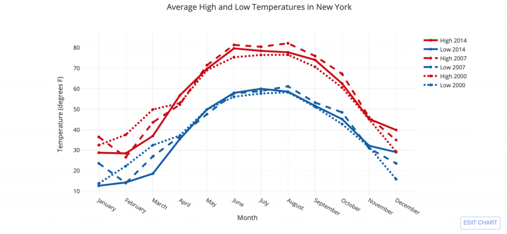
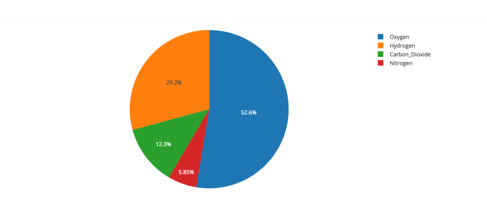
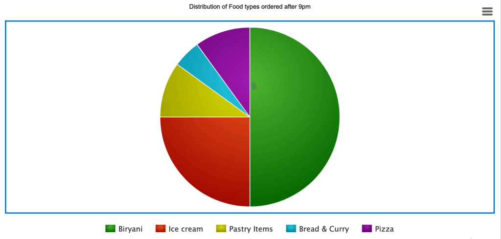
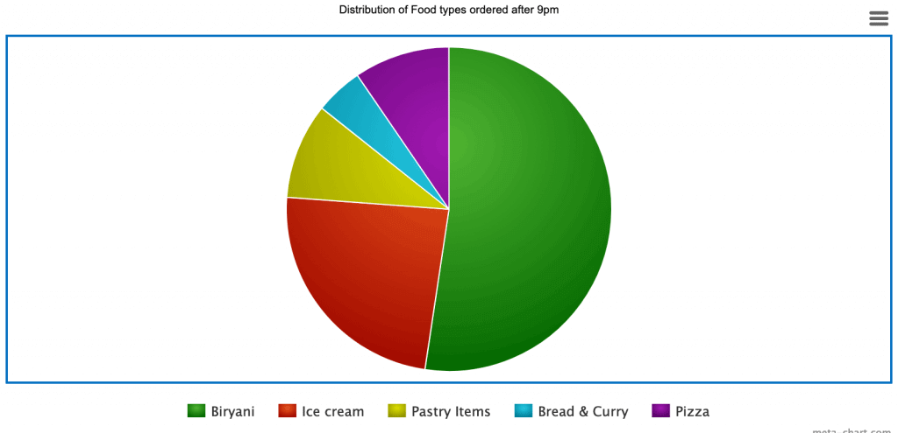
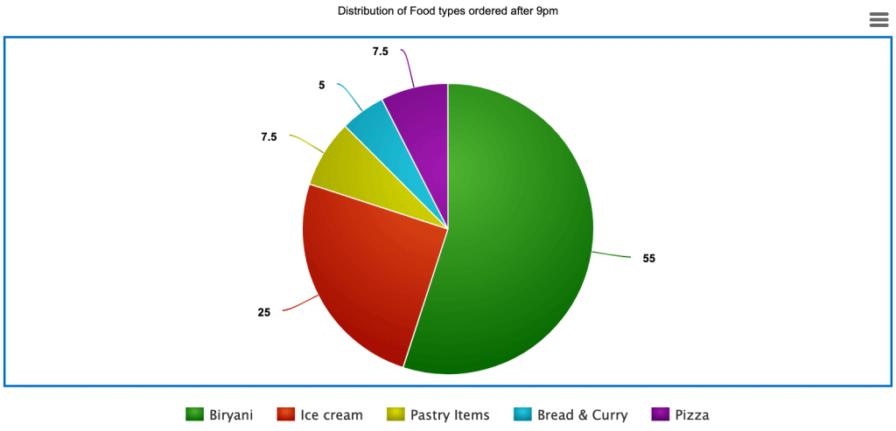
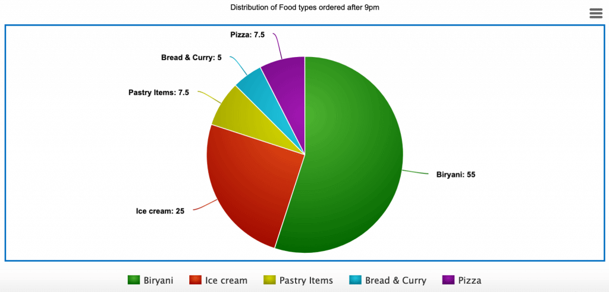
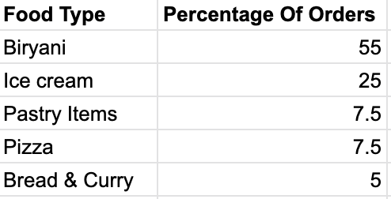
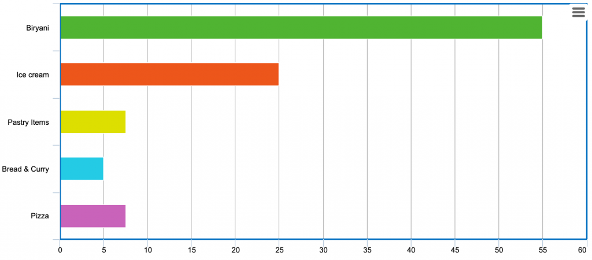
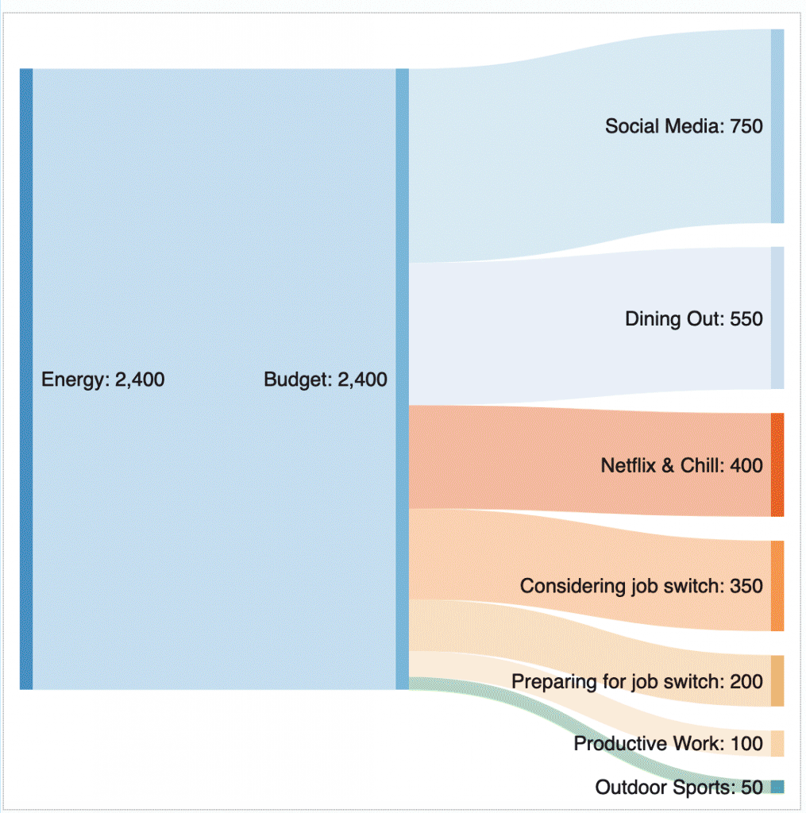
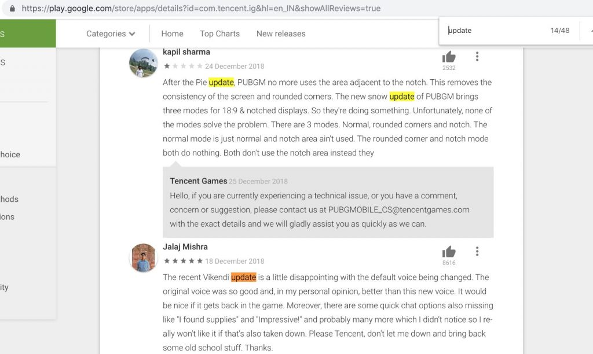

#### PROGRAMA DE EMPREGO

# FORMAWEB IV

|                       |                                                              |
| --------------------- | ------------------------------------------------------------ |
| **CURSO:**            | PROGRAMA DE EMPREGO FORMAWEB IV                           |
| **MÓDULO**            | MF0966_3. Consulta e manipulación de información contida en xestores de datos |
| **UNIDADE FORMATIVA** | UF2215: Implementación e uso dunha base de datos             |
| **NºEXP:**            | 36/00004/2021                                                |

[TOC]

# Introdución á visualización de datos

A representación de datos ou información en medios gráficos para que o espectador poida comprender facilmente o proceso de tendencias nos datos chámase visualización de datos. Emprégase calquera elemento visual para que as tendencias, os valores atípicos e os patróns se poidan comprender e estudar a partir dos datos. As diferentes ferramentas utilizadas para a visualización de datos inclúen gráficos, mapas e gráficos, etc. As ferramentas están deseñadas para comprender e comprender facilmente a información proporcionada polos datos en lugar de pasar por todo o proceso de dixitalización das follas de Excel para que o analista aforre tempo.

### Gráficos de sectores

Un dos gráficos máis omnipresentes en uso é o gráfico de pizza ou o gráfico circular.

**A proporción de gases nunha mestura**

Adoita utilizarse durante as eleccións para mostrar que partido ten os leóns para repartir os votos, este gráfico, aínda que moi popular, ten algunhas desvantaxes evidentes. Estadísticos como Edward Tufte, Leland Wilkinson e Gerald van Belle expresaron a súa descontención cara ao uso de gráficos circulares. A evidencia máis concluínte contra os gráficos de sectores probablemente foi proporcionada por Stephen Few, o fundador de Perceptual Edge. No seu artigo, "Save the Pie for the Dessert", publicado no Visual Business Intelligence Newsletter, Stephen explica por que, para sorpresa dos seus colegas e estudantes, considera que os gráficos circulares son un medio ineficaz para visualizar datos.

Bótalle un ollo ao gráfico circular a continuación.

Neste gráfico que representa a proporción de alimentos pedidos despois das 21.00 horas, é fácil estimar a porcentaxe que pertence a Ice Cream: 25%. Non obstante, tras unha lixeira modificación, xa non é posible determinar facilmente a porcentaxe de pedidos de xeados.

Aínda que a porcentaxe de xeados segue sendo o 25%, é difícil de entender a partir do diagrama anterior. No diagrama anterior, era fácil adiviñar a porcentaxe porque a sombra para o xeado comezaba na posición das 6 en punto e estirábase ata as 9. Como os nosos ollos están adestrados para ver os reloxos ás 12, 3, 6 e 9, un gráfico circular tamén é máis fácil de interpretar se as súas rexións se adhiren ás 4 posicións do reloxo. Un ávido defensor dos gráficos circulares suxeriría que este problema podería evitarse facilmente usando etiquetas e marcando a porcentaxe en cada rexión.

Gráfico circular con etiquetas de datos.

Pero, de novo, para mapear o valor co elemento, os nosos ollos teñen que seguir cambiando o foco da lenda na parte inferior do gráfico ás etiquetas do gráfico.

A solución sería achegar tamén o nome do elemento, xunto cos valores, para obter algo semellante a isto:

Perfecto, dirías. Pero entón pregúntoche: agora que adxuntamos os nomes dos elementos xunto cos valores, en que se diferencia o gráfico de sectores anterior da táboa seguinte:

Limpa a táboa cos datos ordenados en Porcentaxe de pedido.

Esta información non parece moito mellor que as etiquetas e lendas espalladas polo gráfico circular. Para que serve, entón, un gráfico circular? Suponse que as visualizacións engaden valor; son axentes de conclusións; suponse que fan que os datos expoñan os seus segredos. Pero neste caso, o gráfico circular non cumpre a súa promesa.

### Introduza o gráfico de barras de visualización de datos

A alternativa máis delgada e moito máis elegante ao gráfico circular é o gráfico de barras, que é capaz de expresar todo o que di a torta e moito máis sen facer un lío de etiquetas e lendas.

**Gráfico de barras que representa o mesmo: fácil de comparar, contrastar e concluír.**

Esta é a mesma información que agora se presenta suavemente ao observador. Ademais de mostrar os valores individuais, este gráfico permítenos comparar rapidamente a popularidade de cada alimento e mesmo comparar a diferenza relativa de valor entre elementos consecutivos. Os mesmos datos estarían dispoñibles a través da táboa, pero os nosos cerebros son mellores para procesar imaxes que para descifrar o texto.

É por iso que o uso do gráfico circular reduciuse co paso do tempo. Aínda que un visual favorito na industria dos medios, este foi substituído por representacións mellores e máis sofisticadas. Ademais de gráficos de liñas, tortas e gráficos de barras, hai unha infinidade de outros gráficos que son útiles. Un gráfico interesante, pero non tan popular para os non iniciados, é o Diagrama de Sankey. Este diagrama úsase para expresar a distribución e o fluxo da materia. O asunto en cuestión podería ser enerxía, diñeiro ou mesmo auga.

Diagrama de Sankey do fluxo e distribución de enerxía dun empregado de TI típico.

Arriba hai un diagrama de Sankey ficticio que expresa como e onde se distribúe a maior parte da Enerxía dun empregado de TI.

### Ferramentas máis novas

Coa chegada das redes sociais e das diferentes plataformas onde a xente pode escribir os seus sentimentos, opinións e opinións, unha ferramenta de visualización de datos que se tornou bastante común é a nube de palabras. As nubes de palabras axúdannos a descubrir de que fala a xente.

Unha representación en nube de palabras moi real e en directo das reseñas dos usuarios de PUBG na tenda de Google Play.

Se miramos a nube de palabras aquí, que foi construída a partir das 80 principais críticas do xogo PUBG na tenda de Google Play, vemos que a resposta xeral ao xogo é "boa", algunhas persoas incluso chamándoo "mellor". ”. Non obstante, parece que hai un problema con algunhas "actualizacións" que a xente está a pedir aos creadores do xogo que corrixan. De feito, cando consultamos as críticas da Play Store ese día, vemos o mesmo reflectido.

O problema coas actualizacións. Ademais, mira se podes atopar unha aparición da palabra "por favor" aquí.

### Futuro

Isto é só rascar a punta do iceberg. Bibliotecas como Plotly e D3 levaron a visualización de datos a un nivel diferente. Isto ocorreu porque a demanda tamén cambiou. Como visualizarías unha cidade intelixente nun panel? Unha pantalla xigante na que se poden mostrar os vitais de toda unha cidade.

O tráfico, o uso de enerxía, as condicións de saúde das diferentes áreas, a calidade do aire e unha serie de outros parámetros deben mostrarse nunha única páxina. Este requisito pide un enfoque diferente para a visualización de datos Así que aprendemos que é a visualización de datos coa axuda deste concepto. Xa non podemos quedarnos con cadros e gráficos. Requírese un enfoque novedoso onde os gráficos reúnan a arte e a imaxinación, creando unha experiencia visual enriquecedora. Esa discusión pide un artigo completamente diferente. Ata a próxima.