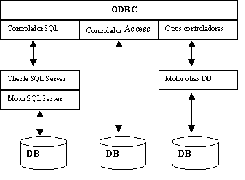

#### PROGRAMA DE EMPREGO

# FORMAWEB IV

|                       |                                                              |
| --------------------- | ------------------------------------------------------------ |
| **CURSO:**            | PROGRAMA DE EMPREGO FORMAWEB IV                           |
| **MÓDULO**            | MF0966_3. Consulta e manipulación de información contida en xestores de datos |
| **UNIDADE FORMATIVA** | UF2215: Ferramentas dos SXBD. Pasarelas e medios de conexión.             |
| **NºEXP:**            | 36/00004/2021                                                |

[TOC]

# Tecnoloxías de conectividade

# ODBC, JDBC e OLE DB

O Estándar Internacional para SQL define unha **linguaxe estándar de alto nivel para acceder e manipular datos que se almacenan nunha base de datos relacional.** O estándar internacional para SQL CLI define unha interface de programación de aplicacións (API) que os programas usan para emitir instrucións SQL de forma estandarizada mediante unha serie de funcións API ben definidas.

O termo **Open Database Connectivity (ODBC)** é un termo máis utilizado que SQL CLI, e en moitos contextos os dous termos úsanse indistintamente. ODBC é unha especificación de Microsoft para unha API que é unha implementación dos estándares internacionais para SQL CLI. ODBC é un superconxunto da API SQL, porque define moitas funcións que os estándares internacionais para a API SQL non. Non obstante, a CLI de SQL e a especificación ODBC de Microsoft están estreitamente aliñadas e os dous termos úsanse indistintamente, especialmente en ambientes de programación C e C++. A menos que se indique o contrario, os termos SQL CLI e ODBC significan o mesmo neste documento.

Sun Microsystems desenvolveu unha especificación, chamada **JDBC** , que **define unha API para o contorno de programación Java™** que os programadores Java utilizan **para acceder a bases de datos relacionais e emitir instrucións SQL**. A especificación JDBC define moitos dos mesmos tipos de funcións para programadores Java que o ODBC e SQL CLI definen para programadores C e C++. É posible que os programas Java invoquen directamente as funcións da API definidas por ODBC e a API SQL. Non obstante, a natureza do entorno de programación Java dificulta este proceso. JDBC adoita ofrecer unha solución mellor que ODBC para o ambiente de programación Java orientado a obxectos.

Do mesmo xeito que ODBC, JDBC é unha implementación dos estándares internacionais para a CLI de SQL. A implementación de JDBC consiste nun conxunto de interfaces, clases e métodos Java que un programador Java pode usar para facer os mesmos tipos de funcións que usa un programador C ou C++ cando invoca chamadas de función ODBC. Do mesmo xeito, JDBC é un superconxunto da CLI de SQL, porque define moitas funcións que non están definidas polos estándares internacionais para a API de SQL.

**OLE DB** está deseñado como un substituto de alto nivel de ODBC para admitir unha variedade máis ampla de bases de datos non relacionais que non necesariamente implementan SQL (por exemplo, bases de datos de obxectos e follas de cálculo). OLE ten un modelo de provedor-cliente, onde os clientes solicitan acceso aos datos e os provedores son as interfaces de compoñentes de software que permiten o acceso aos datos.

## Arquitectura ODBC

A implementación ODBC é unha arquitectura cliente-servidor, cos seguintes compoñentes principais:

- **Aplicación**

  A aplicación encárgase de interactuar co usuario e de invocar funcións da API de ODBC que envían instrucións SQL para procesalas por un sistema de ficheiros ou un sistema de xestión de bases de datos.

- **Administrador de controladores**

  O xestor de controladores acepta as funcións da API ODBC da aplicación e pásaas a un controlador ODBC para procesalas. Tamén acepta a saída do controlador ODBC e pásaa á aplicación.

- **Controlador ODBC**

  O controlador ODBC procesa as funcións da API ODBC que recibe do xestor de controladores, interactúa co sistema de ficheiros ou co sistema de xestión de bases de datos para acceder aos datos necesarios e devolve os resultados ao xestor de controladores ODBC.

- **Orixe dos datos**

  Unha fonte de datos contén o conxunto de datos ao que accede o controlador ODBC, xunto con calquera ambiente asociado cos datos. Estes ambientes poden incluír o acceso a ficheiros ou software de acceso a bases de datos, un sistema operativo e unha plataforma de rede.

Para utilizar ODBC para acceder a un dispositivo, necesita polo menos unha configuración cliente-servidor de dous niveis. Nun sistema cliente-servidor de dous niveis, a fonte de datos gárdase nunha aplicación , que xestiona todo o proceso de acceso á base de datos. O controlador ODBC, o xestor de controladores e a aplicación residen no sistema cliente e usan unha conexión de rede a un proceso - MySQL/MariaDB/Postgres p.ex.- no host da aplicación , que coordina as funcións de procesamento de instrucións SQL.

## Arquitectura JDBC

A arquitectura JDBC consta de catro compoñentes principais:

- **Aplicación Java™**

  A aplicación, escrita na linguaxe de programación Java, encárgase de interactuar co usuario e de chamar ás funcións da API de JDBC. Estas funcións da API envían instrucións SQL para procesalas por un sistema de ficheiros ou un sistema de xestión de bases de datos. A aplicación Java usa interfaces, clases e métodos definidos pola API de Java para conectarse e acceder á fonte de datos.

- **Máquina virtual Java**

  Cando se compila unha aplicación Java, o programa obxecto Java consta de códigos de bytes. A máquina virtual Java é a encargada de converter os bytecodes Java en instrucións que pode executar na máquina na que se está a executar a aplicación. A máquina virtual Java funciona como intermediario entre o programa obxecto Java e a máquina na que se está a executar a aplicación. Existe unha implementación de máquina virtual Java diferente para cada plataforma. A máquina virtual Java fai posible que o mesmo programa Java se execute, sen cambios nin recompilación, en calquera máquina para a que estea implementada unha máquina virtual Java.

- **Controlador JDBC**

  O controlador JDBC procesa as interfaces, as clases e os métodos da API JDBC da aplicación Java. A aplicación Java usa o controlador JDBC para interactuar co sistema de ficheiros ou co sistema de xestión de bases de datos para acceder aos datos necesarios. Tamén devolve os resultados á máquina virtual Java, que, á súa vez, devolve eses resultados á aplicación Java. Existe un controlador JDBC diferente para cada tipo de DBMS ou para cada tipo de fonte de datos. Netezza proporciona un controlador JDBC para a versión 3.0 da especificación da API JDBC de Oracle. O controlador é un controlador Java tipo 4 puro que foi probado por Netezza para a súa conformidade coas especificacións JDBC de Oracle en plataformas Windows, Linux e UNIX. O controlador JDBC paraNetezza admite todos os tipos de datos NZSQL, incluídos os cifrados de contrasinais, e ofrece opcións de conexión para host, porto e base de datos. A partir da versión 4.6 da aplicación Netezza , o controlador JDBC require Java Runtime Environment (JRE) versión 1.5 e posterior. Se o host de Netezza está a executar a versión 7.1.0.0 ou posterior e está configurado para utilizar soporte de criptografía SP 800-131a, os clientes JDBC precisan Java Runtime Environment (JRE) versión 1.7 e posterior.

- **Orixe dos datos**

  Unha fonte de datos contén o conxunto de datos ao que accede o controlador JDBC, xunto con calquera ambiente asociado cos datos. Estes ambientes poden incluír o acceso a ficheiros ou software de acceso a bases de datos, un sistema operativo e unha plataforma de rede.

Para utilizar JDBC para acceder a un dispositivo IBM Netezza , necesita polo menos unha configuración cliente-servidor de dous niveis. Nun sistema cliente-servidor de dous niveis, a fonte de datos gárdase na aplicación Netezza , que xestiona todo o proceso de acceso á base de datos. O controlador JDBC, a máquina virtual e a aplicación JDBC residen no sistema cliente e usan unha conexión de rede a un proceso Postgres no host da aplicación Netezza , que coordina as funcións de procesamento de instrucións SQL.

---

máis info:

- [IBM](https://www.ibm.com/docs/es/psfa/7.1.0?topic=netezza-odbc-jdbc-ole-db-installation-configuration)

- [Incorporación dos procesos ODBC, JDBC e OLE DB](https://www.ibm.com/docs/es/SSULQD_7.1.0/com.ibm.nz.datacon.doc/c_datacon_process.html)

