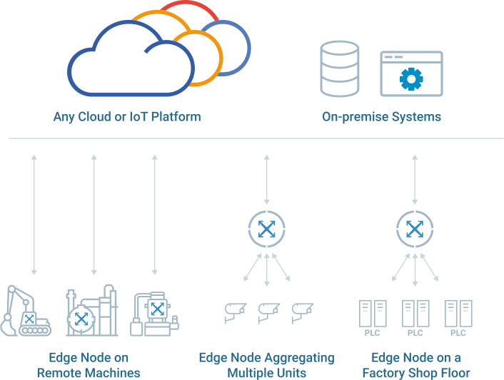

#  Conceptos da administración de bd

A xestión de bases de datos é o proceso de recompilación, almacenamento, organización, mantemento e análise de datos. As organizacións aproveitan varias prácticas e ferramentas de xestión de bases de datos para impulsar decisións baseadas en datos e planificación estratéxica. Existe unha ampla gama de solucións aplicables para a xestión de bases de datos, das cales os **sistemas de xestión de bases de datos** (DBMS) son os máis comúns.

---

## Que é un sistema de xestión de bases de datos (DBMS)?

---

É o software que executa consultas sobre os datos, incluída a adición, actualización e busca de valores. Un [RDBMS](https://es.wikipedia.org/wiki/Sistema_de_gesti%C3%B3n_de_bases_de_datos_relacionales) tamén pode proporcionar unha representación visual dos datos. Por exemplo, pode mostrar datos en táboas como nunha folla de cálculo, o que lle permite ver e incluso editar valores individuais na táboa. Algúns programas RDMBS permiten crear formularios que poden axilizar o ingreso, a edición e a eliminación de datos.

---

Un DBMS permite ás organizacións xestionar bases de datos de forma eficaz. Aproveitando a tecnoloxía DBMS se realizan tarefas como crear e actualizar bases de datos, así como ler, escribir e eliminar datos. 

---

## Funcións dun DBMS

O obxectivo principal dun DBMS é **proporcionar unha interface que permita ás organizacións estandarizar a xestión de datos de forma consistente** en equipos e departamentos. Isto conséguese xestionando tres aspectos fundamentais:

- **Datos:** o que a organización agrega, almacena e analiza. 
- **Motores de base de datos:** permite ás organizacións acceder, almacenar e modificar datos. 
- **Esquema de base de datos:** determina a estrutura lóxica de cada base de datos. 

---

Cando se xestionan ben, estes fundamentos poden axudar ás organizacións a garantir a integridade, a seguridade e a concorrencia dos datos durante todo o ciclo de vida dos mesmos.

---

Un DBMS xeralmente ofrece capacidades para as seguintes tarefas:  

- Modificacións da xestión de datos 
- Monitorización e posta a punto 
- Seguridade de datos 
- Copia de seguridade e recuperación

---

As capacidades avanzadas de DBMS inclúen:

- **Automatización**: para unha gran variedade de tarefas, incluíndo rexistro e auditoría, ou restauracións e reinicios.

- **Centralización**: unifica os procesos de datos nun fluxo de traballo visualizado, ao que se accede a través de varios dispositivos e localizacións, e permite que diferentes usuarios mostren diferentes vistas dun esquema de base de datos.

- **Controis de acceso**: determinar roles e privilexios para cada usuario, para garantir que os usuarios teñan acceso limitado aos datos corporativos e evitar o abuso dos privilexios. 

- **Facilidade de uso**: os DBMS adoitan ofrecer unha experiencia de usuario intuitiva, permitindo aos usuarios con diferentes niveis de habilidade acceder e aproveitar os datos.

---

Outra gran vantaxe do DBMS é a independencia dos datos. Cando o DBMS está deseñado para a independencia dos datos lóxicos e físicos, os usuarios e desenvolvedores non precisan facer cambios cando os datos se moven. Un DBMS pode xestionar esta tarefa, sempre que estea conectado cunha interface de programación de aplicacións (API) a calquera nova fonte de datos.

---

## Compoñentes do DBMS

---

As solucións de DBMS veñen equipadas cun conxunto único de compoñentes, cada un responsable de realizar tarefas diferentes. Estes son os compoñentes máis básicos do DBMS:

- **Software**: un DBMS é un sistema baseado en software que proporciona unha interface de xestión que axuda aos usuarios a controlar bases de datos e fontes de datos.
- **Datos:** o DBMS ofrece controis para xestionar datos operativos, como rexistros e metadatos, así como ficheiros de índice, dicionarios de datos e información administrativa. 
- **Procedementos**: Documentos que normalizan a administración de bases de datos, utilizados como pautas por empregados e usuarios, e como políticas de automatización. 

---

- **Idiomas de base de datos**: o DBMS usa varios linguaxes para realizar tarefas como controlar o acceso dos usuarios e especificar o esquema da base de datos. As linguaxes de DBMS inclúen:
  -  linguaxe de manipulación de datos (DML), 
  - linguaxe de definición de datos (DDL), 
  - linguaxe de control de datos (DCL) e 
  - linguaxe de acceso a bases de datos (DAL).

---

- **Procesador de consultas:** serve como intermediario de comunicación entre os usuarios e o motor de datos DBMS. O procesador de consultas permite aos usuarios consultar solicitudes, por exemplo, introducindo instrucións SQL (Structured Query Language).

- **Xestor de base de datos en tempo de execución** : permite ao DBMS centralizar a xestión de datos no tempo de execución. Un administrador de bases de datos en tempo de execución valida as autorizacións dos usuarios, procesa as consultas aprobadas, determina que estratexia proporciona resultados de consulta óptimos, garante a integridade dos datos e xestiona as tarefas que requiran a execución e as consultas de datos en tempo de execución.

---

- **Xestor de bases de datos** : xestiona os traballos de bases de datos e permite aos administradores realizar operacións de bases de datos e tarefas de mantemento, incluíndo copias de seguridade e restauración, clonación, eliminación, actualización da base de datos e execución de parches.  

- **Motor de base de datos** : realiza as tarefas principais de almacenamento e recuperación de datos. Un motor de base de datos pódese integrar no software DBMS ou como un recurso remoto ao que se accede a través dunha API. 

- **Xerador de informes** : permite aos usuarios extraer ficheiros DBMS e mostrar a información en formatos estruturados, segundo especificacións predefinidas. Os procesos de informes axudan aos usuarios a realizar análises e obter información útil.

---

## Categorías e tecnoloxías de DBMS

---

Existe unha ampla gama de solucións de DBMS, dedicadas a diferentes tipos de datos, fontes e casos de uso. Estes son os tipos máis comúns de categorías e tecnoloxías de DBMS:

---

- **RDBMS**: un sistema de xestión de bases de datos relacionais (RDBMS) está deseñado especificamente para bases de datos relacionais, que almacenan datos en formatos estruturados como columnas e filas. As solucións RDBMS populares inclúen Oracle Database, MySQL e Microsoft SQL Server.

---

- **DBMS de rede** : unha base de datos na que se organizan as relacións entre os tipos de rexistro mediante conxuntos de un a varios. Isto difire dun modelo xerárquico en que permite que un tipo de rexistro sexa membro de máis dun conxunto. As filas individuais pódense recuperar mediante funcións da API que permiten que unha aplicación navegue por instancias individuais de conxunto. Raima Database é un dos provedores de bases de datos coñecidos que ten capacidades de rede.

---

- **DBMS** NoSQL: unha base de datos NoSQL pode almacenar datos que non son só SQL, en formatos que non son só relacionais. Basicamente, as bases de datos NoSQL permiten almacenar datos sen esquema e este tipo de deseño require diferentes capacidades de xestión. As solucións populares de DBMS NoSQL inclúen MongoDB, Amazon DynamoDB, Cassandra e Azure Cosmos DB.

---

- **DBMS en memoria (IMDBMS)**: tamén coñecido como DBMS de memoria principal, estes sistemas aproveitan a memoria para o almacenamento de datos, garantindo un acceso rápido aos datos. O IMDBMS, que usa menos instrucións da CPU que os sistemas baseados en disco, úsase normalmente para mellorar o rendemento ao reducir a latencia de E/S e a sobrecarga de procesamento.

---

- **DBMS multimodelo** : pode soportar varios tipos de modelos de datos. Este tipo de estratexia de datos adoita ser compatible con solucións NoSQL, que adoitan ser necesarias para almacenar diferentes tipos de datos xuntos. 

---

- **NewSQL DBMS — Deseñado** como plataformas RDBMS con características que admiten a distribución NoSQL. [NewSQL DBMS](https://dev.to/harperdb/deep-dive-newsql-databases-255l) adoita ofrecer capacidades para xestionar altos niveis de datos, como o cumprimento de ACID - atomicidad, consistencia, illamento e durabilidade- e o procesamento en tempo real. Os DBMS populares de NewSQL inclúen Google Cloud Spanner, MemSQL, Splice Machine e ClustrixDB.

---

- Tamén existen xestores RDBMS (Sistema de Xestión de Bases de Datos Relacionais) desenvolvidos para casos de uso no marco IoT. Ao combinar tecnoloxías de modelos de rede e relacionais nun único sistema, permíten organizar e acceder á información de forma eficiente, independentemente da complexidade dos datos. Este tipo é un DBMS axeitado para dispositivos e aplicacións integrados que se executan en sistemas operativos en tempo real. 

---

*IoT e as bases de datos.*

---

### RDBMS vs DBMS

En xeral, as bases de datos almacenan conxuntos de datos que poden ser consultados para o seu uso noutras aplicacións. Un sistema de xestión de bases de datos admite o desenvolvemento, administración e uso de plataformas de bases de datos.

Un RDBMS é un tipo de sistema de xestión de bases de datos (DBMS) que almacena datos nunha estrutura de táboas baseada en filas que conecta elementos de datos relacionados. Un RDBMS inclúe funcións que manteñen a seguridade, a precisión, a integridade e a coherencia dos datos. Isto é diferente do almacenamento de ficheiros usado nun DBMS.

---

Outras diferenzas entre os sistemas de xestión de bases de datos e os sistemas de xestión de bases de datos relacionais inclúen:

- **Número de usuarios permitidos.** Aínda que un DBMS só pode aceptar un usuario á vez, un RDBMS pode funcionar con varios usuarios.
- **Requisitos de hardware e software.** Un DBMS necesita menos software e hardware que un RDBMS.
- **Cantidade de datos.** Os RDBMS poden xestionar calquera cantidade de datos, de pequeno a grande, mentres que un DBMS só pode xestionar cantidades máis limitadas.
- **Estrutura da base de datos.** Nun DBMS, os datos gárdanse nunha forma xerárquica, mentres que un RDBMS utiliza unha táboa onde as cabeceiras úsanse como nomes de columna e as filas conteñen os valores correspondentes.

---

- **Implementación de ACID.** Os DBMS non usan o modelo de atomicidade, consistencia, illamento e durabilidade ( [ACID](https://searchsqlserver.techtarget.com/definition/ACID) ) para almacenar datos. Por outra banda, os RDBMS basean a estrutura dos seus datos no modelo ACID para garantir a coherencia.
- **Bases de datos distribuídas.** Aínda que un RDBMS ofrece soporte completo para bases de [datos distribuídas](https://searchoracle.techtarget.com/definition/distributed-database) , un DBMS non ofrecerá soporte.
- **Tipos de programas xestionados.** Mentres que un SGBD axuda a xestionar as relacións entre as súas táboas de datos incorporadas, un SGBD céntrase en manter as bases de datos que están presentes na rede do ordenador e nos [discos duros](https://www.techtarget.com/searchstorage/definition/hard-disk) do sistema .
- **Soporte de normalización de bases de datos.** Un RDBMS pódese [normalizar](https://searchsqlserver.techtarget.com/definition/normalization) , pero un DBMS non.

---

### Características de los sistemas de gestión de bases de datos relacionales

---

*ref.:*

- https://dev.to/     -  un *megazine* bastante interesante onde atopar artigos moi variados sobre desenvolvemento, produtos, tecnoloxías e cultura dixital.
- https://searchsqlserver.techtarget.com    - outro sitio moi interesante sobre o uso de bbdd.

- https://my.uopeople.edu/pluginfile.php/57436/mod_book/chapter/37615/CS2203.Textbook.Database.Fundamentals.pdf    - libro básico respaldado por IBM - o *inventor*/promotor das bases de datos tal e com as coñecemos agora-. Aínda que a edición orixinal é de 2010 aquí está todo o necesario para encetar no mundo das bases de datos. 
- https://docs.ccsu.edu/curriculumsheets/ChadTest.pdf  -  extensiva documentacion sobre bases de datos.
- https://www.dcs.warwick.ac.uk/~hugh/TTM/   - para estar ao tanto de cambios e melloras en todo o relacionado a bases de datos e sistemas de xestión. Máis info: [TTM](https://en.wikipedia.org/wiki/The_Third_Manifesto)
