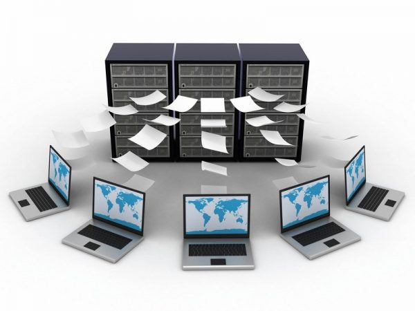
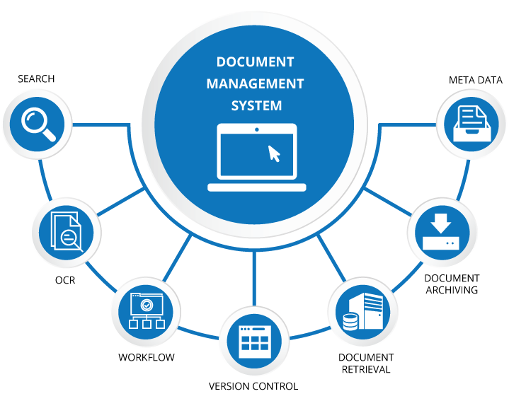
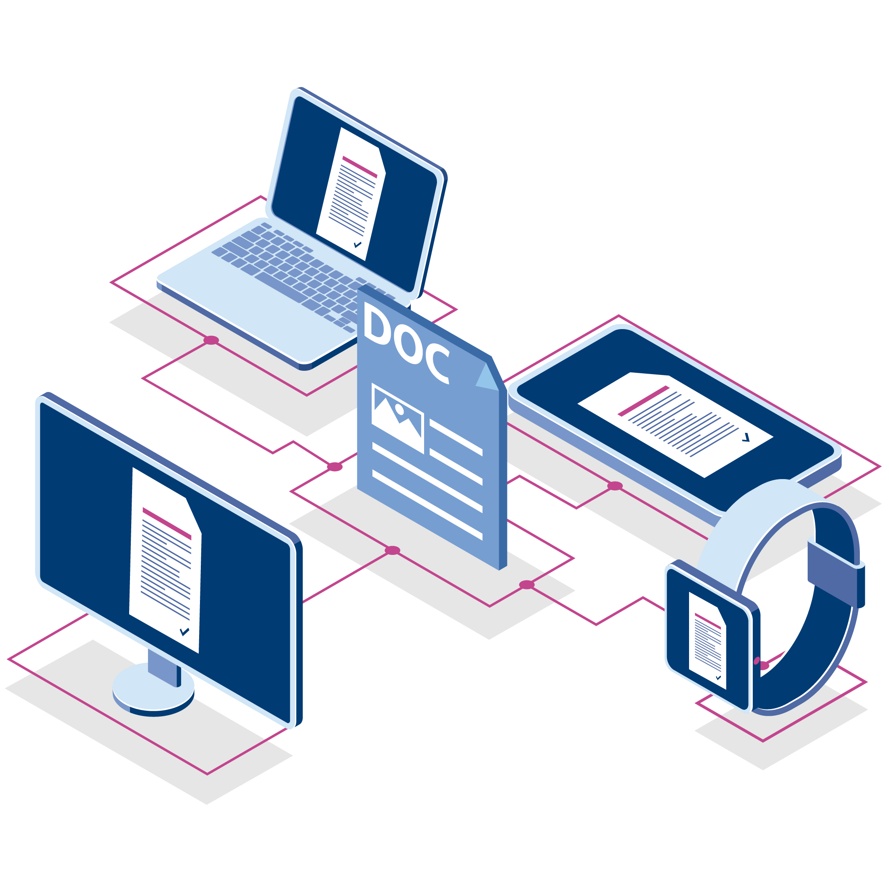

# QUE É UN REPOSITORIO DIXITAL?

---

## A **inxente cantidade de información**, en todo tipo de formatos, que se xera e consulta na actualidade produce un **problema colateral** para as organizacións: atopar **como publicala e xestionala** para que sexa facilmente identificada, consultada e compartida por todos os interesados.

---

## Unha das posibles solucións é a creación de **repositorios dixitais** onde se catalogue e organice toda esa información, ou alo menos aquela que pode ser de utilidade.

---

## DEFINICIÓN DE REPOSITORIO DIGITAL

---

## Os repositorios dixitais son basicamente **arquivos onde se almacenan os recursos dixitais para poder ser consultados a través de internet**. Un repositorio dixital pode albergar todo tipo de formatos dixitais: libros electrónicos, documentos en todo tipo de formatos -pdf, json, xml, doc,...-, vídeos, fotos, animacións...

---

## Aínda que os repositorios dixitais están en xeral asociados ao ámbito universitario, investigador e docente, o certo é que son instrumentos que poden **ser empregados por calquera empresa ou organización** que se propoña como obxectivo recoller, xestionar e preservar calquera tipo de produción. O obxectivo final é **garantir a consulta e visibilidade de toda esa información**.

---

## CARACTERÍSTICAS DUN REPOSITORIO DE DOCUMENTOS

---
## - Baséase nun **sistema de xestión e validación de publicacións**.
---
## - Conta **cun sistema de busca propio** que permite localizar a información que precisamos localizar dun xeito sinxelo e rápido.
---
## - Almacena **diferentes tipos de arquivos e formatos**, evidentemente en formato dixital.
---
## - Promove **a difusión e exhibición de información** ou contidos.
---
## - En xeral, os repositorios están dispoñibles en **páxinas web especializadas**, con directorios e listas creadas por universidades e outras institucións.

---

## TIPOS DE REPOSITORIOS DOCUMENTAIS

## Podemos distinguir entre **2 tipos diferentes de repositorios documentais**:

---

## 1. **Repositorios Institucionais** . Caracterízanse por **estar creados polas propias organizacións** co fin de conservar, preservar, organizar e clasificar a información relevante que xeran, co fin de posibilitar e facilitar ao máximo a súa consulta por parte dos interesados. Supoñen un compromiso de esa institución co libre acceso á información de valor que xera. **A propiedade desta información pertence a unha determinada institución:** unha universidade, unha empresa, unha asociación, etc.

---

## 2. **Repositorios temáticos**. O factor diferencial deste tipo de repositorios é que **os documentos xestionados pertencen a unha área temática concreta** e adoitan ser elaborados por investigadores e expertos. Nestes casos, o nexo común é o tema, xa que a información pode proceder de diversas institucións.

---

## **VANTAXES DOS REPOSITORIOS DIXITAIS**
---

## Son **moitas as vantaxes de contar con repositorios dixitais** , beneficios que chegan tanto ás institucións que os crean como aos estudantes, investigadores e todas as persoas que se benefician intelectualmente de ter acceso a información que pode ser moi valiosa e, ás veces, xerar ben para a sociedade coma enteiro.

---
## - A principal vantaxe dos repositorios é que permiten **o acceso aberto a información valiosa**: datos de estudo e investigación, produción científica, etc.
---
## - Contribúen a garantir que **os contidos se conserven** a longo prazo

---
## - Permiten **organizar e clasificar a información**

---
## - **Facilitan a busca** de documentos e a información exacta que nos interesa, grazas á indexación

---
## - Permiten **unha maior visibilidade e difusión** da investigación e da información en xeral

---
## - **Aumentan significativamente o impacto** do traballo entre comunidades científicas e asociacións de expertos

---
## - Son unha fantástica ferramenta para o **intercambio de información** entre docentes, investigadores e todo tipo de profesionais.

---
## - O seu **labor divulgativo é moi importante**, xa que permite a transmisión de coñecemento a practicamente todo o mundo, co único requisito de ter unha conexión a Internet.

---
## - Os sistemas informáticos actuais **permiten a integración da información con outro software**, o que permite cruzar datos, completar e mellorar a información orixinal dun xeito sinxelo e fluído,...

---
## - Permiten **avaliar e contrastar datos e resultados** con outros profesionais e outras fontes

---
## - As institucións que crean estes repositorios **gañan prestixio e recoñecemento** no seu ámbito ou sector, converténdose en auténticos referentes
---
## - Os repositorios son unha **excelente ferramenta** para recoller, preservar e **difundir a** produción e investigación científica e académica.
---
## - Garanten a seguridade dos datos fronte a incidencias naturais - inundacións, incendios,...-.** E ao tempo que permiten unha xestión controlada no uso, a integridae e o respecto aos dereitos de autor, tamén fan máis fácil a replica e diseminación autorizada e menos custoso facer copias de de respaldo e seguranza.

---
## - Ademais de para ás organizacións académicas ou científicas, ou para as institucións gobernamentais e civís, os repositorios e, en xeral a xestión documental, é moi vantaxosa para todo tipo de empresas, xa que fai **moito máis eficiente calquera proceso que implique traballar con calquera tipo de documento** : facturas, informes, expedientes dos empregados, nóminas, pedidos, proxectos, formularios, seguimento de clientes e provedores,...

---

## Un repositorio **permite almacenar toda a información relevante de calquera organización**, e tamén controlar os ciclos de vida desa información. Deste xeito, é posible ter toda a documentación centralizada e que sexa accesible para todas as persoas autorizadas.

---

## - Ademais, **toda a información pódese indexar** para facilitar futuras buscas. Todo isto permitirache reducir custos e axilizar todo o procesado de documentos.

---

## ALGÚNS RETOS DOS REPOSITORIOS DIXITAIS

---

## As vantaxes dos repositorios dixitais son obvias, pero aínda hai **marxe de mellora en varios aspectos**. Para facerse aínda máis útiles, os repositorios dixitais deben superar unha serie de retos que permitan a súa completa optimización:

---
## - **Conseguir unha maior visibilidade**, utilizando todos os recursos que existen na actualidade en Internet. Por exemplo, incluír a ligazón ao arquivo dixital en redes e foros profesionais.

---
## - **Traballar aínda máis na interconexión con outros sistemas** e programas de empresas e institucións

---
## - **Mellorar a seguridade**, evitando que os documentos sexan modificados por persoas non autorizadas ou, se así o decidimos, limitar o acceso. En calquera caso, tomando as medidas oportunas, a información nun repositorio queda moito menos exposta que cando se almacenan documentos en papel. Por outra banda, o feito de que a información sexa accesible para todos os empregados non significa que non se poidan establecer distintos niveis de protección da información sensible.

---
## - Implantar **sistemas de busca e organización da información aínda máis eficaces** e xeneralizar o seu uso na medida do posible.

---
## -  **Promover a inclusión de imaxes, vídeos e documentos sonoros.**

---
## - Garantir escrupulosamente **a normativa de protección de datos e seguridade da información.**

---

## SISTEMAS DE XESTIÓN DOCUMENTAL

---

---

## Existen diferentes solucións de xestión documental que che permiten **xestionar de forma eficiente toda a documentación e información valiosa da túa empresa**. 

---

## Un software de xestión documental é unha aplicación que permite o **tratamento, arquivo e edición de documentos electrónicos**, xa sexan documentos escaneados ou creados directamente en formato dixital. A nivel empresarial, unha solución destas características pode ser útil en procesos desenvolvidos en practicamente todos os departamentos, desde Finanzas ata Recursos Humanos.

---

## Cun sistema de xestión documental a organización pode configurar un único repositorio, é dicir, un **arquivo dixital onde almacenar toda a información relevante da organización**

---

## e dese xeito, terías toda a documentación centralizada e accesible a todas as persoas autorizadas grazas á indexación.

---

## SISTEMAS DE XESTIÓN DOCUMENTAL NA EMPRESA

---

## Nas empresas trátanse cada día un número crecente de documentos, que consumen tempo e recursos.

---

## Os documentos empresariais (xa sexan dixitalizados ou creados no propio sistema de procesamento de datos, xunto cos documentos escaneados ou os informes xerados, máis todo tipo de documentación, así como os arquivos de correo electrónico ou das suites ofimáticas,... poden chegar a ser un importante problema para una empresa ou organización.

---

## A xestión manual detes arquivos pode incluso afastar a información da súa utilidade práctica. De aí que se fagan necesarias solucións con certas características - sistema de xestión documental-, que contribúan a conseguir arquivos máis eficientes e a axilizar a tramitación dos documentos e tamén a súa catalogación e consulta.

---

## [Un sistema de xestión documental](https://gdx-group.com/gestion-documental/) pode ser de gran axuda para **axilizar toda a burocracia dunha empresa ou organización**:

---

## -  liberando aos seus traballadores de arquivos e tarefas repetitivas.

---

## -  impedindo a diseminación incontrolada da información.

---

## -  contribuíndo a axilizar os procesos de documentación, arquivado e consulta. É unha forma de minimizar, as horas de traballo en tarefas moitas veces pouco produtivas.

---

## A demais, un **xestor de documentos axuda a minimizalos erros da intervención humana**, reducindo tamén o tempo de comprobación e corrección.

---
## Avantaxas:

- **Almacenamento centralizado**
- **Almacenamento en arquivos dixitais**
- **Organizado automaticamente**
- **Buscas intelixentes**
- **Recuperación máis rápida**
- **Redución de erros de transacción**
- **Preservación de información**
- **Seguridade no tratamento de datos**

---

---
