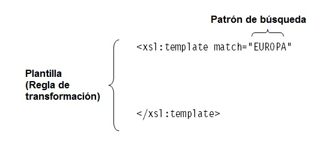
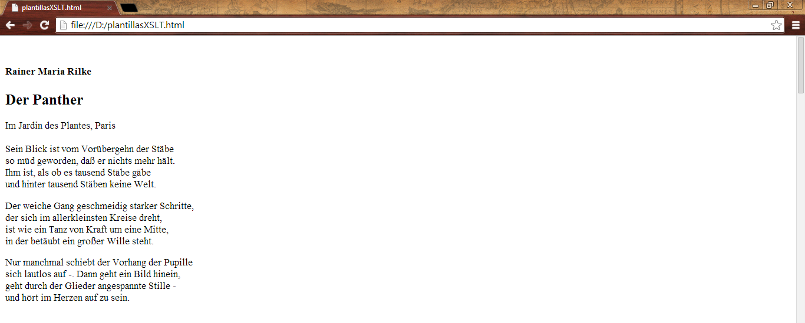
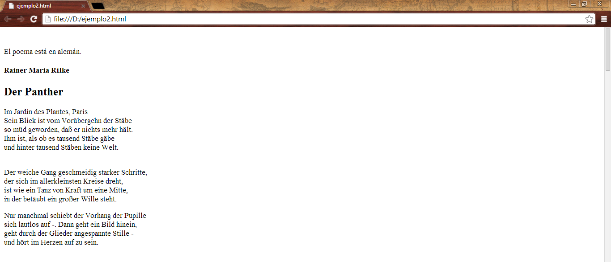

[TOC]

# XSLT

[XSLT](https://www.w3.org/TR/2017/REC-xslt-30-20170608/) é a linguaxe de transformación de [XML](https://www.w3.org/XML/). Ao igual que XSL-FO e [XPath](https://www.data2type.de/es/xml-xslt-xslfo/xpath/), XSLT é un subconxunto de XSL.

A través das denominadas follas de estilo é posible aplicar regras que serven de base para a xeración dun documento final. As follas de estilo son interpretadas por un procesador XSLT que genera o documento XML deseado en función de estas regras.


## Procesadores e ferramentas XSLT

Algúns editores e procesadores XSLT. Os editores para escribir e desenvolver secuencias de comandos XSLT e os procesadores (*parser*) necesarios para o procesamento do código dos arquivos XML. 

Para escribir e desenvolver secuencias de comandos XSLT podes empregar distintas ferramentas:

| **Ferramenta**      | **Descrición**                                               |
| ------------------- | ------------------------------------------------------------ |
| **oXygen Editor**   | oXygen XML Editor é unha potente ferramenta para o desenvolvemento de follas de estilo. Aquí pode atopar unha versión de proba gratuíta: [http://www.oxygenxml.com](http://www.oxygenxml.com/) |
| **XML Copy Editor** | Sinxelo pero potente editor DTD/XML Schema/RELAX NG, con validación XSLT e XPath,  resaltado da sintaxe, código pregable,...   [XML Copy Editor (sourceforge.io)](https://xml-copy-editor.sourceforge.io/) |
| **Altova XML**      | Color de sintaxe, numeración de liñas, marcadores e pregamento de código. [Xerador e avaliador de XPath](https://www.altova.com/es/xmlspy-xml-editor/xslt-editor#xpath_editor) interactivo https://www.altova.com/es/xmlspy-xml-editor/xslt-editor |
| **EditiX**          | Un concepto novo para unha linguaxe de sempre [Professional XML Editor 2022 - EditiX](https://www.editix.com/) |

 

Para poder ver XSLT en acción é necesario un [programa de procesamento](https://www.w3schools.com/xml/xml_parser.asp). Algúns dos procesadores XSLT máis utilizados:

| **Procesador XSLT**   | **Descrición**                                               |
| --------------------- | ------------------------------------------------------------ |
| **Saxon**             | Procesador gratuíto dispoñible tanto en versión Java como en Win32. A saída se obtén por consola. [Descargar Saxon](http://saxon.sourceforge.net/) |
| **MSXML 4.0**         | O procesador de Microsoft é unha parte integrante de Internet Explorer a partir da versión 5.5. |
| **FreeFormatter.com** | Para probas en liña [Free Online XSL Transformer (XSLT)](https://freeformatter.com/xsl-transformer.html) |
| **XSLTranform.net**   | http://xsltransform.net                                      |

# Guía de inicio rápido

Primeiro presentamos a estrutura básica dunha folla de estilo XSLT para a transformación en XHTML.

#### O arquivo de exemplo ``poema.xml``:

```xml
<?xml version="1.0" encoding="UTF-8"?>
<!DOCTYPE antologia SYSTEM "poema.dtd">
<antologia>
    <poema añodepublicacion="1905" idioma="de">
        <autor>
            <nombre>Rainer Maria</nombre>
            <apellido>Rilke</apellido>
        </autor>
        <titulo>Der Panther</titulo>
        <subtitulo>Im Jardin des Plantes, Paris</subtitulo>
        <estrofa>
            <verso>Sein Blick ist vom Vorübergehn der Stäbe</verso>
            <verso>so müd geworden, daß er nichts mehr hält.</verso>
            <verso>Ihm ist, als ob es tausend Stäbe gäbe</verso>
            <verso> und hinter tausend Stäben keine Welt.</verso>
        </estrofa>
        
        <estrofa>
            <verso>Der weiche Gang geschmeidig starker Schritte,</verso>
            <verso> der sich im allerkleinsten Kreise dreht,</verso>
            <verso> ist wie ein Tanz von Kraft um eine Mitte,</verso>
            <verso>in der betäubt ein großer Wille steht.</verso>
        </estrofa>
        <estrofa>
            <verso> Nur manchmal schiebt der Vorhang der <negrilla>Pupille</negrilla></verso>
            <verso>sich lautlos auf -. Dann geht ein Bild hinein,</verso>
            <verso> geht durch der <negrilla>Glieder</negrilla> angespannte Stille -</verso>
            <verso>und hört im <negrilla>Herzen</negrilla> auf zu sein.</verso>
        </estrofa>
    </poema>
    
    <poema añodepublicacion="1799" idioma="de">
        <autor>
            <nombre>Johann Wolfgang</nombre>
            <apellido> von Goethe</apellido>
        </autor>
        <titulo>Der Zauberlehrling</titulo>
        <estrofa>
            <verso>Hat der alte Hexenmeister</verso>
            <verso>Sich doch einmal wegbegeben!</verso>
            <verso>Und nun sollen seine Geister</verso>
            <verso>Auch nach meinem Willen leben.</verso>
            <verso>Seine Wort und Werke</verso>
            <verso>Merkt ich und den Brauch,</verso>
            <verso>Und mit Geistesstärke</verso>
            <verso>Tu ich Wunder auch.</verso>
        </estrofa>
        
        <estrofa>
            <verso>Walle! walle</verso>
            <verso>Manche Strecke,</verso>
            <verso>Daß, zum Zwecke,</verso>
            <verso>Wasser fließe</verso>
            <verso>Und mit reichem, vollem Schwalle</verso>
            <verso>Zu dem Bade sich ergieße.</verso>
        </estrofa>
        
        <estrofa>
            <verso>Und nun komm, du alter Besen,</verso>
            <verso>Nimm die schlechten Lumpenhüllen!</verso>
            <verso>Bist schon lange Knecht gewesen:</verso>
            <verso>Nun erfülle meinen Willen!</verso>
            <verso>Auf zwei <negrilla>Beinen</negrilla> stehe,</verso>
            <verso>Oben sei ein Kopf,</verso>
            <verso>Eile nun und gehe</verso>
            <verso>Mit dem Wassertopf!</verso>
        </estrofa>
        
        <estrofa>
            <verso>Walle! walle</verso>
            <verso>Manche Strecke,</verso>
            <verso>Daß, zum Zwecke,</verso>
            <verso>Wasser fließe</verso>
            <verso>Und mit reichem, vollem Schwalle</verso>
            <verso>Zu dem Bade sich ergieße.</verso>
        </estrofa>
        
        <estrofa>
            <verso>Seht, er läuft zum Ufer nieder;</verso>
            <verso>Wahrlich! ist schon an dem Flusse,</verso>
            <verso>Und mit Blitzesschnelle wieder</verso>
            <verso>Ist er hier mit raschem Gusse.</verso>
            <verso>Schon zum zweiten Male!</verso>
            <verso>Wie das Becken schwillt!</verso>
            <verso>Wie sich jede Schale</verso>
            <verso>Voll mit Wasser füllt!</verso>
            <verso>Stehe! stehe!</verso>
            <verso>Denn wir haben</verso>
            <verso>Deiner Gaben</verso>
            <verso>Vollgemessen! -</verso>
            <verso>Ach, ich merk es! Wehe! wehe!</verso>
            <verso>Hab ich doch das Wort vergessen!</verso>
        </estrofa>
        
        <estrofa>
            <verso>Ach, das Wort, worauf am Ende</verso>
            <verso>Er das wird, was er gewesen.</verso>
            <verso>Ach, er läuft und bringt behende!</verso>
            <verso>Wärst du doch der alte Besen!</verso>
            <verso>Immer neue Güsse</verso>
            <verso>Bringt er schnell herein,</verso>
            <verso>Ach! und hundert Flüsse</verso>
            <verso>Stürzen auf mich ein!</verso>
            <verso>Nein, nicht länger</verso>
            <verso>Kann ich's lassen;</verso>
            <verso>Will ihn fassen.</verso>
            <verso>Das ist Tücke!</verso>
            <verso>Ach, nun wird mir immer bänger!</verso>
            <verso>Welche Miene! welche Blicke!</verso>
        </estrofa>
        
        <estrofa>
            <verso>O du Ausgeburt der Hölle!</verso>
            <verso>Soll das ganze Haus ersaufen?</verso>
            <verso>Seh ich über jede Schwelle</verso>
            <verso>Doch schon Wasserströme laufen.</verso>
            <verso>Ein verruchter Besen,</verso>
            <verso>Der nicht hören will!</verso>
            <verso>Stock, der du gewesen,</verso>
            <verso>Steh doch wieder still!</verso>
            <verso>Willst's am Ende</verso>
            <verso>Gar nicht lassen?</verso>
            <verso>Will dich fassen,</verso>
            <verso>Will dich halten</verso>
            <verso>Und das alte Holz behende</verso>
            <verso>Mit dem scharfen Beile spalten.</verso>
        </estrofa>
        
        <estrofa>
            <verso>Seht, da kommt er schleppend wieder!</verso>
            <verso>Wie ich mich nur auf dich werfe,</verso>
            <verso>Gleich, o Kobold, liegst du nieder;</verso>
            <verso>Krachend trifft die glatte Schärfe.</verso>
            <verso>Wahrlich! brav getroffen!</verso>
            <verso>Seht, er ist entzwei!</verso>
            <verso>Und nun kann ich hoffen,</verso>
            <verso>Und ich atme frei!</verso>
            <verso>Wehe! wehe!</verso>
            <verso>Beide Teile</verso>
            <verso>Stehn in Eile</verso>
            <verso>Schon als Knechte</verso>
            <verso>Völlig fertig in die Höhe!</verso>
            <verso>Helft mir, ach! ihr hohen Mächte!</verso>
        </estrofa>
        
        <estrofa>
            <verso>Und sie laufen! Naß und nässer</verso>
            <verso>Wird's im Saal und auf den Stufen.</verso>
            <verso>Welch entsetzliches Gewässer!</verso>
            <verso>Herr und Meister! hör mich rufen! -</verso>
            <verso>Ach, da kommt der Meister!</verso>
            <verso>Herr, die Not ist groß!</verso>
            <verso>Die ich rief, die Geister,</verso>
            <verso>Werd ich nun nicht los.</verso>
            <verso>In die Ecke,</verso>
            <verso>Besen! Besen!</verso>
            <verso>Seid's gewesen.</verso>
            <verso>Denn als Geister</verso>
            <verso>Ruft euch nur, zu seinem Zwecke,</verso>
            <verso>Erst hervor der alte Meister.</verso>
        </estrofa>
    </poema>
    
    <poema añodepublicacion="1945" idioma="de">
        <autor>
            <nombre>Berthold </nombre>
            <apellido>Brecht</apellido>
        </autor>
        <titulo>Die Moritat von Mackie Messer</titulo>
        <estrofa>
            <verso>Und der Haifisch, der hat <negrilla>Zähne</negrilla></verso>
            <verso>Und die trägt er im <negrilla>Gesicht</negrilla></verso>
            <verso>Und Macheath, der hat ein Messer</verso>
            <verso>Doch das Messer sieht man nicht.</verso>
        </estrofa>
        
        <estrofa>
            <verso>Und es sind des Haifischs <negrilla>Flossen</negrilla></verso>
            <verso>Rot, wenn dieser Blut vergiesst</verso>
            <verso>Mackie Messer trägt'nen Handschuh</verso>
            <verso>Drauf man keine Untat liest.</verso>
        </estrofa>
        
        <estrofa>
            <verso>An der Themse grünem Wasser</verso>
            <verso>Fallen plötzlich Leute um</verso>
            <verso>Es ist weder Pest noch Cholera</verso>
            <verso>Doch es heisst: Mackie geht um.</verso>
        </estrofa>
        
        <estrofa>
            <verso>An'nem schönen blauen Sonntag</verso>
            <verso>Liegt ein toter Mann am Strand</verso>
            <verso>Und ein Mensch geht um die Ecke</verso>
            <verso>Den man Mackie Messer nennt.</verso>
        </estrofa>
        
        <estrofa>
            <verso>Und Schmul Meier bleibt versochwunden</verso>
            <verso>Und so mancher reiche Mann</verso>
            <verso>Und sein Geld hat Mackie Messer</verso>
            <verso>Dem man nichts beweisen kann.</verso>
        </estrofa>
        
        <estrofa>
            <verso>Jenny Towler ward gefunden</verso>
            <verso>Mit'nem Messer in der <negrilla>Brust</negrilla></verso>
            <verso>Und am Kai geht Mackie Messer</verso>
            <verso>Der von allem nichts gewusst.</verso>
        </estrofa>
        
        <estrofa>
            <verso>Wo ist Alfons gleich, der Fuhrherr?</verso>
            <verso>Kommt das je ans Sonnenlicht?</verso>
            <verso>Wer es immer wissen könnte</verso>
            <verso>Mackie Messer weiss es nicht.</verso>
        </estrofa>
        
        <estrofa>
            <verso>Und das grosse Feuer in Soho</verso>
            <verso>Sieben Kinder und ein Greis</verso>
            <verso>In der Menge Mackie Messer, den</verso>
            <verso>Man nicht fragt, und der nichts weiss.</verso>
        </estrofa>
        
        <estrofa>
            <verso>Und die minderjähr'ge Witwe</verso>
            <verso>Deren Namen jeder weiss</verso>
            <verso>Wachte auf und war geschändet</verso>
            <verso>Mackie welches war dein Preis?</verso>
        </estrofa>
    </poema>
    
    <poema añodepublicacion="1890" idioma="de">
        <autor>
            <nombre>Heinrich Christian Wilhelm</nombre>
            <apellido>Busch</apellido>
        </autor>
        <titulo> Pst!</titulo>
        <estrofa>
            <verso>Es gibt ja leider Sachen und Geschichten,</verso>
            <verso>Die reizend und pikant,</verso>
            <verso>Nur werden sie von Tanten und von Nichten</verso>
            <verso>Niemals genannt.</verso>
        </estrofa>
        
        <estrofa>
            <verso>Verehrter Freund, so sei denn nicht vermessen,</verso>
            <verso>Sei zart und schweig auch du.</verso>
            <verso>Bedenk: Man liebt den Käse wohl, indessen</verso>
            <verso>Man deckt ihn zu.</verso>
        </estrofa>
    </poema>
    
    <poema añodepublicacion="-750" idioma="el">
        <autor>
            <nombre/>
            <apellido>Όμηρος</apellido>
        </autor>
        <titulo>Ιλιάδα</titulo>
        <estrofa>
            <verso>Μῆνιν ἄειδε, θεὰ, Πηληιάδεω Ἀχιλῆος</verso>
            <verso>οὐλομένην, ἣ μυρί’ Ἀχαιοῖς ἄλγε’ ἔθηκε,</verso>
            <verso>πολλὰς δ’ ἰφθίμους ψυχὰς Ἄϊδι προῒαψεν</verso>
            <verso>ἡρώων, αὐτοὺς δὲ ἑλώρια τεῦχε κύνεσσιν</verso>
            <verso>οἰωνοῖσί τε πᾶσι• Διὸς δ’ ἐτελείετο βουλή</verso>
            <verso>ἐξ οὗ δὴ τὰ πρῶτα διαστήτην ἐρίσαντε</verso>
            <verso>Ἀτρεΐδης τε ἄναξ ἀνδρῶν καὶ δῖος Ἀχιλλεύς.</verso>
        </estrofa>
    </poema>
</antologia>
```

#### A folla de estilo:

```xml
<?xml version="1.0" encoding="UTF-8"?>                 (1)
<xsl:stylesheet version="1.0" xmlns:xsl="http://www.w3.org/1999/XSL/Transform"> (2)
<xsl:output encoding="iso-8859-1"/>
    <xsl:template match="/">                           (3)
      <html>
         <body>
             <h2><xsl:apply-templates/></h2>           (4)
         </body>
      </html>
    </xsl:template>
</xsl:stylesheet>
```

(1) As follas de estilo XSLT son documentos válidos en [XML](https://www.w3schools.com/xml/xml_xslt.asp). Polo que empezan por un prólogo.

(2) O elemento raíz dunha folla de estilo é sempre un elemento **``xsl:stylesheet``** ou **``xsl:transform ``**. Este informa ao procesador de que se trata dunha folla de estilo. O atributo obrigatorio **``version``** ten asignado o valor 1.0, xa que a folla de estilo está definida segundo a recomendación de novembro de 1999. Con axuda do atributo obrigatorio do espazo de nomes (``namespace``) **``xmlns:xsl``** nos aseguramos de que as instrucións XSLT sexan claras e se diferencien doutras marcas. O valor do atributo é fixo.

(3) O elemento **``xsl:template``** cumpre a función dun patrón. Sempre que se produza unha coincidencia a través do atributo **``match``**, o valor do atributo aparecerá no lugar correspondente, isto é, na árbore resultado do documento de saída. O valor do atributo **``match``** é unha expresión [XPath](https://www.data2type.de/es/xml-xslt-xslfo/xpath/) (localización). Neste caso se trata do signo empregado para o elemento raíz (**``/``**), o cal só aparece unha vez en cada documento XML. Cando o procesador XSLT, que examina o documento de orixe na busca de coincidencias co patrón da folla de estilo, detecta o signo **``/``**, copia o contido dos elementos do patrón **``xsl:template``** no documento de resultados. Desta maneira obtense a estrutura básica dun documento HTML.

(4) O elemento **``xsl:apply-templates/``** fai que o procesador copie o contido de todos aqueles elementos no documento final, que se conteñen no nodo ao que se lle aplica o patrón **``xsl:template``**. *Debido a que neste exemplo se trata do elemento raíz, se copiará neste lugar o contido completo do noso exemplo no documento final.* Os espazos en branco, as tabulacións e os saltos de liña comprendidos entre as etiquetas HTML e o contido a inserir son ignorados de maneira automática segundo as regras XML, xa que estes non contan como parte do contido.

#### O resultado da transformación mediante o procesador:

```markup
<html>
    <body>
       <h2>Rainer MariaRilkeDer PantherIm Jardin des Plantes, Paris Sein Blick ist vom Vorübergehn
der Stäbeso müd geworden, daß er nichts mehr ält.Ihm ist, als ob es tausend Stäbe gäbe
und hinter tausend Stäben keine Welt. Der weiche Gang geschmeidig starker Schritte, der
sich im allerkleinsten Kreise dreht, ist wie ein Tanz von Kraft um eine Mitte, in der
betäubt ein großer Wille steht. Nur manchmal schiebt der Vorhang der Pupillesich lautlos
auf -. Dann geht ein Bild hinein, geht durch der Glieder angespannte Stille - und hört
im Herzen auf zu sein.Johann Wolfgang von GoetheZauberlehrlingHat
der alte HexenmeisterSich doch einmal wegbegeben!Und nun sollen seine GeisterAuch nach
meinem Willen leben.Seine Wort und WerkeMerkt ich und den Brauch,Und mit GeistesstärkeTu
ich Wunder auch.Walle! walleManche Strecke,Daß, zum Zwecke,Wasser fließeUnd mit reichem,
vollem SchwalleZu dem Bade sich ergieße.Und nun komm, du alter Besen,Nimm die schlechten
Lumpenhüllen!Bist schon lange Knecht gewesen:Nun erfülle meinen Willen!Auf zwei Beinen
stehe,Oben sei ein Kopf,Eile nun und geheMit dem Wassertopf!Walle! walleManche
Strecke,Daß, zum Zwecke,Wasser fließeUnd mit reichem, vollem SchwalleZu dem Bade sich
ergieße.Seht, er läuft zum Ufer nieder;Wahrlich! ist schon an dem Flusse,Und mit
Blitzesschnelle wiederIst er hier mit raschem Gusse.Schon zum zweiten Male!Wie das
Becken schwillt!Wie sich jede SchaleVoll mit Wasser füllt!Stehe! stehe!Denn wir
habenDeiner GabenVollgemessen! - Ach, ich merk es! Wehe! wehe!Hab ich doch das Wort
vergessen!Ach, das Wort, worauf am EndeEr das wird, was er gewesen.Ach, er läuft und
bringt behende!Wärst du doch der alte Besen!Immer neue GüsseBringt er schnell
herein,Ach! und hundert FlüsseStürzen auf mich ein!Nein, nicht längerKann ich's
lassen;Will ihn fassen.Das ist Tücke!Ach, nun wird mir immer bänger!Welche Miene! welche
Blicke!O du Ausgeburt der Hölle!Soll das ganze Haus ersaufen?Seh ich über jede
SchwelleDoch schon Wasserströme laufen.Ein verruchter Besen,Der nicht hören will! Stock,
der du gewesen,Steh doch wieder still!Willst's am EndeGar nicht lassen?Will dich
fassen,Will dich haltenUnd das alte Holz behendeMit dem scharfen Beile spalten.Seht, da
kommt er schleppend wieder!Wie ich mich nur auf dich werfe,Gleich, o Kobold, liegst du
nieder;Krachend trifft die glatte Schärfe.Wahrlich! brav getroffen! Seht, er ist
entzwei!Und nun kann ich hoffen,Und ich atme frei!Wehe! wehe!Beide TeileStehn in
EileSchon als KnechteVöllig fertig in die Höhe!Helft mir, ach! ihr hohen Mächte!Und sie
laufen! Naß und nässerWird's im Saal und auf den Stufen.Welch entsetzliches
Gewässer!Herr und Meister! hör mich rufen! -Ach, da kommt der Meister!Herr, die Not ist
groß!Die ich rief, die Geister,Werd ich nun nicht los.In die Ecke,Besen! Besen!Seid's
gewesen.Denn als GeisterRuft euch nur, zu seinem Zwecke,Erst hervor der alte Meister.
Berthold BrechtMoritat von Mackie MesserUnd der Haifisch, der hat ZähneUnd die trägt er
im GesichtUnd Macheath, der hat ein MesserDoch das Messer sieht man nicht.Und es sind
des Haifischs FlossenRot, wenn dieser Blut vergiesstMackie Messer trägt'nen
HandschuhDrauf man keine Untat liest.An der Themse grünem WasserFallen plötzlich Leute
umEs ist weder Pest noch CholeraDoch es heisst: Mackie geht um.An'nem schönen blauen
SonntagLiegt ein toter Mann am StrandUnd ein Mensch geht um die EckeDen man Mackie
Messer nennt.Und Schmul Meier bleibt verschwundenUnd so mancher reiche MannUnd sein Geld
hat Mackie MesserDem man nichts beweisen kann.Jenny Towler ward gefundenMit'nem Messer
in der BrustUnd am Kai geht Mackie MesserDer von allem nichts gewusst.Wo ist Alfons
gleich, der Fuhrherr?Kommt das je ans Sonnenlicht?Wer es immer wissen könnteMackie
Messer weiss es nicht.Und das grosse Feuer in SohoSieben Kinder und ein GreisIn der
Menge Mackie Messer, denMan nicht fragt, und der nichts weiss.Und die minderjähr'ge
WitweDeren Namen jeder weissWachte auf und war geschändetMackie welches war dein
Preis?Heinrich Christian WilhelmBusch! Es gibt ja leider Sachen und Geschichten,Die
reizend und pikant,Nur werden sie von Tanten und von NichtenNiemals genannt.Verehrter
Freund, so sei denn nicht vermessen,Sei zart und schweig auch du.Bedenk: Man liebt den
Käse wohl, indessenMan deckt ihn zu. ΌμηροςΙλιάδαΜηνιν άειδε, θεά, Πηληιάδεω
Άχιλήοςούλομένην, η μυρί’ Άχαιοίς αλγε’ εθηκε,πολλάς δ’ ίφθίμους ψυχμς Άϊδι
προιαψενηρώων, αυτους δε ελώρια τευχε κύνεσσινοέωνοέσί τε πέσι• Διές δ’ υτελείετο βουλή
ἐξ οὗ δὴ τὰ πρῶτα διαστήτην ἐρίσαντεἈτρεΐδης τε ἄναξ ἀνδρῶν καὶ δῖος Ἀχιλλεύς.</h2>
    </body>
</html>
```

#### Vista do navegador:


# O elemento <xsl:output>

O elemento de alto nivel **<[xsl:output](https://developer.mozilla.org/en-US/docs/Web/XSLT/Element/output)>** indícalle ao procesador con que formato se debe xerar o resultado. Os formatos de saída poden ser [XML](https://developer.mozilla.org/en-US/docs/Web/XML/XML_introduction), [HTML](https://developer.mozilla.org/en-US/docs/Web/HTML) ou un documento de texto. En XSLT 2.0 é posible a demais XHTML. O formato de saída se especifica a través do valor asignado ao atributo **method**. O método de saída predeterminado en XSLT é XML, salvo que no documento apareza unha etiqueta HTML. Neste caso se xeraría un documento HTML 4.0.

No exemplo o elemento **<xsl:output>** quedaría como sigue:

**<xsl:output method="html" version="4.01" encoding="UTF-8"/>**

A través do valor **UTF-8** definimos a codificación dos caracteres, neste caso se trata do formato UTF-8 de Unicode (nos sistemas de Windows podes atopar un exemplo desta codificación no mapa de caracteres da fonte Arial Unicode MS).


# Regras de patrón

As regras de patrón (template) son modelos (patterns) para a transformación da árbore fonte na árbore resultado. Estas regras se compoñen de dúas partes, a primeira se coñece como patróns de busca e a segunda como patróns. A través do patrón se identifican os nodos da árbore fonte a os cales se aplica a regra.

#### Estructura da regra



Para amosar o funcionamento dos modelos ampliamos a folla de estilo do exemplo con algúns pequenos patróns.

#### A folla de estilo:

```xml
<?xml version="1.0" encoding="UTF-8"?>
<xsl:stylesheet version="1.0" xmlns:xsl="http://www.w3.org/1999/XSL/Transform">
    <xsl:output encoding="iso-8859-1" />
    <xsl:template match="antologia">
        <html>
            <body>
                <xsl:apply-templates/>              (1)
            </body>
        </html>
    </xsl:template>
    <xsl:template match="autor">
        <br/>
        <h4>
            <xsl:apply-templates/>
        </h4>
    </xsl:template>
    <xsl:template match="nombre">
        <xsl:apply-templates/>
        <xsl:text> </xsl:text>                      (2)
    </xsl:template>
    <xsl:template match="apellido">
        <xsl:apply-templates/>
    </xsl:template>
    <xsl:template match="titulo">
        <h2>
            <xsl:apply-templates/>
        </h2>
    </xsl:template>
    <xsl:template match="estrofa">
        <p>
            <xsl:apply-templates/>
        </p>
    </xsl:template>
    <xsl:template match="verso">
        <xsl:apply-templates/>
        <br/>
    </xsl:template>
</xsl:stylesheet>
```

(1) Neste lugar se copiará o contido do elemento **<antologia>** xunto con todos os seus subelementos. O procesador busca subelementos hasta a mesma base de caracteres, así como patróns que se poidan aplicar. Debido a que no exemplo hai definido un patrón para cada subelemento, se copiará o contido de estas patróns na estrutura do documento resultado. En caso de que non houbera un patrón para un determinado subelemento, o procesador simplemente copiaría o contido do mesmo.

(2) A través de **<xsl:text>** se introduce aquí un espazo en branco no documento resultado.

#### Vista do navegador:




##### Exercicio 1

a) Crea un patrón para o arquivo poema.xml. Cada uno dos elementos que aparecen no mesmo debe quedar definido. Genere además un título "Antología" que aparezca al inicio do documento.

b) ¿Por qué aparece o texto dun elemento, aunque no tenga ningún patrón asignada que lo defina?

c) Borre os datos dos autores e escriba su propio nombre como autor.

[>> ver solucións do exercicio 1](https://www.data2type.de/es/xml-xslt-xslfo/xslt/xslt-introduccion/soluciones#c4351)

 

## Patrón con nome

No exemplo dado os patróns se aplican a os elementos (nodos na estrutura do documento de orixe [XML](https://www.data2type.de/es/xml-xslt-xslfo/xml/)). Estes patróns se definen a través do elemento **<xsl:template>** e do atributo **match**. Non obstante, os patróns poden definirse tamén con independencia de tales nodos. No sitio do atributo **match** aparece o atributo **name** cun nome calquera, por exemplo **``muestra``**. O elemento **<xsl:template>** é válido para ambos tipos de patrón. Sin embargo, a execución é distinta para cada variante. Os patróns que teñen asignados un nodo se invocan mediante o elemento **<xsl:apply-templates>**, mentres que as patróns con nome se invocan a través do elemento **<xsl:call-template>** e do atributo **name**. Por exemplo: **<xsl:call-template name="muestra">**. O atributo **match** có elemento **<xsl:apply-templates>** fai que se busque no documento XML segundo un patrón busca, de maneira que o patrón non se executa hasta que se produca unha coincidencia. Mediante o atributo **name** só se busca na folla de estilo o patrón do mesmo nome cando se realice unha chamada a esta.

#### A folla de estilo:

```xml
<?xml version="1.0" encoding="UTF-8"?>
<xsl:stylesheet version="1.0" xmlns:xsl="http://www.w3.org/1999/XSL/Transform">
    <xsl:output encoding="iso-8859-1" version="1.0"/>
    <xsl:template match="antologia">
        <html>
            <body>
                <h1>antologia</h1>
                <p>
                    <xsl:call-template name="titulo"/>
                </p>
            </body>
        </html>
    </xsl:template>
    <xsl:template name="titulo">
        <br/>titulo: <xsl:apply-templates select="poema/titulo"/>
    </xsl:template>
    <xsl:template match="titulo">
        <h4>
            <xsl:apply-templates/>
        </h4>
    </xsl:template>
</xsl:stylesheet>
```

##### Exercicio 2

a) Por que se engade a especificación do atributo **``select``** en **``<xsl:apply-templates select="poema/titulo"/>``** ?

b) Escribe a folla de estilo de maneira que tamén aparezan o nome e apelidos do autor.

Observación:

A disxunción de varios elementos pode conseguirse a través do operador de unión "``|``".

c) Que ocorre si non se executa algún elemento?

[>> ver solucións do exercicio 2](https://www.data2type.de/es/xml-xslt-xslfo/xslt/xslt-introduccion/soluciones#c4537)

# Acceder aos valores dos nodos

Para acceder aos contidos dos nodos se recorre ao elemento **<xsl:value-of>** co seu atributo obrigatorio **select**. O patrón establece a posición na árbore fonte. O atributo **select** do elemento **<xsl:value-of>** determina o valor que debe ser copiado na árbore resultado. É posible, por exemplo, seleccionar o nome, o contido ou o atributo dun nodo. Para a selección do nodo actual pode aparecer o signo "**``.``**" no canto do nome do elemento. Este signo se usa para extraer o contido do elemento actual. Para seleccionar atributos se pode antepor o carácter **``@``** ao nome do atributo. No caso de que se seleccione un elemento con subelementos, os seguintes posibles patróns (sin a chamada mediante **<xsl:apply-templates>**) serán ignorados e só se mostrará o texto seleccionado. Neste contexto mostramos o seguinte exemplo:

#### A folla de estilo:

```xml
<?xml version="1.0" encoding="UTF-8"?>
<xsl:stylesheet version="1.0" xmlns:xsl="http://www.w3.org/1999/XSL/Transform">
    <xsl:output encoding="iso-8859-1" version="1.0"/>
    <xsl:template match="antologia">
        <html>
            <body>
                <xsl:value-of select="."/>
            </body>
        </html>
    </xsl:template>
    <xsl:template match="autor">
        <br/>
        <h4>
            <xsl:apply-templates/>
        </h4>
    </xsl:template>
    <xsl:template match="nombre">
        <xsl:apply-templates/>
        <xsl:text> </xsl:text>
    </xsl:template>
    <xsl:template match="apellido">
        <xsl:apply-templates/>
    </xsl:template>
    <xsl:template match="titulo">
        <h2>
            <xsl:apply-templates/>
        </h2>
    </xsl:template>
    <xsl:template match="estrofa">
        <p>
           <xsl:apply-templates/>
        </p>
    </xsl:template>
    <xsl:template match="verso">
        <xsl:apply-templates/>
        <br/>
    </xsl:template>
</xsl:stylesheet>
```

#### Vista do navegador:

****


##### Exercicio 3

Escriba a folla de estilo XSLT de maneira que aparezca o atributo **``añodepublicacion``** do elemento **``poema``**.

[>> ver solución do exercicio 3](https://www.data2type.de/es/xml-xslt-xslfo/xslt/xslt-introduccion/soluciones#c4539)


# Bucles

Como se veu anteriormente, os contidos do documento de orixe poden copiarse no documento de saída a través do elemento **<xsl:apply-templates>**. Sin embargo, as veces é necesario copiar só determinados elementos do documento de orixe. Para estes casos pode usarse o elemento **<xsl:for-each>**, que é útil, por exemplo, para a creación de índices. No seguinte exemplo mostramos como se xera un índice.

```markup
<?xml version="1.0" encoding="UTF-8"?>
<xsl:stylesheet version="1.0" xmlns:xsl="http://www.w3.org/1999/XSL/Transform">
<xsl:output encoding="iso-8859-1" version="1.0"/>
  <xsl:template match="antologia">
    <html>
        <body>
            <h2>indice</h2>
            <xsl:for-each select="poema">             (1)
                <a>
                   <xsl:attribute name="href">#<xsl:value-of select="@añodepublicacion"/>
                   </xsl:attribute>                     (2)
                   <xsl:value-of select="titulo"/>
                </a>
                <br/>
            </xsl:for-each>
            <xsl:apply-templates/>
        </body>
     </html>
  </xsl:template>
  <xsl:template match="autor">
      <br/>
      <h4>
          <xsl:apply-templates/>
      </h4>
  </xsl:template>
  <xsl:template match="nombre">
           <xsl:apply-templates/>
           <xsl:text> </xsl:text>
  </xsl:template>
  <xsl:template match="apellido">
           <xsl:apply-templates/>
  </xsl:template>
  <xsl:template match="titulo">
      <h2>
          <a>
             <xsl:attribute name="nombre">             (3)
             <xsl:value-of select="parent::poema/@añodepublicacion"/>
             </xsl:attribute>
          </a>
          <xsl:apply-templates/>
      </h2>
  </xsl:template>
  <xsl:template match="estrofa">
      <p>
         <xsl:apply-templates/>
      </p>
  </xsl:template>
  <xsl:template match="verso">
        <xsl:apply-templates/>
        <br/>
  </xsl:template>
</xsl:stylesheet>
```

(1) O elemento **<xsl:for-each>** crea un bucle. Para cada coincidencia cos nodos seleccionados mediante o atributo **``select``** se realiza un recorrido. Na práctica se usan os bucles para establecer unha selección. A miúdo se recorre aos bucles para a creación de índices ou rexistros. Para iso se extraen determinadas informacións de todo o documento de orixe que son presentadas cunha estrutura nova.

(2) Neste lugar se utiliza o bucle para mostrar todos os títulos dos poemas e establecer unha referencia interna aos mesmos no lugar correspondente do documento. Para iso, o elemento **<xsl:attribute>** crea atributos no nodo pai, neste caso para o elemento **``<a>``**. O atributo obrigatorio **name** da nome aos atributos que se van a crear no documento de saída, neste caso o atributo **href**, que determina o destino do enlace. O contido do elemento **<xsl:attribute>** se converte no valor do atributo **href** no documento de saída. O carácter **#** se usa en HTML para facer referencia a unha ancora que se atopa no documento actual. O nome da ancora se define neste caso segundo o año de publicación, isto é, segundo o valor do atributo **añodepublicacion**.

(3) O principio utilizado neste lugar se corresponde có explicado anteriormente. Neste punto se crean as ancoras necesarias. Aquí tamén se fai uso do elemento de HTML **``<a>``**.

#### O resultado:

```markup
<html>
    <body>
        <h2>Índice</h2>
        <a href="#1905">Der Panther</a>                (2)
        <br />
        <a href="#1799">Zauberlehrling</a>             (2)
        <br />
        <a href="#1945">Moritat von Mackie Messer</a>  (2)
        <br />
        <a href="#1890">!</a>                          (2)
        <br />
        <a href="#-750">Ιλιάδα</a>                     (2)
        <br />
        <br />
        <h4>Rainer Maria Rilke</h4>
        <h2>
            <a name="1905" />Der Panther</h2>Im Jardin des Plantes, Paris <p>Sein Blick ist vom Vorübergehn der Stäbe<br />so müd geworden, daß er nichts mehr ält.<br />Ihm ist, als ob es tausend Stäbe gäbe<br />und hinter tausend Stäben keine Welt.<br />             (3)
        </p>
...
```

#### O resultado na vista do navegador:


# Condicións

En XSLT existen dous elementos cos que podemos establecer condicións: o elemento **<xsl:if>** e o elemento **<xsl:choose>**.

## <xsl:if>

O elemento **<xsl:if>** nos permite crear condicións. O elemento consta dun atributo obrigatorio **test**, que no seu valor contén a expresión que se avaliará no documento de orixe. A diferencia doutras linguaxes de programación, en XSLT non se da ningunha conexión entre IF e ELSE.

#### A folla de estilo:

```markup
<?xml version="1.0" encoding="UTF-8"?>
<xsl:stylesheet version="1.0" xmlns:xsl="http://www.w3.org/1999/XSL/Transform">
<xsl:output encoding="iso-8859-1" version="1.0"/>
    <xsl:template match="antologia">
        <html>
           <body>
             <xsl:apply-templates/>
           </body>
        </html>
    </xsl:template>
    <xsl:template match="autor">
        <br/>
        <h4>
            <xsl:apply-templates/>
        </h4>
    </xsl:template>
    <xsl:template match="nombre">
            <xsl:apply-templates/>
            <xsl:text> </xsl:text>
    </xsl:template>
    <xsl:template match="apellido">
            <xsl:apply-templates/>
    </xsl:template>
    <xsl:template match="titulo">
        <h2>
            <xsl:apply-templates/>
        </h2>
    </xsl:template>
    <xsl:template match="estrofa">
        <p>
            <xsl:apply-templates/>
        </p>
    </xsl:template>
    <xsl:template match="verso">
            <xsl:apply-templates/>
        <br/>
    </xsl:template>
    <xsl:template match="poema">
        <br/>
        <xsl:if test="@idioma='el'">El poema está en griego.</xsl:if>     (1)
        <xsl:if test="@idioma='en'">El poema está en inglés.</xsl:if>
        <xsl:if test="@idioma='de'">El poema está en alemán.</xsl:if>
           <xsl:apply-templates/>
    </xsl:template>
</xsl:stylesheet> 
```

(1) Como podemos comprobar, o contido do elemento **<xsl:if>** se executa si se produce unha coincidencia entre a expresión contida no atributo **test** e o documento de orixe.

#### Vista do navegador:




##### Exercicio 4

Fai os cambios necesarios na folla de estilo para que só aparezan poemas en grego.

[>> ver solución do exercicio 4](https://www.data2type.de/es/xml-xslt-xslfo/xslt/xslt-introduccion/solucións#c4541)

## <xsl:choose>

O elemento **<xsl:choose>** cos seus elementos secundarios **<xsl:when>** e **<xsl:otherwise>** se corresponde coa estrutura condicional ``switch/case`` noutras linguaxes de programación.

Esta estrutura permite establecer varias condicións. A demais, se pode fixar un valor, que se asignará no caso de ningunha destas se cumpra. A estrutura debe comenzar có elemento **<xsl:choose>**. O elemento pode conter tantos elementos secundarios **<xsl:when>** como se precise e un único elemento **<xsl:otherwise>**. O elemento **<xsl:when>** dispón ao igual que o elemento **<xsl:if>** dun atributo obrigatorio **test**. Si se cumpre a expresión contida no atributo **test**, se copiará o contido do elemento na árbore resultado. A diferenza máis notable entre o elemento <xsl:if><xsl:choose>/<xsl:when> é a posibilidade que ofrece esta última de introducir o elemento **<xsl:otherwise>**. Este elemento entra en acción cando non se cumpre ningunha das condicións establecidas por <xsl:when>

#### A folla de estilo:

```markup
<?xml version="1.0" encoding="UTF-8"?>
<xsl:stylesheet version="1.0" xmlns:xsl="http://www.w3.org/1999/XSL/Transform">
  <xsl:output encoding="iso-8859-1" version="1.0"/>
    <xsl:template match="antologia">
        <html>
            <body>
                <xsl:apply-templates/>
            </body>
        </html>
    </xsl:template>
    <xsl:template match="autor">
           <br/>
           <h4>
               <xsl:apply-templates/>
          </h4>
    </xsl:template>
    <xsl:template match="nombre">
              <xsl:apply-templates/>
              <xsl:text> </xsl:text>
    </xsl:template>
    <xsl:template match="apellido">
              <xsl:apply-templates/>
    </xsl:template>
    <xsl:template match="titulo">
          <h2>
              <xsl:apply-templates/>
          </h2>
    </xsl:template>
    <xsl:template match="estrofa">
          <p>
              <xsl:apply-templates/>
          </p>
    </xsl:template>
    <xsl:template match="Vers">
              <xsl:apply-templates/>
              <br/>
    </xsl:template>
    <xsl:template match="poema">
              <br/>
              <xsl:choose>                                                                 (1)
                  <xsl:when test="@idioma='el'">El poema está en griego.</xsl:when> 
                  <xsl:when test="@idioma='en'">El poema está en inglés.</xsl:when>  (2)
                  <xsl:otherwise>El poema está en alemán.</xsl:otherwise>              (3)
             </xsl:choose>
             <xsl:apply-templates/>
    </xsl:template>
</xsl:stylesheet>
```

(1) A estrutura condicional está comprendida entre os elementos **<xsl:choose>**. Os elementos **<xsl:when>** e **<xsl:otherwise>** só son válidos como elementos secundarios de **<xsl:choose>**.

(2) O elemento **<xsl:when>** se executa si se cumpre a expresión do atributo **test**. Neste caso se avalía si o contido do nodo actual, é dicir, **@idioma**, posúe o valor "``en``". Si o valor coincide coa expresión aparecerá o texto "El poema está en inglés" no documento de saída.

(3) O elemento **<xl:otherwise>** se executará no caso de que non se cumpra ningunha das condicións establecidas polos elementos **<xsl:when>**.

# Ordenación

Con axuda do elemento **<xsl:sort>** é posible ordenar os nodos antes de que se xere o documento de saída. O criterio de ordenación das cadeas de caracteres asignado por defecto é a orden alfabética crecente. O atributo **``order``** permite escoller entre unha ordenación ascendente ou descendente en función do valor asignado ao mesmo ( "``ascending``" ou "``descending``"). A súa vez, có atributo opcional **data-type** pode seleccionarse unha clave de ordenación alfabética ("``text``") ou numérica ("``number``"). O elemento **<xsl:sort>** debe estar aniñado dentro dun elemento **<xsl:apply-templates>** ou **<xsl:for-each>** e non pode ten contido.

No seguinte exemplo os poemas se ordenarán segundo o ano de publicación.

#### A folla de estilo:

```markup
<?xml version="1.0" encoding="UTF-8"?>
<xsl:stylesheet version="1.0" xmlns:xsl="http://www.w3.org/1999/XSL/Transform">
  <xsl:output encoding="iso-8859-1" version="1.0"/>
    <xsl:template match="/">
      <xsl:for-each select="//poema">
        <xsl:sort order="ascending" data-type="number" select="@añodepublicacion"/> (1)
        <xsl:apply-templates/>
      </xsl:for-each>
    </xsl:template>
    <xsl:template match="autor">
        <br/>
        <h4>
            <xsl:apply-templates/>
        </h4>
    </xsl:template>
    <xsl:template match="nombre">
            <xsl:apply-templates/>
            <xsl:text> </xsl:text>
    </xsl:template>
    <xsl:template match="apellido">
            <xsl:apply-templates/>
    </xsl:template>
    <xsl:template match="titulo">
        <h2>
            <xsl:apply-templates/>
        </h2>
        <p>Año de publicación: 
            <xsl:value-of select="parent::poema/@añodepublicacion"/>
        </p>
    </xsl:template>
    <xsl:template match="estrofa">
        <p>
            <xsl:apply-templates/>
        </p>
    </xsl:template>
    <xsl:template match="verso">
            <xsl:apply-templates/>
        <br/>
    </xsl:template>
    <xsl:template match="poema">
            <xsl:apply-templates/>
    </xsl:template>
</xsl:stylesheet>
```

(1) O elemento **<xsl:sort>** se encarga de que todos os elementos no [bucle](https://www.data2type.de/es/xml-xslt-xslfo/xslt/xslt-introduccion/bucles/) se ordenen según o año de publicación norden numérico creciente. Para ello é necesario asignar o valor **number** al atributo **data-type**, ya que o valor predeterminado é **text**.

#### Vista do navegador:


##### Exercicio 5

a) Na instancia **poema_ordenacion.xml** aparecen dous poemas có mesmo ano de publicación. Nese caso se deberá aplicar unha clave de ordenación adicional. Si ben os poemas se ordenan por defecto segundo o seu ano de publicación, estes se ordenarán en función do nome do autor cando o año de publicación dos poemas coincida.

Observación

Na [recomendación XSLT](http://www.w3.org/TR/xslt#sorting) podes atopar un exemplo de uso simultáneo de varias regras de ordenación.

b) Engade a demais un índice ao documento.

[>> ver solucións do exercicio 5](https://www.data2type.de/es/xml-xslt-xslfo/xslt/xslt-introduccion/soluciones#c4543)

#### A instancia poema_ordenacion.xml

```markup
<?xml versoion="1.0" encoding="UTF-8"?>
<!DOCTYPE antologia SYSTEM "poema.dtd">
<antologia>
    <poema añodepublicacion="1905" idioma="de">
        <autor>
            <nombre>Rainer Maria</nombre>
            <apellido>Rilke</apellido>
        </autor>
        <titulo>Der Panther</titulo>
        <Untertitulo>Im Jardin des Plantes, Paris</Untertitulo>
        <estrofa>
            <verso>Sein Blick ist vom Vorübergehn der Stäbe</verso>
            <verso>so müd geworden, daß er nichts mehr hält.</verso>
            <verso>Ihm ist, als ob es tausend Stäbe gäbe</verso>
            <verso> und hinter tausend Stäben keine Welt.</verso>
        </estrofa>
        
        <estrofa>
            <verso>Der weiche Gang geschmeidig starker Schritte,</verso>
            <verso> der sich im allerkleinsten Kreise dreht,</verso>
            <verso> ist wie ein Tanz von Kraft um eine Mitte,</verso>
            <verso>in der betäubt ein großer Wille steht.</verso>
        </estrofa>
        <estrofa>
            <verso> Nur manchmal schiebt der Vorhang der <negrilla>Pupille</negrilla></verso>
            <verso>sich lautlos auf -. Dann geht ein Bild hinein,</verso>
            <verso> geht durch der <negrilla>Glieder</negrilla> angespannte Stille -</verso>
            <verso>und hört im <negrilla>Herzen</negrilla> auf zu sein.</verso>
        </estrofa>
    </poema>
    
    <poema añodepublicacion="1799" idioma="de">
        <autor>
            <nombre>Johann Wolfgang</nombre>
            <apellido> von Goethe</apellido>
        </autor>
        <titulo>Der Zauberlehrling</titulo>
        <estrofa>
            <verso>Hat der alte Hexenmeister</verso>
            <verso>Sich doch einmal wegbegeben!</verso>
            <verso>Und nun sollen seine Geister</verso>
            <verso>Auch nach meinem Willen leben.</verso>
            <verso>Seine Wort und Werke</verso>
            <verso>Merkt ich und den Brauch,</verso>
            <verso>Und mit Geistesstärke</verso>
            <verso>Tu ich Wunder auch.</verso>
        </estrofa>
        
        <estrofa>
            <verso>Walle! walle</verso>
            <verso>Manche Strecke,</verso>
            <verso>Daß, zum Zwecke,</verso>
            <verso>Wasser fließe</verso>
            <verso>Und mit reichem, vollem Schwalle</verso>
            <verso>Zu dem Bade sich ergieße.</verso>
        </estrofa>
        
        <estrofa>
            <verso>Und nun komm, du alter Besen,</verso>
            <verso>Nimm die schlechten Lumpenhüllen!</verso>
            <verso>Bist schon lange Knecht gewesen:</verso>
            <verso>Nun erfülle meinen Willen!</verso>
            <verso>Auf zwei <negrilla>Beinen</negrilla> stehe,</verso>
            <verso>Oben sei ein Kopf,</verso>
            <verso>Eile nun und gehe</verso>
            <verso>Mit dem Wassertopf!</verso>
        </estrofa>
        
        <estrofa>
            <verso>Walle! walle</verso>
            <verso>Manche Strecke,</verso>
            <verso>Daß, zum Zwecke,</verso>
            <verso>Wasser fließe</verso>
            <verso>Und mit reichem, vollem Schwalle</verso>
            <verso>Zu dem Bade sich ergieße.</verso>
        </estrofa>
        
        <estrofa>
            <verso>Seht, er läuft zum Ufer nieder;</verso>
            <verso>Wahrlich! ist schon an dem Flusse,</verso>
            <verso>Und mit Blitzesschnelle wieder</verso>
            <verso>Ist er hier mit raschem Gusse.</verso>
            <verso>Schon zum zweiten Male!</verso>
            <verso>Wie das Becken schwillt!</verso>
            <verso>Wie sich jede Schale</verso>
            <verso>Voll mit Wasser füllt!</verso>
            <verso>Stehe! stehe!</verso>
            <verso>Denn wir haben</verso>
            <verso>Deiner Gaben</verso>
            <verso>Vollgemessen! -</verso>
            <verso>Ach, ich merk es! Wehe! wehe!</verso>
            <verso>Hab ich doch das Wort vergessen!</verso>
        </estrofa>
        
        <estrofa>
            <verso>Ach, das Wort, worauf am Ende</verso>
            <verso>Er das wird, was er gewesen.</verso>
            <verso>Ach, er läuft und bringt behende!</verso>
            <verso>Wärst du doch der alte Besen!</verso>
            <verso>Immer neue Güsse</verso>
            <verso>Bringt er schnell herein,</verso>
            <verso>Ach! und hundert Flüsse</verso>
            <verso>Stürzen auf mich ein!</verso>
            <verso>Nein, nicht länger</verso>
            <verso>Kann ich's lassen;</verso>
            <verso>Will ihn fassen.</verso>
            <verso>Das ist Tücke!</verso>
            <verso>Ach, nun wird mir immer bänger!</verso>
            <verso>Welche Miene! welche Blicke!</verso>
        </estrofa>
        
        <estrofa>
            <verso>O du Ausgeburt der Hölle!</verso>
            <verso>Soll das ganze Haus ersaufen?</verso>
            <verso>Seh ich über jede Schwelle</verso>
            <verso>Doch schon Wasserströme laufen.</verso>
            <verso>Ein verruchter Besen,</verso>
            <verso>Der nicht hören will!</verso>
            <verso>Stock, der du gewesen,</verso>
            <verso>Steh doch wieder still!</verso>
            <verso>Willst's am Ende</verso>
            <verso>Gar nicht lassen?</verso>
            <verso>Will dich fassen,</verso>
            <verso>Will dich halten</verso>
            <verso>Und das alte Holz behende</verso>
            <verso>Mit dem scharfen Beile spalten.</verso>
        </estrofa>
        
        <estrofa>
            <verso>Seht, da kommt er schleppend wieder!</verso>
            <verso>Wie ich mich nur auf dich werfe,</verso>
            <verso>Gleich, o Kobold, liegst du nieder;</verso>
            <verso>Krachend trifft die glatte Schärfe.</verso>
            <verso>Wahrlich! brav getroffen!</verso>
            <verso>Seht, er ist entzwei!</verso>
            <verso>Und nun kann ich hoffen,</verso>
            <verso>Und ich atme frei!</verso>
            <verso>Wehe! wehe!</verso>
            <verso>Beide Teile</verso>
            <verso>Stehn in Eile</verso>
            <verso>Schon als Knechte</verso>
            <verso>Völlig fertig in die Höhe!</verso>
            <verso>Helft mir, ach! ihr hohen Mächte!</verso>
        </estrofa>
        
        <estrofa>
            <verso>Und sie laufen! Naß und nässer</verso>
            <verso>Wird's im Saal und auf den Stufen.</verso>
            <verso>Welch entsetzliches Gewässer!</verso>
            <verso>Herr und Meister! hör mich rufen! -</verso>
            <verso>Ach, da kommt der Meister!</verso>
            <verso>Herr, die Not ist groß!</verso>
            <verso>Die ich rief, die Geister,</verso>
            <verso>Werd ich nun nicht los.</verso>
            <verso>In die Ecke,</verso>
            <verso>Besen! Besen!</verso>
            <verso>Seid's gewesen.</verso>
            <verso>Denn als Geister</verso>
            <verso>Ruft euch nur, zu seinem Zwecke,</verso>
            <verso>Erst hervor der alte Meister.</verso>
        </estrofa>
    </poema>
    
    <poema añodepublicacion="1945" idioma="de">
        <autor>
            <nombre>Berthold </nombre>
            <apellido>Brecht</apellido>
        </autor>
        <titulo>Die Moritat von Mackie Messer</titulo>
        <estrofa>
            <verso>Und der Haifisch, der hat <negrilla>Zähne</negrilla></verso>
            <verso>Und die trägt er im <negrilla>Gesicht</negrilla></verso>
            <verso>Und Macheath, der hat ein Messer</verso>
            <verso>Doch das Messer sieht man nicht.</verso>
        </estrofa>
        
        <estrofa>
            <verso>Und es sind des Haifischs <negrilla>Flossen</negrilla></verso>
            <verso>Rot, wenn dieser Blut vergiesst</verso>
            <verso>Mackie Messer trägt'nen Handschuh</verso>
            <verso>Drauf man keine Untat liest.</verso>
        </estrofa>
        
        <estrofa>
            <verso>An der Themse grünem Wasser</verso>
            <verso>Fallen plötzlich Leute um</verso>
            <verso>Es ist weder Pest noch Cholera</verso>
            <verso>Doch es heisst: Mackie geht um.</verso>
        </estrofa>
        
        <estrofa>
            <verso>An'nem schönen blauen Sonntag</verso>
            <verso>Liegt ein toter Mann am Strand</verso>
            <verso>Und ein Mensch geht um die Ecke</verso>
            <verso>Den man Mackie Messer nennt.</verso>
        </estrofa>
        
        <estrofa>
            <verso>Und Schmul Meier bleibt versochwunden</verso>
            <verso>Und so mancher reiche Mann</verso>
            <verso>Und sein Geld hat Mackie Messer</verso>
            <verso>Dem man nichts beweisen kann.</verso>
        </estrofa>
        
        <estrofa>
            <verso>Jenny Towler ward gefunden</verso>
            <verso>Mit'nem Messer in der <negrilla>Brust</negrilla></verso>
            <verso>Und am Kai geht Mackie Messer</verso>
            <verso>Der von allem nichts gewusst.</verso>
        </estrofa>
        
        <estrofa>
            <verso>Wo ist Alfons gleich, der Fuhrherr?</verso>
            <verso>Kommt das je ans Sonnenlicht?</verso>
            <verso>Wer es immer wissen könnte</verso>
            <verso>Mackie Messer weiss es nicht.</verso>
        </estrofa>
        
        <estrofa>
            <verso>Und das grosse Feuer in Soho</verso>
            <verso>Sieben Kinder und ein Greis</verso>
            <verso>In der Menge Mackie Messer, den</verso>
            <verso>Man nicht fragt, und der nichts weiss.</verso>
        </estrofa>
        
        <estrofa>
            <verso>Und die minderjähr'ge Witwe</verso>
            <verso>Deren Namen jeder weiss</verso>
            <verso>Wachte auf und war geschändet</verso>
            <verso>Mackie welches war dein Preis?</verso>
        </estrofa>
    </poema>
    
    <poema añodepublicacion="1905" idioma="de">
        <autor>
            <nombre>Heinrich Christian Wilhelm</nombre>
            <apellido>Busch</apellido>
        </autor>
        <titulo> Pst!</titulo>
        <estrofa>
            <verso>Es gibt ja leider Sachen und Geschichten,</verso>
            <verso>Die reizend und pikant,</verso>
            <verso>Nur werden sie von Tanten und von Nichten</verso>
            <verso>Niemals genannt.</verso>
        </estrofa>
        
        <estrofa>
            <verso>Verehrter Freund, so sei denn nicht vermessen,</verso>
            <verso>Sei zart und schweig auch du.</verso>
            <verso>Bedenk: Man liebt den Käse wohl, indessen</verso>
            <verso>Man deckt ihn zu.</verso>
        </estrofa>
    </poema>
    
    <poema añodepublicacion="-750" idioma="el">
        <autor>
            <nombre/>
            <apellido>Όμηρος</apellido>
        </autor>
        <titulo>Ιλιάδα</titulo>
        <estrofa>
            <verso>Μῆνιν ἄειδε, θεὰ, Πηληιάδεω Ἀχιλῆος</verso>
            <verso>οὐλομένην, ἣ μυρί’ Ἀχαιοῖς ἄλγε’ ἔθηκε,</verso>
            <verso>πολλὰς δ’ ἰφθίμους ψυχὰς Ἄϊδι προῒαψεν</verso>
            <verso>ἡρώων, αὐτοὺς δὲ ἑλώρια τεῦχε κύνεσσιν</verso>
            <verso>οἰωνοῖσί τε πᾶσι• Διὸς δ’ ἐτελείετο βουλή</verso>
            <verso>ἐξ οὗ δὴ τὰ πρῶτα διαστήτην ἐρίσαντε</verso>
            <verso>Ἀτρεΐδης τε ἄναξ ἀνδρῶν καὶ δῖος Ἀχιλλεύς.</verso>
        </estrofa>
    </poema>
</antologia>
```


# Numeración

Mediante **<xsl:number>** é posible asignar unha secuencia a os nodos da árbore resultado. Por exemplo, se poden numerar capítulos, parágrafos ou elementos simples. É posible igualmente a numeración en distintos niveis, así como a definición do formato de saída. O atributo **format** permite elexir, por exemplo, entre unha numeración con números arábigos ou rómanos, ou con letras.

O elemento **<xsl:number>** vai acompañado habitualmente de tres atributos: **count**, **level** e **format**. O atributo **count** determina os nodos que deben ser numerados, **level** establece o modo no que se debe asignar a secuencia e **format** o formato de saída.

#### A folla de estilo:

```markup
<?xml version="1.0" encoding="UTF-8"?>
<xsl:stylesheet version="1.0" xmlns:xsl="http://www.w3.org/1999/XSL/Transform">
   <xsl:output encoding="iso-8859-1" version="1.0"/>
   <xsl:template match="antologia">
      <html>
         <body>
            <xsl:apply-templates/>
         </body>
      </html>
   </xsl:template>
   <xsl:template match="autor">
      <br/>
      <h4>
         <xsl:apply-templates/>
      </h4>
   </xsl:template>
   <xsl:template match="nombre">
      <xsl:apply-templates/>
      <xsl:text> </xsl:text>
   </xsl:template>
   <xsl:template match="apellido">
      <xsl:apply-templates/>
   </xsl:template>
   <xsl:template match="titulo">
      <h2>
         <xsl:number format="I" level="any"/>          (1)
         <xsl:text> </xsl:text>                        (2)
         <xsl:apply-templates/>
      </h2>
   </xsl:template>
   <xsl:template match="estrofa">
      <p>
         <b>Estrofa<xsl:number/></b>
         <br/>
         <xsl:apply-templates/>
      </p>
   </xsl:template>
   <xsl:template match="verso">
      <b>Verso <xsl:number level="multiple" count="//estrofa | //estrofa/verso" format="1.1"/></b> (3)
      <br/>
      <xsl:apply-templates/>
      <br/>
   </xsl:template>
   <xsl:template match="poema">
      <br/>
      <xsl:apply-templates/>
   </xsl:template>
</xsl:stylesheet>
```

(1) Neste patrón se utiliza o elemento **<xsl:number>** para numerar os poemas. O atributo **format** ten establecido na configuración básica os números arábigos. O valor **``I``** asigna un formato de numeración romana en maiúsculas á secuencia xerada.

Aquí se contarán todos os elementos **poema** en todos os niveis, xa que se lle asignou o valor **any** ao atributo **level** e polo tanto non se terá en conta a estrutura.

(2) O elemento **<xsl:text>** permite copiar texto no documento de saída. Isto pode facerse aquí tamén sin este elemento. No obstante, en relación con XSL-FO se emprega de maneira habitual debido a que o seu uso permite controlar os espazos como parte integrante do texto de saída.

(3) O elemento **<xsl:number>** é empregado aquí cos tres atributos máis importantes. O atributo **level** establece o modo de reconto en función dos niveles da árbore, que pode ser **single** ou **multiple** (1., 1.1, 1.2, etc). O atributo **format** establece o formato e ten como posibles valores 1, a, A, i e I, os cales se poden combinar. Cada nivel se separa con axuda dun carácter. Aquí se utiliza o punto, pero é posible o emprego de outros separadores. O atributo **count** establece que elementos se deben contar e en que niveles. O separador para os niveles é o carácter **``|``**.

#### Vista do navegador


##### Exercicio 6

a) Completa o exemplo de maneira que apareza tamén en cada verso a numeración romana correspondente ao poema. Por exemplo: I.3.4.

b) Escribe a folla de estilo para que apareza unha numeración continua das liñas. A numeración debe comprender todo o texto.

[>> ver solucións do exercicio 6](https://www.data2type.de/es/xml-xslt-xslfo/xslt/xslt-introduccion/soluciones#c4549)

# Variables e parámetros

Mediante o elemento **<xsl:variable>** podemos definir variables. Si se usa como elemento de alto nivel declaramos unha variable con validez global, mentres que si o elemento **<xsl:variable>** se atopa dentro dun patrón, declaramos unha variable local. As variables globais son tamén válidas cando se importan outras follas de estilo. É posible asignar o valor desexado ás variables a través do atributo **select**, ou ben a través do contido do elemento, que terá a forma dunha cadea ou secuencia de caracteres. Para realizar unha chamada do valor debe anteporse o carácter **$** ao nome da variable.

O concepto de variable é especialmente importante no traballo práctico con XSLT, xa que a través destas se pode organizar de maneira centralizada a multitude de informacións contidas nas follas de estilo. Como exemplo disto podemos nomear aquí os tamaños das fontes. Polo xeral, a importancia das variables aumenta canto maior é a extensión das follas de estilo. O uso de **<xsl:param>** é basicamente o mesmo que o de **<xsl:variable>** e os atributos de ambos elementos son practicamente idénticos. Aquí non se examinaran as pequenas diferencias que existen entre as funcións que cumpren ambos elementos.

```markup
<?xml version="1.0" encoding="UTF-8"?>
<xsl:stylesheet version="1.0" xmlns:xsl="http://www.w3.org/1999/XSL/Transform">
   <xsl:output encoding="iso-8859-1" version="1.0"/>
   <xsl:variable name="presentacion-del-poema"><b>Poema</b></xsl:variable>    (1)
   <xsl:template match="antologia">
      <html>
         <body>
            <xsl:apply-templates/>
         </body>
      </html>
   </xsl:template>
   <xsl:template match="autor">
      <br/>
      <h4>
         <xsl:apply-templates/>
      </h4>
   </xsl:template>
   <xsl:template match="nombre">
      <xsl:apply-templates/>
      <xsl:text> </xsl:text>
   </xsl:template>
   <xsl:template match="apellido">
      <xsl:apply-templates/>
   </xsl:template>
   <xsl:template match="titulo">
      <h2>
         <xsl:apply-templates/>
      </h2>
   </xsl:template>
   <xsl:template match="estrofa">
      <p>
         <xsl:apply-templates/>
      </p>
   </xsl:template>
   <xsl:template match="verso">
      <xsl:apply-templates/>
      <br/>
   </xsl:template>
   <xsl:template match="poema">
   <xsl:variable name="año">
      <xsl:value-of select="@añodepublicacion"/>        (2)
   </xsl:variable>
   <br/>
      <xsl:copy-of select="$presentacion-del-poema"/> do año  (3)
      <xsl:value-of select="$año"/>
         <xsl:apply-templates/>
   </xsl:template>
</xsl:stylesheet>
```

(1) O elemento **<xsl:variable>** inclúe o atributo obrigatorio **name**, que toma como valor o nome da variable. Poderase realizar unha chamada deste nome tantas veces como se desexe. Debido a que aquí o elemento **<xsl:variable>** é un fillo directo de **<xsl:stylesheet>**, se está declarando unha variable global válida para toda a folla de estilo. O contido da variable, que neste caso é a estrutura HTML, pode ser copiado en calquera lugar a través dunha chamada.

(2) Esta variable é local e só ten validez dentro do patrón no que está declarada. Posto que a variable conta có atributo **``select``**, o valor do mesmo será usado como texto de re emprazo. Isto significa que o valor de **``select``** determina o contido da variable. Debido a que o contido da variable **``año``** é texto plano (neste caso o contido do atributo **añodepublicacion** que non posúe ningunha estrutura, a chamada se realizará a través do elemento **<xsl:value-of>**. Aquí tamén se deberá antepor o carácter **``$``** ao nome da variable.

(3) O elemento **<xsl:copy-of>** permite facer unha copia completa (incluíndo nodos descendentes) na árbore resultado, mentres que o elemento **<xsl:copy>** só realiza unha copia superficial. Estes elementos soen ser importantes para as follas de estilo XSLT. O carácter **``$``** é imprescindible aquí, xa que informa ao procesador de que se trata dunha variable, non dun elemento.

#### Vista do navegador


##### Exercicio 7

Fai uso do concepto de variable para examinar secuencias de caracteres.

O poema completo no documento de saída debe aparecer sobre un fondo vermello cando o primeiro carácter do atributo **añodepublicacion** sexa "``-``".

Observación:

A función **starts-with** serve para avaliar si a cadea do primeiro argumento comenza coa cadea do segundo argumento. Sintaxe: **boolean starts-with (string, string)**.

O elemento **<xsl:attribute>** engade un atributo no documento de saída. O nome do mesmo se define mediante o atributo **name**. O valor do atributo será o contido de **<xsl:attribute>**. Se utiliza normalmente para crear atributos durante a transformación. O valor do atributo se determina e escribe a través de **<xsl:value-of>**. Os seus atributos son **name** e **namespace**.

[>> ver solución do exercicio 7](https://www.data2type.de/es/xml-xslt-xslfo/xslt/xslt-introduccion/soluciones#c4553)

# Módulos

Os elementos **<xsl:import>** e **<xsl:include>** permiten importar follas de estilos o fragmentos destas. A diferenza entre estes elementos radica na prioridade outorgada ao contido importado. O emprego de **<xsl:import>** atribúe unha menor prioridade á folla de estilo importada en relación coa folla de estilo que a inclúe. En caso de que se asignen dous patróns a un mesmo elemento se executará aquel que non foi importado. En cambio, có uso do elemento **<xsl:include>** entran en xogo as regras de preferencia estándar dentro dun documento. Isto significa que se utilizará o patrón que faga referencia a un elemento de maneira máis precisa (por exemplo, mediante o uso dunha ruta absoluta). No caso de que posúan o mesmo valor, se executará a última. Ambos elementos baleiros teñen un único atributo **href**, do que o valor é unha referencia de URI da folla de estilo que vai a importarse.

Este tipo de chamada pódese representar como segue:

```markup
<xsl:include href="style.xsl"/>
```

##### Exercicio 8

a) Proba as instrucións de importación na túa folla de estilo.

b) Despois "exporta" patróns a outro arquivo.

[>> ver solucións do exercicio 8](https://www.data2type.de/es/xml-xslt-xslfo/xslt/xslt-introduccion/soluciones#c4553)

## Referencia XSLT 1.0

### Elementos de XSLT

[xsl:apply-imports](https://www.data2type.de/es/xml-xslt-xslfo/xslt/referencia-xslt1#xsl%3Aapply-imports) | [xsl:apply-templates](https://www.data2type.de/es/xml-xslt-xslfo/xslt/referencia-xslt1#xsl%3Aapply-templates) | [xsl:attribute ](https://www.data2type.de/es/xml-xslt-xslfo/xslt/referencia-xslt1#xsl%3Aattribute)| [xsl:attribute-set](https://www.data2type.de/es/xml-xslt-xslfo/xslt/referencia-xslt1#xsl%3Aattribute-set) | [xsl:call-template](https://www.data2type.de/es/xml-xslt-xslfo/xslt/referencia-xslt1#xsl%3Acall-template) | [xsl:choose](https://www.data2type.de/es/xml-xslt-xslfo/xslt/referencia-xslt1#xsl%3Achoose) | [xsl:comment](https://www.data2type.de/es/xml-xslt-xslfo/xslt/referencia-xslt1#xsl%3Acomment) | [xsl:copy](https://www.data2type.de/es/xml-xslt-xslfo/xslt/referencia-xslt1#xsl%3Acopy) | [xsl:copy-of](https://www.data2type.de/es/xml-xslt-xslfo/xslt/referencia-xslt1#xsl%3Acopy-of) | [xsl:decimal-format](https://www.data2type.de/es/xml-xslt-xslfo/xslt/referencia-xslt1#xsl%3Adecimal-format) | [xsl:element](https://www.data2type.de/es/xml-xslt-xslfo/xslt/referencia-xslt1#xsl%3Aelement) | [xsl:fallback](https://www.data2type.de/es/xml-xslt-xslfo/xslt/referencia-xslt1#xsl%3Afallback) | [xsl:for-each](https://www.data2type.de/es/xml-xslt-xslfo/xslt/referencia-xslt1#xsl%3Afor-each) | [xsl:if](https://www.data2type.de/es/xml-xslt-xslfo/xslt/referencia-xslt1#xsl%3Aif) | [xsl:import](https://www.data2type.de/es/xml-xslt-xslfo/xslt/referencia-xslt1#xsl%3Aimport) | [xsl:include](https://www.data2type.de/es/xml-xslt-xslfo/xslt/referencia-xslt1#xsl%3Ainclude) | [xsl:key](https://www.data2type.de/es/xml-xslt-xslfo/xslt/referencia-xslt1#xsl%3Akey) | [xsl:message](https://www.data2type.de/es/xml-xslt-xslfo/xslt/referencia-xslt1#xsl%3Amessage) | [xsl:namespace-alias](https://www.data2type.de/es/xml-xslt-xslfo/xslt/referencia-xslt1#xsl%3Anamespace-alias) | [xsl:number ](https://www.data2type.de/es/xml-xslt-xslfo/xslt/referencia-xslt1#xsl%3Anumber)| [xsl:otherwise ](https://www.data2type.de/es/xml-xslt-xslfo/xslt/referencia-xslt1#xsl%3Aotherwise)| [xsl:output](https://www.data2type.de/es/xml-xslt-xslfo/xslt/referencia-xslt1#xsl%3Aoutput) | [xsl:param](https://www.data2type.de/es/xml-xslt-xslfo/xslt/referencia-xslt1#xsl%3Aparam) | [xsl:preserve-space](https://www.data2type.de/es/xml-xslt-xslfo/xslt/referencia-xslt1#xsl%3Apreserve-space) | [xsl:processing-instruction](https://www.data2type.de/es/xml-xslt-xslfo/xslt/referencia-xslt1#xsl%3Aprocessing-instruction) | [xsl:sort](https://www.data2type.de/es/xml-xslt-xslfo/xslt/referencia-xslt1#xsl%3Asort) | [xsl:strip-space](https://www.data2type.de/es/xml-xslt-xslfo/xslt/referencia-xslt1#xsl%3Astrip-space) | [xsl:stylesheet](https://www.data2type.de/es/xml-xslt-xslfo/xslt/referencia-xslt1#xsl%3Astylesheet) | [xsl:template](https://www.data2type.de/es/xml-xslt-xslfo/xslt/referencia-xslt1#xsl%3Atemplate) | [xsl:text](https://www.data2type.de/es/xml-xslt-xslfo/xslt/referencia-xslt1#xsl%3Atext) | [xsl:transform ](https://www.data2type.de/es/xml-xslt-xslfo/xslt/referencia-xslt1#xsl%3Atransform)| [xsl:value-of](https://www.data2type.de/es/xml-xslt-xslfo/xslt/referencia-xslt1#xsl%3Avalue-of) | [xsl:variable](https://www.data2type.de/es/xml-xslt-xslfo/xslt/referencia-xslt1#xsl%3Avariable) | [xsl:when](https://www.data2type.de/es/xml-xslt-xslfo/xslt/referencia-xslt1#xsl%3Awhen) | [xsl:with-param](https://www.data2type.de/es/xml-xslt-xslfo/xslt/referencia-xslt1#xsl%3Awith-param)|

### Atributos de XSLT

[case-order](https://www.data2type.de/es/xml-xslt-xslfo/xslt/referencia-xslt1#case-order) | [cdata-section-elements](https://www.data2type.de/es/xml-xslt-xslfo/xslt/referencia-xslt1#cdata-section-elements) | [count ](https://www.data2type.de/es/xml-xslt-xslfo/xslt/referencia-xslt1#count)| [data-type](https://www.data2type.de/es/xml-xslt-xslfo/xslt/referencia-xslt1#data-type) | [decimal-separator](https://www.data2type.de/es/xml-xslt-xslfo/xslt/referencia-xslt1#decimal-separator) | [digit ](https://www.data2type.de/es/xml-xslt-xslfo/xslt/referencia-xslt1#digit)| [disable-output-escaping](https://www.data2type.de/es/xml-xslt-xslfo/xslt/referencia-xslt1#disable-output-escaping) | [doctype-public](https://www.data2type.de/es/xml-xslt-xslfo/xslt/referencia-xslt1#doctype-public) | [doctype-system](https://www.data2type.de/es/xml-xslt-xslfo/xslt/referencia-xslt1#doctype-system) | [elements ](https://www.data2type.de/es/xml-xslt-xslfo/xslt/referencia-xslt1#elements)| [encoding ](https://www.data2type.de/es/xml-xslt-xslfo/xslt/referencia-xslt1#encoding)| [exclude-result-prefixes](https://www.data2type.de/es/xml-xslt-xslfo/xslt/referencia-xslt1#exclude-result-prefixes) | [extension-element-prefixes](https://www.data2type.de/es/xml-xslt-xslfo/xslt/referencia-xslt1#extension-element-prefixes) | [format ](https://www.data2type.de/es/xml-xslt-xslfo/xslt/referencia-xslt1#format)| [from ](https://www.data2type.de/es/xml-xslt-xslfo/xslt/referencia-xslt1#from)| [grouping-separator](https://www.data2type.de/es/xml-xslt-xslfo/xslt/referencia-xslt1#grouping-separator) | [grouping-size](https://www.data2type.de/es/xml-xslt-xslfo/xslt/referencia-xslt1#grouping-size) | [href ](https://www.data2type.de/es/xml-xslt-xslfo/xslt/referencia-xslt1#href)| [id ](https://www.data2type.de/es/xml-xslt-xslfo/xslt/referencia-xslt1#id)| [indent ](https://www.data2type.de/es/xml-xslt-xslfo/xslt/referencia-xslt1#indent)| [infinity ](https://www.data2type.de/es/xml-xslt-xslfo/xslt/referencia-xslt1#infinity)| [lang ](https://www.data2type.de/es/xml-xslt-xslfo/xslt/referencia-xslt1#lang)| [letter-value](https://www.data2type.de/es/xml-xslt-xslfo/xslt/referencia-xslt1#letter-value) | [level ](https://www.data2type.de/es/xml-xslt-xslfo/xslt/referencia-xslt1#level)| [match ](https://www.data2type.de/es/xml-xslt-xslfo/xslt/referencia-xslt1#match)| [media-type](https://www.data2type.de/es/xml-xslt-xslfo/xslt/referencia-xslt1#media-type) | [method ](https://www.data2type.de/es/xml-xslt-xslfo/xslt/referencia-xslt1#method)| [minus-sign](https://www.data2type.de/es/xml-xslt-xslfo/xslt/referencia-xslt1#minus-sign) | [mode ](https://www.data2type.de/es/xml-xslt-xslfo/xslt/referencia-xslt1#mode)| [name ](https://www.data2type.de/es/xml-xslt-xslfo/xslt/referencia-xslt1#name)| [namespace ](https://www.data2type.de/es/xml-xslt-xslfo/xslt/referencia-xslt1#namespace)| [NaN ](https://www.data2type.de/es/xml-xslt-xslfo/xslt/referencia-xslt1#NaN)| [omit-xml-declaration](https://www.data2type.de/es/xml-xslt-xslfo/xslt/referencia-xslt1#omit-xml-declaration) | [order ](https://www.data2type.de/es/xml-xslt-xslfo/xslt/referencia-xslt1#order)| [pattern-separator](https://www.data2type.de/es/xml-xslt-xslfo/xslt/referencia-xslt1#pattern-separator) | [per-mille](https://www.data2type.de/es/xml-xslt-xslfo/xslt/referencia-xslt1#per-mille) | [percent ](https://www.data2type.de/es/xml-xslt-xslfo/xslt/referencia-xslt1#percent)| [priority ](https://www.data2type.de/es/xml-xslt-xslfo/xslt/referencia-xslt1#priority)| [result-prefix](https://www.data2type.de/es/xml-xslt-xslfo/xslt/referencia-xslt1#result-prefix) | [select ](https://www.data2type.de/es/xml-xslt-xslfo/xslt/referencia-xslt1#select)| [standalone ](https://www.data2type.de/es/xml-xslt-xslfo/xslt/referencia-xslt1#standalone)| [stylesheet-prefix](https://www.data2type.de/es/xml-xslt-xslfo/xslt/referencia-xslt1#stylesheet-prefix) | [terminate ](https://www.data2type.de/es/xml-xslt-xslfo/xslt/referencia-xslt1#terminate)| [test ](https://www.data2type.de/es/xml-xslt-xslfo/xslt/referencia-xslt1#test)| [use ](https://www.data2type.de/es/xml-xslt-xslfo/xslt/referencia-xslt1#use)| [use-attribute-sets](https://www.data2type.de/es/xml-xslt-xslfo/xslt/referencia-xslt1#use-attribute-sets) | [value ](https://www.data2type.de/es/xml-xslt-xslfo/xslt/referencia-xslt1#value)| [version ](https://www.data2type.de/es/xml-xslt-xslfo/xslt/referencia-xslt1#version)| [xml:space](https://www.data2type.de/es/xml-xslt-xslfo/xslt/referencia-xslt1#xml%3Aspace) | [xmlns:xsl](https://www.data2type.de/es/xml-xslt-xslfo/xslt/referencia-xslt1#xmlns%3Axsl) | [zero-digit](https://www.data2type.de/es/xml-xslt-xslfo/xslt/referencia-xslt1#zero-digit) |

---

_.ref:_

[What is XSLT? (xml.com)](https://www.xml.com/articles/2017/01/01/what-is-xslt/)

https://desarrolloweb.com/articulos/477.php

http://juangualberto.github.io/lmsgi/tema01/tecnologas_xml.html

https://www.data2type.de/es/xml-xslt-xslfo